## Probability

#### 1. Terminology:
1. $\Omega$: Sample space
2. $\omega \in \Omega$: Outcome (an element of the sample space)
3. $F = P(\Omega)$: Event space: a **power set (*P*)** (set of all subsets) of the sample space $\Omega$
4. $\textbf{P}:F -> [0,1]$: probability measure
5. $(\Omega, F, \textbf{P})$: a probability space

#### 2. Axiom:
1. $P(E) \in \R, \ge 0$: Probabilities of events are positive real numbers
2. $P(\Omega) = 1$: The probability that the outcome of the random process is in the sample space is 1
3. If there are disjoint subsets, the probability of their union is the sum of the probabilities of the individual events

#### 3. Rule:
1. **The addition rule**:
   $P(A\ or \ B) = P(A \cup B ) = P(A) + P(B) - P(A \cap B)$
2. **The multiplication rule**:
   If events are independent of each other, $P(A \cap B) = P(A) * P(B)$
3. **conditional probability**: 
   $P(B | A) =\frac{P(A \cap B )}{P(A)}$
    - if $P(B|A) = P(B)$, they are independent

#### 4. Experiments
##### 4.1 Scientific experiments
- **terminology**
  - **Independent variable**:  units of analysis(often participants/users) are ***randomly*** assigned to different experimental conditions(“treatments”) that **you control**
    - destroys all other potential pre-existing systematic relationships in data
  - if one finds systematic differences in the measurements (**dependent variable**, DV) as a function of the IV, one can conclude that this intervention caused them
- **idea**
  1. **Systematically varying** some independent variable (IV), to create several experimental conditions.
  2. **Randomization**: Randomly assigning units of analysis to these conditions –each to receive a particular level of the IV
  3. Together these constitute the **intervention**,not just observation
  4. Then observation: **Measurement** of a dependent variable (DV)
  5. Then math: Compare data from different conditions
  6. Then logic: Randomization ensures that only the IV systematically varies between conditions, so we *can* attribute **causality** (the effect of the IV on the DV), if there is a difference between the data from different conditions

#### 5. Probability distributions

##### 5.1 Purpose
      describe a continuous random variable
   - random variable: a function that maps all elements of sample space to real numbers

##### 5.2 Pre-conditions
1. Factors combining independently
2. Lots of them

##### 5.3 Moments
- The distribution of the probability mass: $\Epsilon (x) = \sum P(x_i) * X_i$  (analogy: $P(x_i)$ is the length from the pivot, $X_i$ is the mass)
- **the kth moment**:
   - **0th moment:** 1 ("Total mass") = 1
   - **1st (raw) moment**: $m_1 = E(X)$
      - Location: Centrality, Mean
    - **2nd (centralized) moment**: $m_2 = E[(X-m_1)^2]$
      - Scale: Spread, Variance，deviation
    - **3nd (centralized) moment**: $m_3 = E[(X-m_1)^3]$
      - Shape: Symmetric? Skew
    - **4nd (centralized) moment**: $m_3 = E[(X-m_1)^3]$
      - Shape: Heavy tails? Kurtosis2
  - 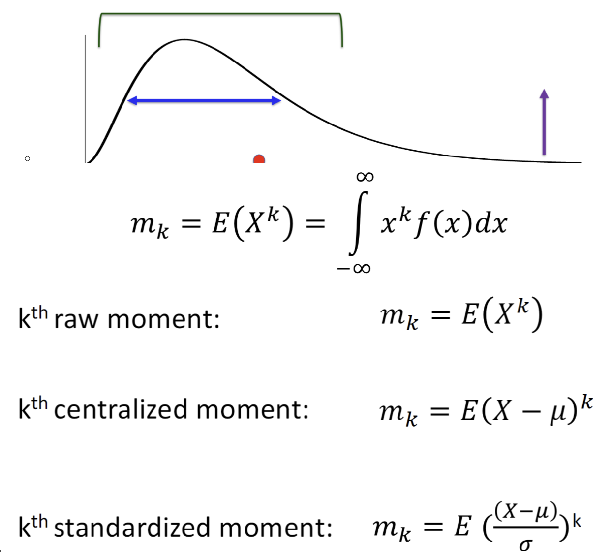
- **usage**: Characherize random variables

##### 5.4 Normal distribution
- def:  a symmetric distribution that is fully characterized by the first two moments.

##### 5.5 Cauchy distribution
- 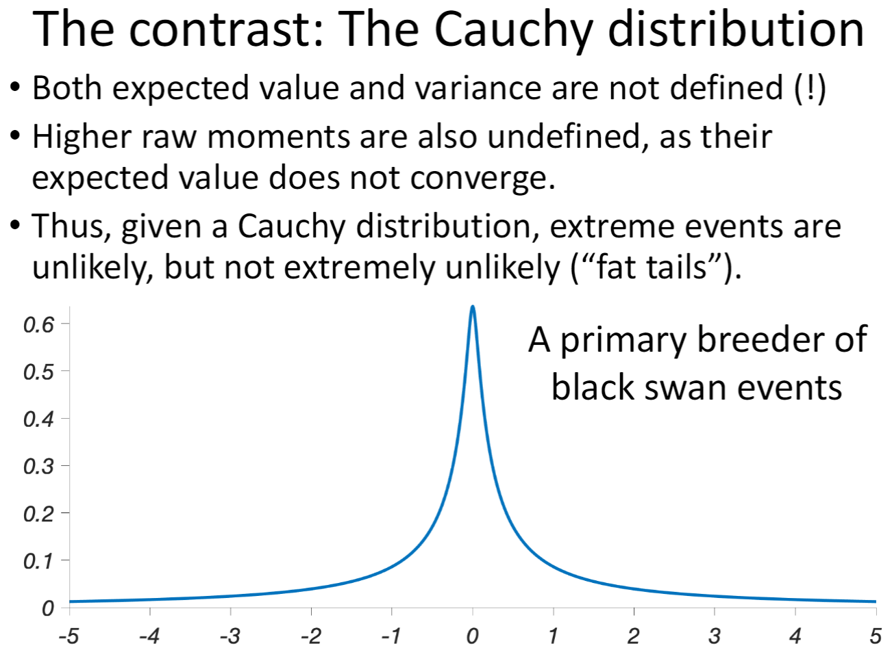
  - **1st and 2nd moments are not defined!!!**

##### 5.6 t distribution
  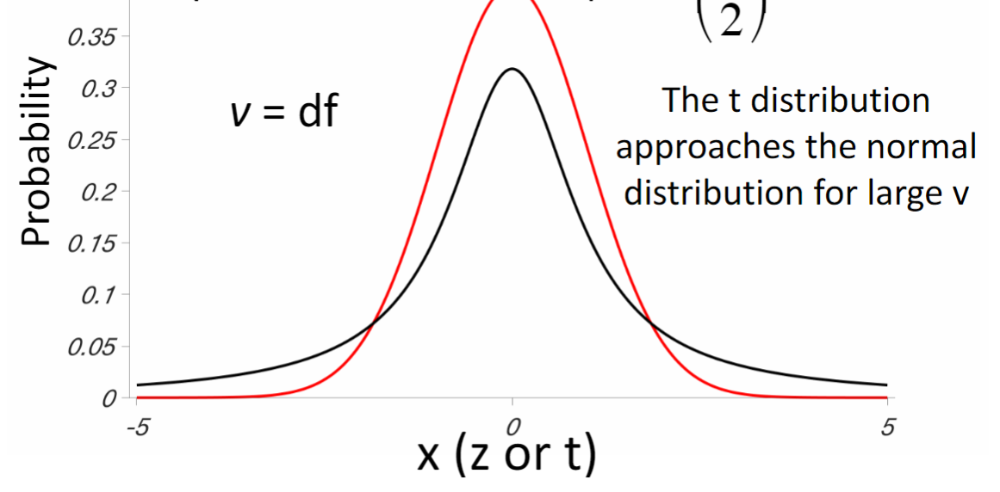
  - characteristic: heavy tail (than normal distribution)
  - **greater df, t distribution approches normal distribution, the thinner tail**

##### 5.7 Sampling
- **idea**: Entire population too large, measure the subset of the population as sample. CHaracterize the sample in terms of statistics to estimate population parameters
  

- **rules**:
  - 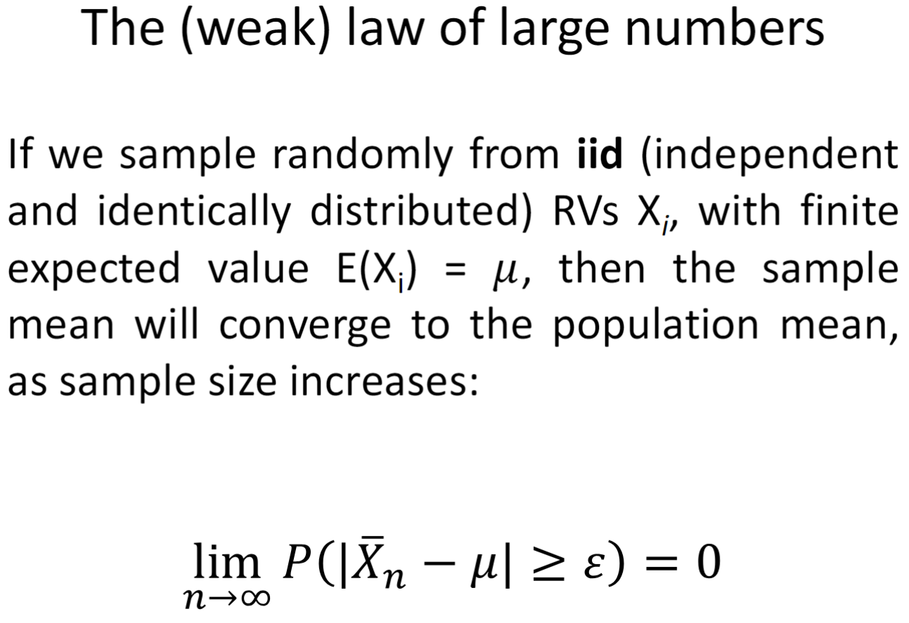
    -  the probability that sample mean deviate $\mu$ approach 0 
  - 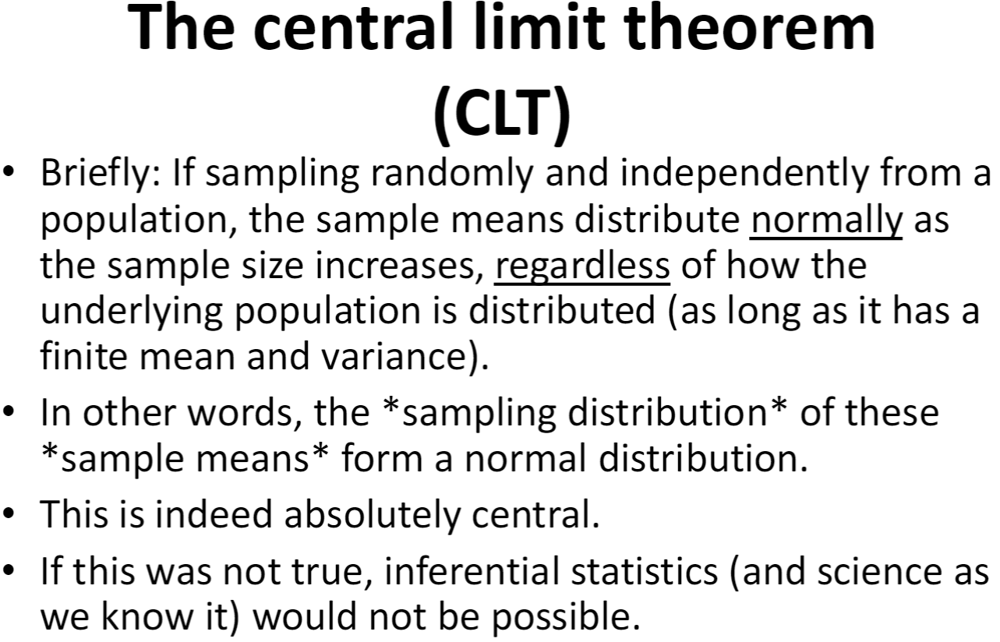
    - **Conditions!!!: sampling randomly (1) and independentlly (2), the distribution of sample means approches normality as increasing the sample size (3), Assuming the mean and the variance of the underlying distribution you sample from is not infinite (not cauchy distribution) (4)**

- **Standard Error (SED)**
  - $SED = \frac{\sigma}{\sqrt{n}}$
    -  $\sigma = $ population standard deviation
    -  $n = $ sample size 
  -  indicates how much the sample mean is likely to differ from the true population mean
  -  smaller SED means sample mean is more accurate estimate of population mean
  -  larger sample size, smaller SED, making sample mean a more reliable estimate of popultion mean

#### 6. Null Hypothesis Significance Testing
- what is **Hypothesis testing**: Hypothesis testing is a statistical method used to make decisions or draw conclusions about a population based on a sample of data. It helps determine whether the evidence in the data supports a specific claim (called a hypothesis) about the population.
- **what is NHST**: a type of hypothesis testing focuses on determining whether sample data provides enough evidence to **reject** null hypothesis in favor of the alternative hypothesis
- **key idea**: ***Falsification***, if unexpected result, showing it's not by random chance
- **When to use which test**: 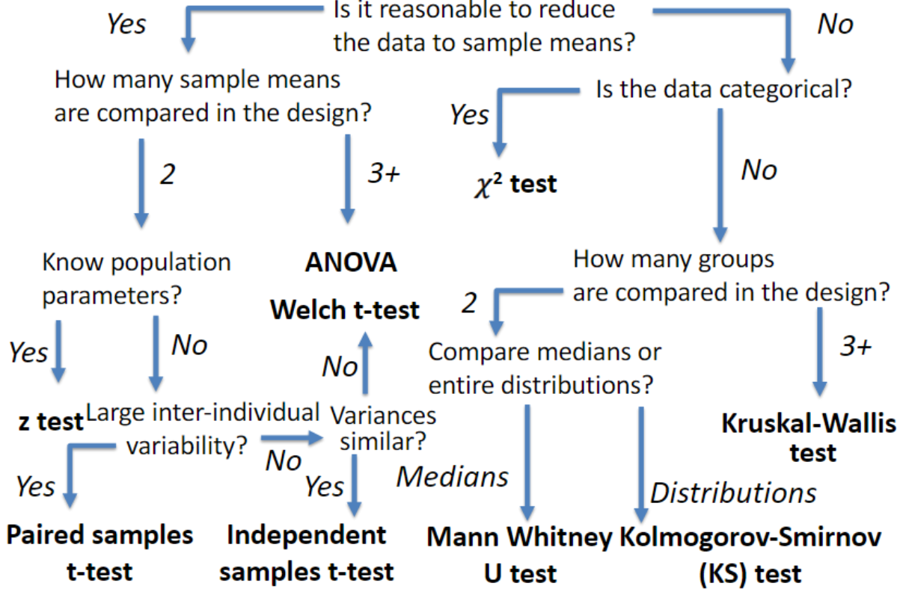

##### 6.1 key concepts
   1. **statistical significance**
       - **terminology**: **refers to** (not equal) the probability that the result of an experiment is not due to random chance. not showing either hypothesis is false.
       - **meaning**: **The observed data is unlikely, assuming chance** (if the null hypothesis were true, the probability of obtaining the observed data by random chance is very low)
   2. **Null Hypothesis (H₀)**: The assumption that there is no effect, no difference, or no relationship between variables. It is the hypothesis that researchers aim to test against. **FALSIFICATION**
   3. **Alternative Hypothesis (H₁ or Hₐ)**: The the statement that contradicts the null hypothesis. It represents what the researcher is trying to prove—usually that there is an effect, a difference, or a relationship.
   4. **Significance Level (α)**
      - **terminology**: A pre-determined threshold that determines how much evidence we need to **reject the null hypothesis**. The most common significance level is 0.05, meaning we accept a 5% chance of rejecting the null hypothesis. 
      - **It is also the probability of making a Type I error**.
   5. **z-score (in z-test)**
      - **terminology**: how far is the observed sample mean from its expected value (the population mean if the null hypothesis is true), in unit of standard error of the mean
      - **$z = \frac{\bar{x} - \mu}{SEM}$**
   6. **p-value** 
      - **terminology**: the probability of observing that particular outcome (or more extreme) under the null hypothesis
      - **meaning**: if p-value is less than 0.05, the result is considered **statistically significant**. Then null hypotheiss could be rejected with no chance (偶然性). 
        - If the p-value ≤ α, reject the null hypothesis.
        - If the p-value > α, fail to reject the null hypothesis.
      - 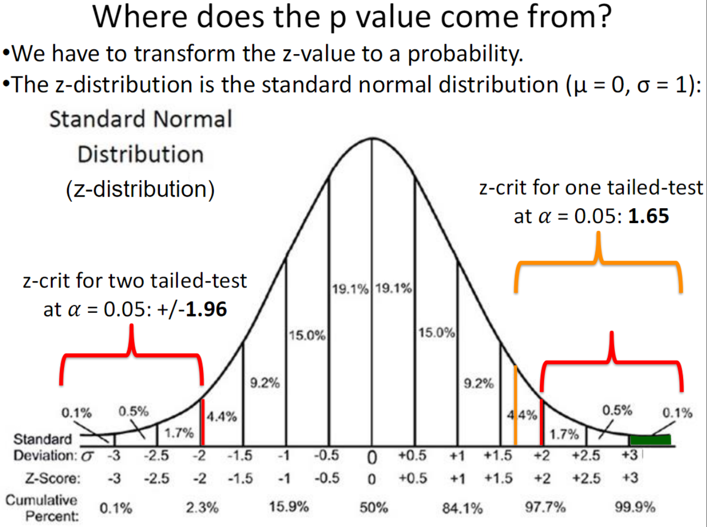
   7. **Parametric Significance tests and Non-parametric significance tests**
      - **Non-parametrric Significance test** counts how often a **category** occurs in a sample/dataset. It **doesn't reduce the data to sample means** since sample means are meaningless
      - **Parametric Significance test** needs to reduce the data to sample means, since sample means are used to show difference between population mean or other sample means

##### 6.2 A/B tests
- **anology**: 实验组和对照组，随机分配，控制变量
- AB test is a frame work for other tests, including z-test, t-test

##### 6.3 error
1. **type I error / α-error / false positive**
   - reject the null hypothesis (H₀) when it is actually true
   - equals to significance level (α)
2. **type II error / β-error / Miss / False negative**
   - fail to reject the null hypothesis when it is actually false
- we can't reduce both the probability of type I and type II error happening. 
- 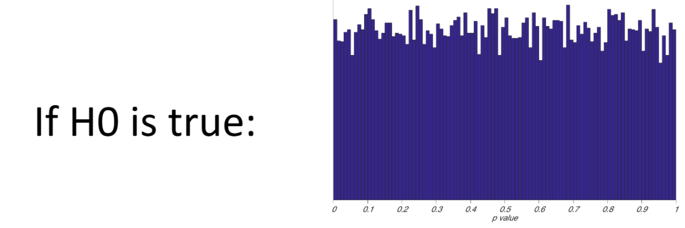
- 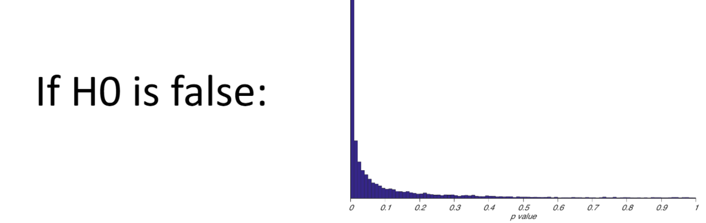

##### 6.4 Test Process (how to test)
1. Start by proposing a hypothesis, e.g. that a “treatment” is effective (e.g. by implementing an A/B test)
2. Assume that the treatment has no effect (the null hypothesis)
3. Administer the treatment to the treatment group (randomly)
4. Measure the outcomes of the treatment group and those of the control group.
5. Compare the outcomes in the two groups. Recognize that any difference could be due to chance (sampling variability). Check statistically significant?
6. - **REJECT**: If the difference in outcomes is too large to be plausibly consistent with chance, reject the null hypothesis
   - **FAIL TO REJECT**: If the difference in outcomes is plausibly consistent with chance alone, we don’t conclude anything about the treatment 
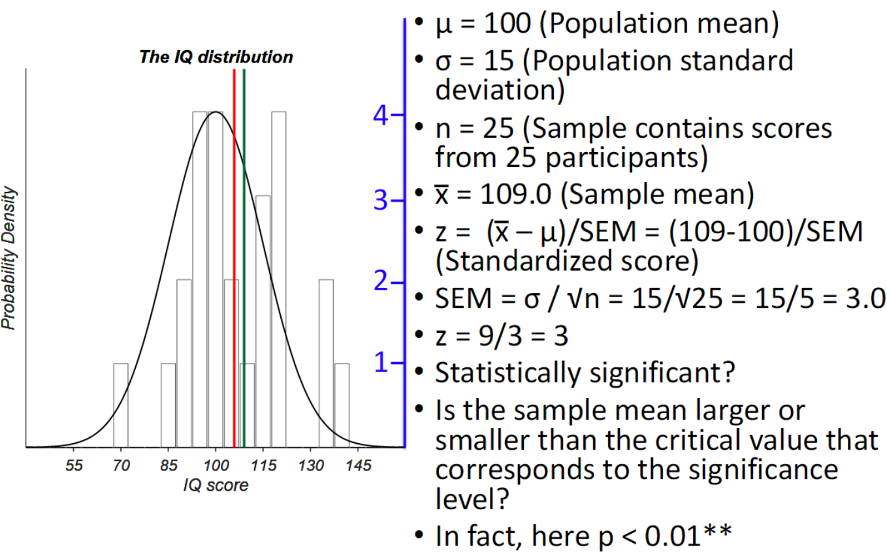

##### 6.5 **t-test**
- why not z-test: usually **unknow population expected value** and **variance**, and doesn't work on **small samples** since it relies on the central limit theorem
- characteristic: don't need population $\mu$ and $\sigma$, small sample size, heavy tail
- **purpose**: whether there's significant difference between the **means** of 2 **samples**
- degree of freedom 
  - $df = n - k$
    - n = number of independent pieces of information in the sample
    - k = how many parameters are estimated from the sample itself
  - in t-test, $df = n_1 + n_2 - 2$
- **process**
  1. find test statistic: $t = \frac{|\bar{X_1} - \bar{X_2} |}{SEM_{pooled}}$
  2. based on df, significance level, find $t_{crit}$
  3. If $t > t_{crit}$, there's significant difference

- **student t-test v.s. Welch's t-test**
  - student t-test requires **homogeneity of variance**, only means differ
  - Welch's t-test allows different variance in two samples

##### 6.6 ANOVA
- can compare more than 2 groups

##### 6.7 $x^2 (chi-square)$ test (goodness of fit test)
- **purpose**: test if the **distribution** of observed data fits the expected distribution. For **categorical** data. 
- **test statistic**
  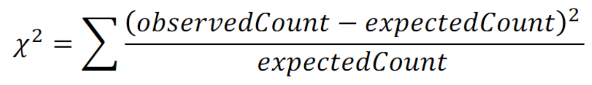
  - if not square, deviation may cancel outcome
- **df**
  - 1 categorical variable: $df = c -1$ where c is the number of categories
  - 2 categorical variables: $df = (r-1)*(c-1)$ why? Independent cells
    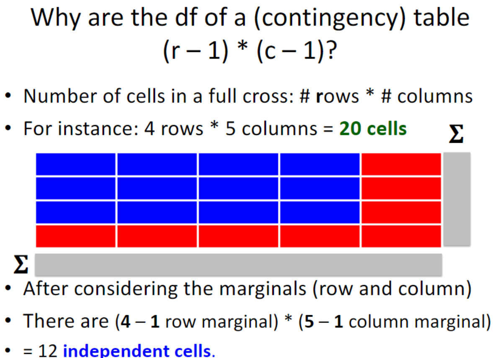

- **process**
  1. find $x^2_{obt}$
  2. based on df, significance level, find $x^2_{crit}$  | or find p-value based on df and $x^2_{obt}$
  3. If $x^2_{obt} > x^2_{crit}$, there's significant difference | or if p-value < significance level, reject H0

- **example**
  1. H0: There's no difference between people from different generations feel about pineapple Pizza
      
  2. find expected frequencies from $E_{ij} = \frac{RowTotal_i * ColumnTotal_j}{OverallTotal}$
  
  3. Find $x^2_{obt} = 6.0$
  4. Find $df = (2-1) * (3-1) = 2$
  5. Find $x^2_{crit} = 5.991$ based on 0.05 siginificance level
  6. Since $x^2_{obt} > x^2_{crit}$, reject H0: There's siginifance difference between how Millennials and Gen Z feel about pineapple on Pizza

##### 6.8 Mann-Whitney U test (Wilcoxon ranksum test)
- why not mean
  - don't have good cardinality in cases like rating movie: difference beween each score isn't the same 
  -  not good representation (since extreme value, ...)
- **idea**: Tests whether two samples come from populations with the same **median** (like t-test). **distribution not matter**
- **test statistic**: U

##### 6.9 Kolmogorov-Smirnov test KS test (a goodness-of-fit test)
- why not median: two samples have same median, but they can have diferent distributions
- **idea**: test whether distributions are the same by comparing the cumulative distribution function of samples
- **test statistic**: $D = max(|F_1(x) - F_2(x)|)$
- **process**: 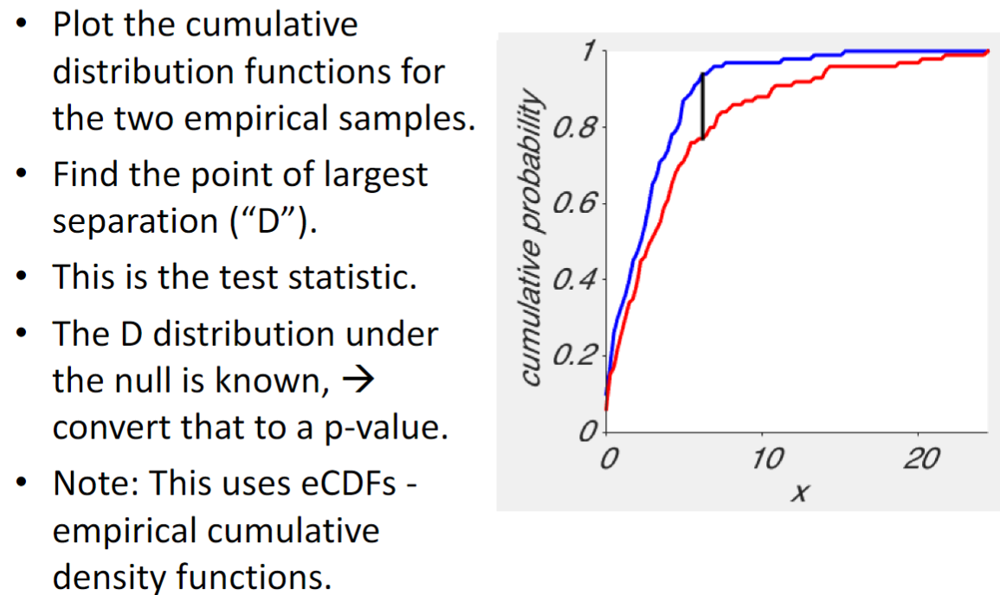

##### 6.10 The Permutation Test
- **use case**: not sure about using which test statistic.
- **purpose**: to test if there's significant difference between two sample datas
- **idea**: use the data we have to determine the null distribution of the test statistic under the null hypothesis (is true)
- **process**
  1. determine the suitable test statistic that can quantify the difference
  2. compute the empirical test statistic
  3. permutation
       1. combine the 2 sample datas as a group
       2. form new synthetic groups from this data **at random**
       3. calculate the shuffled test statistic
       4. repeat many times
  4. determine the null distribution: histogram of these shuffled test statistics
  5. Find $p-value = \frac{MoreExtremeTestStatisticNum}{TotalPermutationNum}$

##### 6.11 Bootstrap
  - **process**: Instead of sampling from reality, we sample from the sample **with replacement**
  - **use case**
    - limited available data
    - underlying distribution of data is not normal/unknown
    - when estmating sample means of rare events (which requires sample size is extremely large)
  - **cons**
    - works **iff N & n = large enough and sample = representative**
      - non-representative: sampling error or sampling bias

#### 7. More inference than p-values and significance
##### 7.1 background
  contemporary ds: significant result = publishable result
  - **replicability crisis** (malice) or **reproducibility crisis** (incompetence)
  - **false-positive**: even we set significance level to 0.05, we can't guarantee the rate of false positive to be 5%
  - **p-hacking**: manupulate experiment design and data analysis
    - **Flexible stopping**: adding data one observation and testing for significance one at a time, until the p-value reaches the significance threshold, then stop
    - **HARKING** (hypothesizing after results are known): Test m any dependent variables, develop hypotheses post-hoc based on what was significant and report only these
    - **remove outliers** on the basis of result

##### **7.2 complement**
###### **1. effect size**
  - how much an effect matters: the objective difference between two samples caused by some factors
    - higher effect size, significant difference. 
    - high effect is scarce in life
  - **effect**: the factors: the treatment to sample
  - **Cohen's d = $(\mu_1 - \mu_2 ) / \sigma$**: normalze mean difference by standard deviation (not error)
  - **relationship**:
    - **not based on sample size**: **larger sample size increase the power, making it easier to detect small effects**
###### **2. statistical power**
  - the probablity of **not** making a type II error (significance where there's effect) = p(1-β)
  - 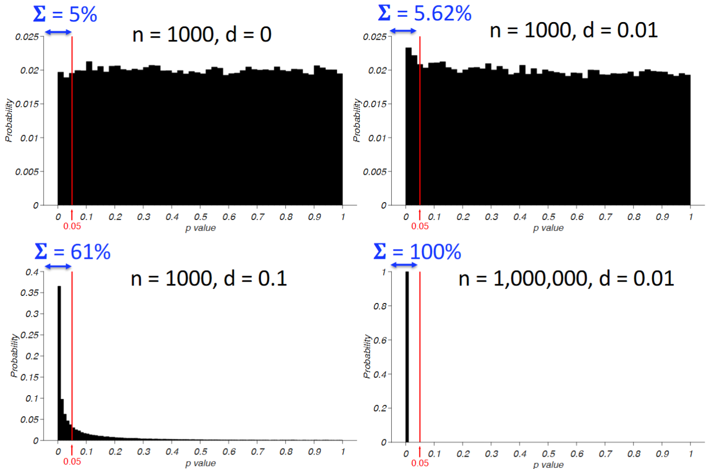
    - sigma is power (or alpha in Fig 1), n is sample size, d is effect size
    - Fig 1 shows that when H0 is true (d=0), P(false positive) is 0.05
    - Fig 2,3,4 shows that when H1 is false, power increases as sample size or effect size increases
  - **relationship**: $z = \frac{(\bar{X}- \mu)}{\frac{\sigma}{\sqrt{n}}} = d*\sqrt{n}$: when H0 is false, z and p shows 1-$\beta$
    -  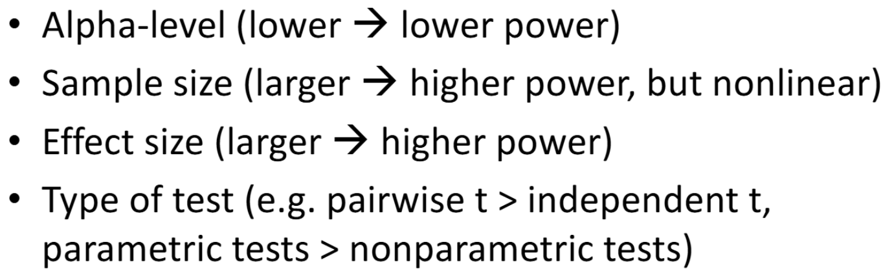
  - 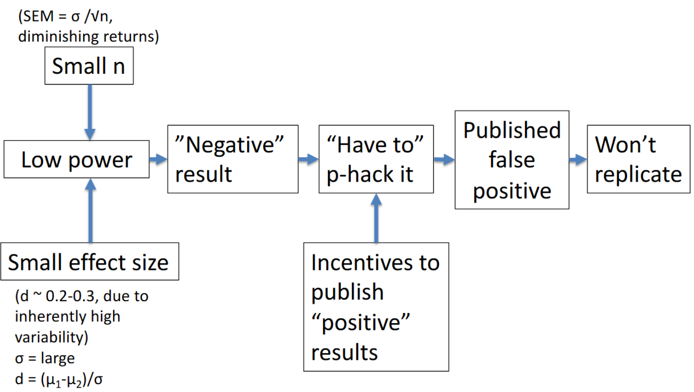
###### **3. confidence intervals**: 
  - an interval estimate of population parameters. if we had a large number of samples, and only sampling error (no sampling bias), most of the sample means (typically 99% or 95%) will be within the CI.
    - doesn't mean it will contain population parameter
    - if CI contains 0 --> no effect, no significant difference at this confidence level
    - calculation: 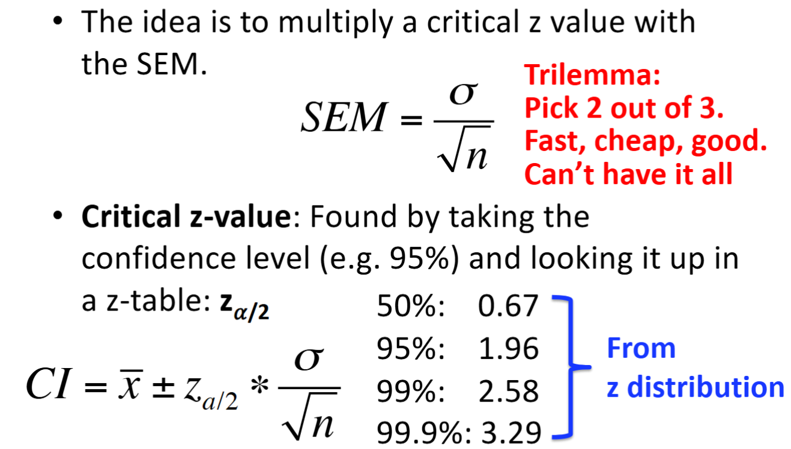

