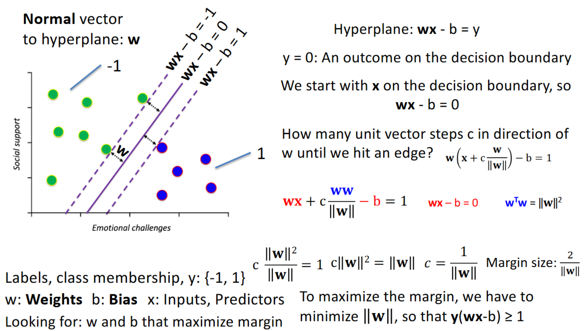

## Machine Learning

### Supervised Learning
- **Process**
  1. Use the training data to make a guess
  2. Determine how good that guess was by comparing the guess with the actual outcomes (label), by virtue of some distance metric.
  3. Minimize (typically in regression) or maximize (typically in classification) that metric
  4. Keep doing that until you are happy with the quality of the guesses (”close enough”). 

#### 1. Regression
- **use case**
  - want to predict some (often future) outcome based on some known (often current) state
  - quantify the known state with data
  - quantify the relationship between known state and outcome
- **def**
  - **predictor/regressor**: known state, independent variable, x
  - **outcome**: unknown state, dependent variable, y (not $\hat{y}$)

- **problem**
  - only based on correlation: end up spurious relationship that are not actually causal

##### Linear Regression
1. **Linear Regression Analysis**
     - **want know how changes in a varying independent variable (the predictor X) affect the dependent variable (the outcome Y)**
     - can't do experiments (we don't randomize)
     - causation is in implied, but not necessarily present since the association can be purely statistical in nature
2. **def**: 
     - **Linear Regression**: relationship between predictor and outcome that can be accounted for by **fitting a line**
     - **Residuals**: The distance (deviation) between the value that we would expect from the predictor (on the line) and the actual value (what can’t be accounted for by the line)
3. **purpose**: 
4. **vector projection for approximation**
   use scale factor $\beta$ to approximate predictor vector a to real outcome vector b
   $\beta = \frac{a^Tb}{a^Ta}$
5. **Regression to the Mean Effect**
   - **background**
     - no correlation: reasonable to use mean outcome since it minimizes the sum of the squared deviations
     - have correlation: regression can be model through $E(y|x)$
   - **meaning**: extreme predictor x, it's outcome tends to regress to $E(y|x)$, instead of more extreme value
   - **the magnitude of the regression to the mean depends on correlation strength**
     - **correlation == 1**: no regression to the mean effect
     - **strong correlation (close to 1)**: the changes of predictor X will precisely show on outcome y, so regression to mean effect is not strong 
     - **weak correlation (close to 0)**: blurred relationship between X and Y, outcome Y tends to regress to $E(y|x)$
     - **correlation == 0**: regression to the mean effect is strongest, always happen 
6. **Multiple regression**
   - **background**: to make stronger causal link, need to **statistical control confounds**(variables that are related to the outcome variable in a way that could explain the observed pattern of outcomes)
   - **purpose**: provides statistical control if one has more than one predictor that matters/more than one known confound
   - **fundamental issue**
     - **we never know we have accounted for all possible confounds**, and **we don't randomize like an experiments**
7. **The General Linear Model (GLM)**
   - $\beta$: Regression parameter(s), coefficient(s), weight(s), scale factor(s)
   - $X$: Independent variable(s) (Predictor)
   - $Y$: Dependent variable, (Outcome)
   - simple linear regression: 
   - multiple regression model: 
   - **$SS_{total} = SS_{explained} + SS_{residual}$**  
8. **Model assessment**: how much varaince does model explained
     - **Coefficient of Determination** $COD = \frac{SS_{explained}}{SS_{explained}+SS_{residual}}$
     - **metrics**
       - **R**: The multiple correlation. Correlation between $\hat{Y}$ and y
       - **$R^2$**: The squared multiple correlation. Proportion of the variance that can be accounted for by the model. **COD**
       - **$1-R^2$**: The proportion of the variance that is not explained by the factors in the model (off the line/plane/hyperplane –residual variation).
     - **example**:
        1. no correlation: 
        2. add variable: 
            - $r_{sp}$ is the correlation coefficient of predictor $X_1$. The higher, the more related the predictor is to the outcome
            - adding new predictor, as long as it is correlated, it can help the model to explain, reducing the residual
     - **tradeoff**: we can keep adding variable, but we don't for simplicity
       - **1. multi-collinearity**: 2 predictors that are each highly correlated
         - original: find vector y's projection on plane X consist of vector x1 and x2. 
         - now: x1 and x2 is pretty same, model will be very sensetive for distribute regression coefficient $\beta_1$, $\beta_2$, so it would be **unstable, unreliable, and have excess variance**
         -  **One-hot encoding / Dummy coding** 
              - to prevent the inherently qualitative nature of number..
              - why k-1 columns (delete other): to prevent multi-collinearity
       - **2. The curse of dimensionality**
         - **sparsity**: need extraordinary amounts of data to estimate parameters, coverage is issue
       - **3. Overfitting**
         - we can fit any dataset with many parameters, but each dataset itself has different error (noise)
         - can be addressed by **cross-validation**
     - **Validation**
       - solely based on metrics is not enough: even low residue, we may not find the real relationship
       - **Cross-validation**
         - 2 part: **training data** (estimate coefficients); **test data** (calculate error)
         - **leakage**: overlap between two sets, will reduce the error
         - if results substantially different in two sets: **high variance**
9. **Regulized Regression**
  - **Bias / variance tradeoffs**
    - **bias**: function too simple (less variable), underfit, model doesn't fit well
    - **variance**: function too flexible (much variable), overfit, fit doesn't transfer to other dataset well
    
  - **Ridge regression**
      
      - Introducing some bias (underfitting) to reduce variance (overfitting) considerably
      - **λ**, [0, infinite)
        - λ = 0: regular linear regression (ordinary least sqaure regression)
        - λ = infinite: slope of regression line is 0 , which corresponds to mean of Y
        - as λ increass, the slope of regression line decreases, shrinkig towards 0
        - optimal λ comes from  cross-validation between training and testsets

#### 2. Classification
##### Logistic regression
- bridge from regression to classification
- **why not linear regression**: it makes no sense on classification 
  - linear regression assumes residuals are distributed normal, however for classification, outcomes are either 0 and 1 (not normal)
  - Effect of unit change is assumed to be constant
  - Linear regression is unbounded
- Mapping continuous inputs to **binary outcomes**, while using a **nonlinear linking function**
- Logistic regression gives **odds** that an outcome happens compared to it not happening, for a given predictor value
  - **Odds**: Probability of an event occurring divided by the probability of the event not occurring $\frac{p}{1-p}$
  - **Logit Function**: Links the values in the predictor variable to the probabilities of the outcomes. 
  - **Logistic Function / Sigmoidal Function**: inverse logit function 
    - why inverse: On logit function, probability is on x-axis; inverse make probability on y-axis 
    - **varying betas**
      - $\beta_0$: shift left or right
      - $\beta_1$: slope becomes steeper
- **Evaluation (only use test data)**
  - **accuracy** is not enough: most real datasets imbalanced
  - **AUC (area under ROC curve) / AUROC**
    - **ROC (Receiver Operating Characteristic)** 
      - plotting **sensitivity (true positive rate)** as a function of **1-specificity (false positive rate)**
      - it  captures the classification accuracy of an algorithm for the entire range of different criteria (thresholds)
        
        

    - **AUC (Area under the ROC curve)**: assess the performance of classification models 

##### Support Vector Machines (SVM)
- **Basic idea: use maximal margin classifiers**
- **find optimal hyperplane efficiently with linear algebra**
  -  
- **Loss function: Hinge Loss**
  
- **soft margin classifiers**: allowing for misclassifications in the margins of the training set 

### Unsupervised Learning
- **difference**: Supervised Learning **use lables to yield distances**, while it **use distance to yield lables**
- we do unsupervised learning when we don't have **labeled data**
- **process** 

#### 3. Dimensionality reduction
- **motivation**: too much going on on multi dimension
- **how**: demention reduction by cosine similarity ----> **feature extraction** (not feature selection) ---> (independent) **latent factors**
  - **feature extration**: create a smaller, more informative feature set by reducing its dimensionality to a new feature space
  - **feature selection**: select the most important features to the problem and discared other features 
- **why**: **Correlated information is redundant**
- **process**: eigondecomposition, SVD; **covariance matrix** always be square
- **usage**
  1. SVD for image compression
  2. **Principal Component Analysis (PCA)**
    - 
    - 

#### 4. Clustering
- **purpose**: Check whether data has an inherent structure: natural groups (**clusters**) in new feature space or principal component space
- **Intuition**: members of a cluster are similar, but dissimilar from members of other clusters

##### 4.1 K-means clustering
- **process**
  1. Placing K cluster centers (centroids) at some initial location in the data space
  2. Identifying which centroid a given datapoint is closest to, for all datapoints
  3. Calculating the distance of all data points from their nearest cluster center (centroid)
  4. Summing all of these distances
  5. Adjusting the location of the centroids such that the total distance of all points from their centroids decreases.
  6. Iteratively doing that until the total distance / centroid location doesn’t change anymore

- **parameters**
  - **K**: the number of clusters
  - Initial centroid locations (default: random)
  - Distance metric (Euclidian distance) 

- **downside**: It does not yield the optimal number of clusters, only the optimal location of cluster centers
  - **solution**: 
    1. the elbow method: find variance within cluster for each K, if it starts becoming flat at k, then k is elbow point
    2. **the sihouette method**
        - **process**
            1. Apply the K-means clustering method for a range of plausible values K (e.g. 2-10)
                - why start with 2: 
            2. For each of these –and each datapoint i-calculate the **Silhouette Coefficient** s(i):
               1. calculate the average distance of a point ito all other points in the same cluster as a(i)
               2. Then calculate the average distance of a data point ito all points in the nearestcluster as b(i)
               3. Then calculate s(i) as (b(i)–a(i) / max([b(i),a(i)])) 
            3. s(i) will vary from 0 (if classification is arbitrary) to 1 (if classification is ideal). Negative s(i) values indicate misclassification.
            4. Make a histogram of the s(i) values for all values of K that you tried

- **pros and cons**
  - pros
    - simple/intuitive
    - fast/efficient
    - converges to a solution
  - cons
    - yield spherical clusters
    - solutions sensitive to outliers

##### 4.2 DBSCAN (Density-Based Spatial Clustering of Applications with Noise)
- **idea**: Use **Density** (number of data points per area) instead of distance
- **parameter**
  - **Epsilon**: The radius around a data point that forms a region/neighborhood within the perimeter
  - **MinPoints**: The minimum number of data points (including starting point) that must be in the region (within the perimeter) for a cluster to be formed 
- **process** 
- **pros and cons**
  - pros
    - finds the number of clusters
    - yiled clusters of arbitrary shape
    - not sensitive to outliers
    - does not include noise in the clusters
  - cons
    - slow
    - relies on sharp density drops to identify cluster boundaries
    - determining epsilon and minPoints can be arbitrary