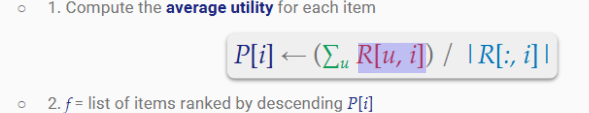
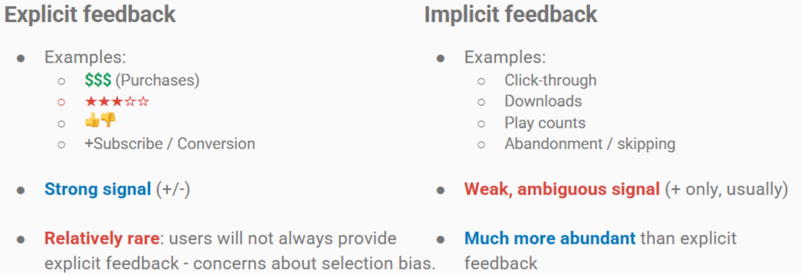
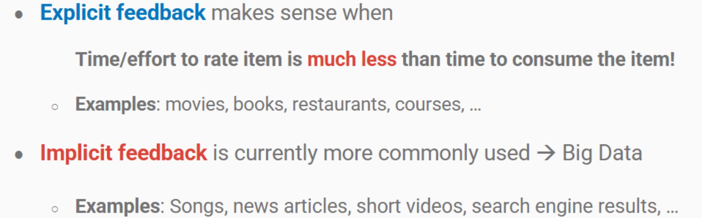
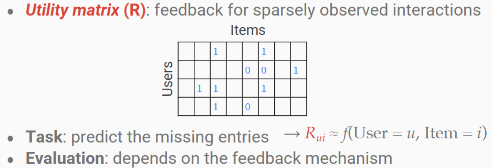
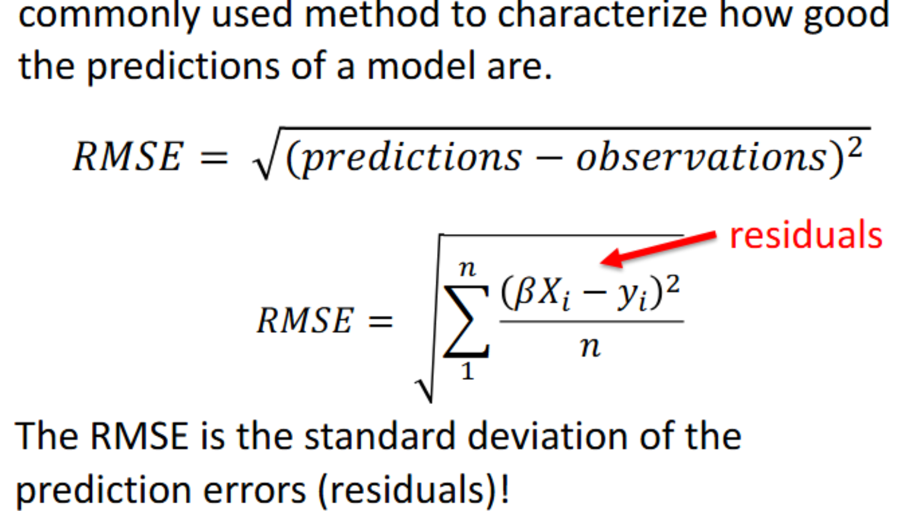

## Recommender Systems

#### Popularity based model
- **ranking the items in order of average ratings**, not by number of ratings
- **process** 
  - P[i] = sum of each ratings of the item / cardinality (number) of ratings
- **cons**
  - **same ranking for all users**, not personalized
  - hard to improve because it has strong correlation between how much people like it. People like it more expose more
- **important and possible to improve it**: polarized, so need personalized. High polarized most benefit from recommender systems

#### Feedback
  - personalized recommendations can be based on **implicit** and **explicit** feedback
  - we only consider explicit feedback this class  

  - **Collaborative filtering: An Explicit feedback** 

#### Latent factor models
- **idea**: decompose the user ratings into latent factors that we estimate (link to regression via Alternating least squares); learned representation is **low-rank** and dense

- **content**
  - **Bi-linear Model**: mapping user-item interactions to Latent Feature Space. $R = U · V^T$
    - model learnable parameters U is user latent freature matrix, V is item latent feature matrix
    - $\hat{R_{ij}} = <U_i, V^T_j> = U · V^T$
    - loss function: $\min \sum (R_{ij} - <U_i, V_j>)^2$
  - **ALS: get freature content matrix V and user preference matrix U from R**
    - **process: Repeat**
      - fix U, solve for V
      - fix V, solve for U
    - **ALS via OLS**: this optimization problem is equivalent to ordinary least squares regression
      - **problem**: Feedback matrices are usuallysparse(most data is missing)
      - **solution**: decompose feedback matrix into two smaller matrices U and V
      - **Approach**:
          1. initialize U and V with random values or values from a SVD
          2. use OLS to alternate between steps where fix U to solve V or fix V to solve U
          3. do OLS alternatively until convergence: RMSE between $<U_i, V_j>$ and feedback we have (actual ratings) in R converges (doesn't change or drops under some threshold)

- **problem for systems based on collaborative filtering only: Handling new items**
  - gives **no representation** to items with no **interactions** (no feedback for an entire item)
  - a new item will never be recommended until it has representation
  - **cold-start** problem
  - **solutions**:
    - active promotion / manual curation
    - complementing this with content-based modeling

#### Content-based models
- suppose you have observed / explicit  features / item factors $x_j$ for each item
- each user i get their own interaction model $u_i$. $R_{ij} = <u_i, x_j>$ 

- **content cold-start**: new item with no rating
  1. train a LF model as before, item j-> $V_j$
  2. regress item factors from features: $V_j = f(x_j)$
  3. a new item can map into embedding space by learned mapping $f(x_k)$

- **user warm-start**: new user enter a system (no feedback from entire user)
  - request some **demographic data** and ask for examples of things you like
  - these data are used to position you in collaborative filter

#### Evaluation
- early reccommender system: **Root mean squared error (RMSE)** 
- **ranking evaluations**: the order items presented
  - **Average Precision (AP)**
    - for each interaction, what fraction of higher-ranked items were also positively recommended
  - **Mean Average Precision (MAP)**
    - The average of AP across all users
  
