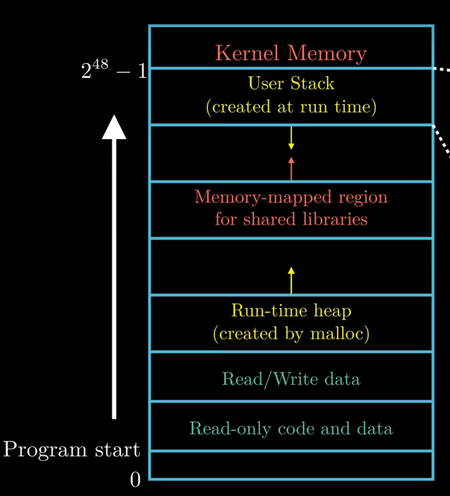
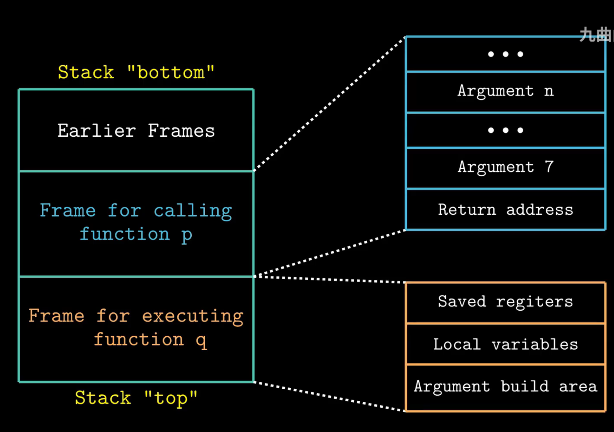
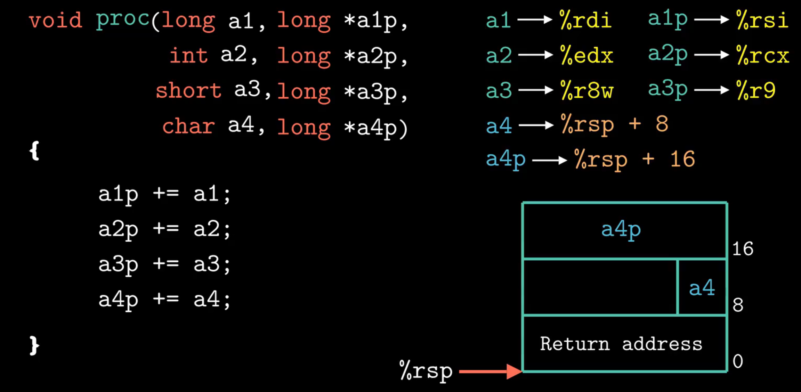
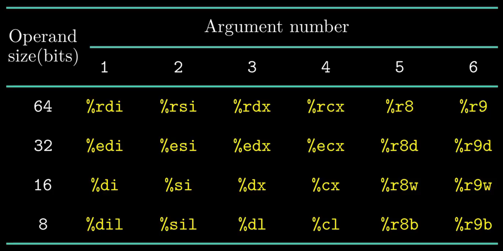
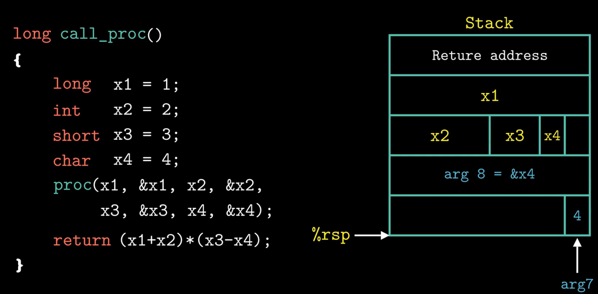

# Stack Frame

### memory allocation

### what is stack frame?
 - section of stack dedicated to a particular function call
 - 

### when *call*
 - %rsp decreases by 8 to push the return address (the address of next assembly code)
 - (%rsp decreases by 8 to) push %rbp from the caller function on the stack, then current %rsp is moved into %rbp --**prologue**
 - %rip is redirected to the first code address of the called function

    | bottom of stack (high address) |
    | :--: |
    | previous %rbp | 
    | return address after finishing comp() |
    | previous %rbp (points to %rbp saved from main()) |
    | 0 (e) |
    | 0 (f) |
    | return address after finishing mul() |
    | %rbp (points to %rbp saved from comp()) |

### when *return*
 - %rbp should be poped out first, and it was changed back to caller's rbp by pop
 - the return address in the stack is poped out
 - %rip is redirected back to the poped return address

### Data Transfer
 - 
 - 

### Local Storage
 - | parameters | local variables |
   | :--: | :--: |
   | inputs as function calls | defined inside of the function | 
   | store in registers and stack (when more than 6) | store in stack|
   | 8-bit align to right in stack | no aligness |
 - 
 - x1, x2, x3, x4 are local variables in call_proc(), so they store in stack and no need to 8-bit align. They are registers in proc(x1,...,&x4), so they take 6 registers, and last two of them store in stack. Since they are register, they need to 8-bit align (arg7 itself takes 8 bit)
