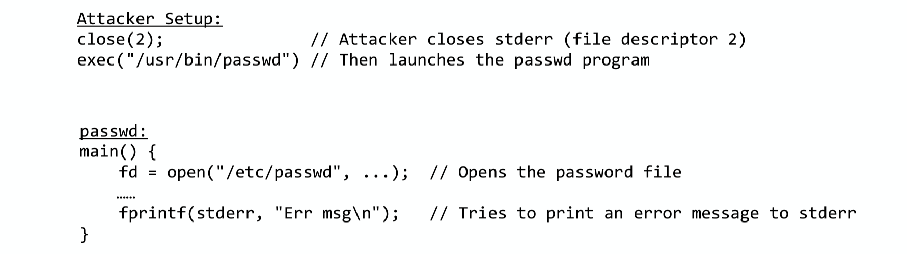

## Security

Famously difficult to reproduce trivially on modern system
- **OS mitigations**: ASLR, W^X (never both), red zones, stack canaries, CAP_*
- **Compiler changes** (.rodata on seperate page, __attribute__((format)))
- **Userspace Mitigation** (bash privileged mode)
- **Architectural advances** (fastcall, '64-bit' address spaces)

#### 1. stack smash
- buffer overflow where an attacker overwrites the **return address** on the stack --> redirect program execution
- **buffer overflow attack**
  - 1: programs fail to validate buffer sizes during input
    - eg. 
      ``` c
      void vulnerable_function() {
      char buffer[10];
      gets(buffer);  // Unsafe: no bounds checking
      }

      int main() {
      vulnerable_function();
      return 0;
      }
      ```
  - 2: attacker writes more data buffer can hold, and overwrite to the return address with malicious value. 
  - 3: When the function tries to return, the CPU jumps to the attacker-controlled address


#### 2. Trusting trust
- **compiler**
  - new language other than c: compiler written in c
    - **how to translate**: beraks the source code into tokens, then write instructions in c for each tokens based on new language's grammer
  - c: old compiler written in c
      - we can add new features in compiler in c, this c compiler will be compiled by the old c complier, this is the update of compiler

- **Thompson's Goal**: **have no source files hint at the bug**, and meanwhile, the **bug will persist across all recompilations**
    - normal: **login.c** -> edit -> **login.c with bug** -> compile -> **login binary with bug**
      - too **explicit** since we can easily find bug in source code. If recompile normal file, login will bug-free
    - hacking (implicit): 
      1. **compiler.c** -> edit -> **compiler.c with bug** -> old compiler -> **buggy compiler**
         - usually insert `x = {if compiling login, insert bug; if compiling compiler, insert x}`
      2. **execute login**: **login.c** -> buggy compiler -> **buggy login**
      3. **update compiler**: **compiler.c** -> buggy compiler -> **buggy compiler (persistently exist)**
          - **self-reproducing program**: a program takes no input and produce a copy of its own source code as its only output (Quine)
     - You can't trust code that you did not totally create yourself


#### 3. Protections and security in Unix
- files and directories are access-controlled by **U(ser)ID** and **G(roup)ID**
- **Root (UID 0)** has all the permissions
- each process has a real UID and effective GID

- **Setuid**: a program that is run with raised privilege level (like root), but this may give attacker chances
  - 1: **attack by manipulate stderr** 
  - 2: **attack by manipulate IFS (Internal File Separator)**
    - IFS: a special shell environment variable in Unix and Unix-like systems that defines the characters the shell uses to split words and process command lines
    - **attack**: program preserve installed with setuid root permission use system() call to execute "/bin/mail" to notify users about backup
      - 1: attacter manipulate the IFS environment variable, setting it to "/"
      - 2: when executes preserve, it calls system("/bin/mail")
      - 3: due to modified IFS, the shell parses it into "bin" and "mail" 
      - 4: the attacker have a malicious executable named "bin", so program executes attacker's "bin" with root privilege
      - 5: now bin program can reset IFS to normal, create a copy of /bin/sh, change ownership to root, set the setuid bit
    - **solution**: If program run with root, shell should ignore IFS environment variable
  - 3: **attack via ptrace**: 
    - ptrace: one process (tracer) may observe and control the execution of another process (tracee), and examine and change tracee's memory and registers
    - 1: **direct privilege escalation**: unprivileged process attemps to ptrace a privileged (setuid) program
      - attacker can manipulate the memory of root process to gain root privileges
      - **solution**: prevent process from ptracing more privileged processes, check whether UID match
    - 2: **privilege escalation via exec()**: unprivileged process A traces another unprivileged process B
      - when B executes a setuid program, A still have control over now-privileged process B
      - **solution**: disable the setuid bit when a tracee calls exec(), except for root
    - 3: **complex privilege escalation chain**: bypass the previous two fixes
      - A and B two unprivileged, A trace B. 
      - When A executes "su attacker" (temporarily root), B executes "su root", so B's exec() maintains setuid bit since A is root
      - attacker can manipulate B's memory, bypass password check, then A connect to a root shell
  - 4: **TOCTTOU attacks (time-of-check-to-time-of-use)**: a race condition vullnerability
    - **idea**: explit the time gap when a program checks a resource's properties and when it actually uses that resource, attacker can revise resources during this gap
    - **solutions**: use file descriptor-based operations instead of relying on file paths


#### Power up to Terminal
1. **Power up**
   - **Processor Initialization**
     - zero out registers, set control registers to default
     - Enter Real Mode:
        - no paging - all physical addresses
        - up to 1 MB physical memory acess
    - **Firmware（固件）Loading**
      - Processor copies executable from ROM to RAM
      - jump to known offset (0xFFFF0)
2. **Firmware (UEFI/bios)**: responsible for hardware initialization and provide a runtime for kernel during early boot
   - **UEFI Initialization**
     - switch to long mode
       - enable paging and addressing
       - create identity mapping page table
     - initialize devices: disk, USB, display, network card
     - load and executes **OS bootloader**
3. **OS bootloader to Kernel**
   - **Execution Flow**
      - 1: EFI Stub:loads and executes decompression stub
      - 2: Decompression: uncompresses kernel data into memory
      - 3: Kernel Launch: executes kernel
      - 4: Firmware Exit: kernel terminates UEFI firmware
4. **Kernel**
   - **memory management**: virtual address space
   - **Interrupt Handling**: rewrite interrupt descriptor table
   - **Device management**: load and initialize device drivers running as part of kernel
   - **root device**: mount root device, run fsck if required
5. **init**
   - **System Initialization**
     - Device configuration (Network IP, GPU resolution)
   - **Daemon Management**: Lauch system services, port binding, manage privileges
   - **Session management**: launch login manager (login(1))...
6. **login(1)** must run as root
   - **Authentication** for username and password
   - **Login Sequence**
      - 1: Fork new process, parents wait for child exit
      - 2: Set user permissions (i), setuid(i) for UID and setgid(i) for GID
      - 3: Change to user's home directory
      - 4: Launch login shell (eg. bash)
    - **Logout Process**
      - 1: User kills shell process -> Parent login process exits
      - 2: init detects exit (via wait) -> starts new login process