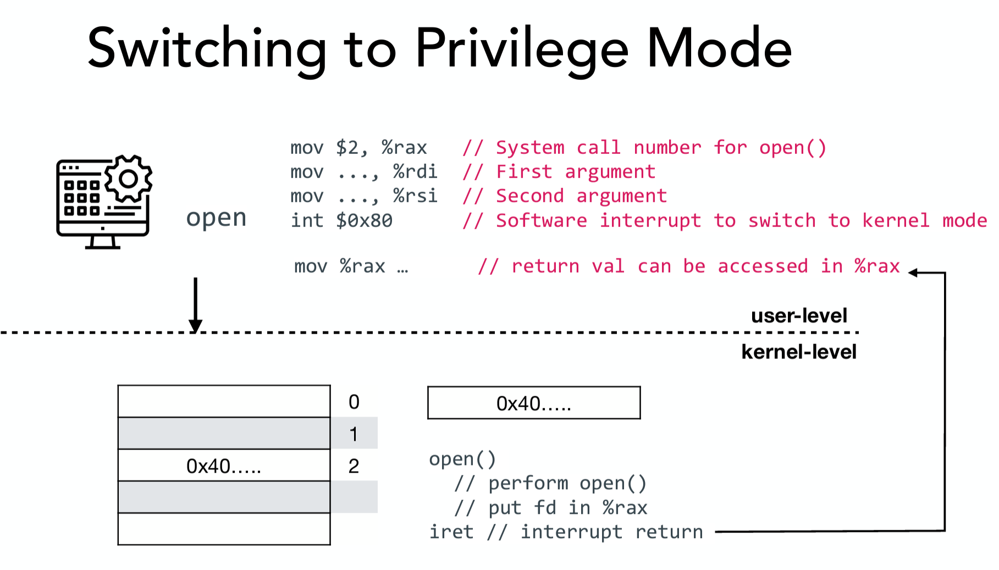
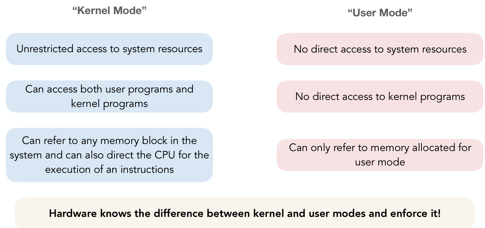
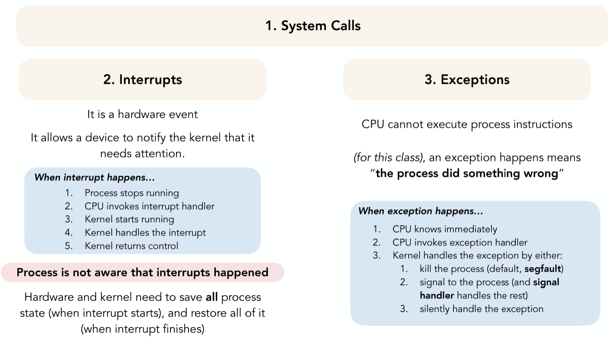

### System Call
- process control (fork, exit)
- file management (open, read, write)
- device management 
- information maintenance (time, date)
- communication (pipe, socket)

#### Difference with function call
- Calling Convention
  - System call: registers (except **%rax** specifying system call) are call-preserved (the value of all these registers remain unchanged)
    - eg. save %rdi, %rsi, %rdx
  
    - after int (interrupt): user-level blocked
    - from user-process prospect, nothing change except %rax

##### Privileged Mode v.s. Unprivileged Mode
 

#### 3 Ways to invoke the Kernel
 

#### System call for Process Control
 - **Process identification**
   - getpid(), getppid() (parent)
 - **Process Creation** (fork())
   - **inherits**: program code, program counter, memory (copied for child), opened file
   - **different**: ret value, pid, parent, running time
   - don't know who runs first
   - parent can use wait() to make sure child process finish first
 - **Process execution**
   - **exec**("code2", args, env) --> start execute code2, never returns to orginal code
   - **discards**: memory, register
   - **preserves**: pid, process, relationship, running time

