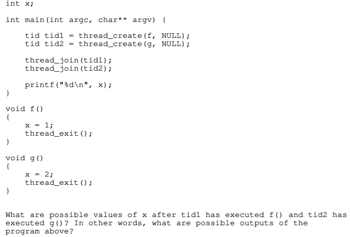

### Threading
- a process doing multiple tasks
- each thread have multiple registers, stacks, but share memory spaces, code, data, files
- | single thread | multi threads | 
  | :--: | :--: |
  |stack | thread 1 |
  | stack | thread 2 |
  |stack | ... |
  | heap | heap |
  | code, text, files | code, text, files |

##### **PCB** (process control block) and **TCB** (thread control block)
- **PCB**: a data structure inside kernel contains process-specific information (pid, opened files..)
- **TCB**: a data structure inside kernel contains thread-specific information (thread id, PCB pointer so that thread can access shared resources)

#### Interface to threads
1. **tid thread_create(void (*fn) (void *), void	*arg);**
   - **void (*fn)(void *)**: pointer to the function that thread will execute
   - **void *arg***: args to be passed into the thread function
   - **return**: thread id (tid) or error
   - **system call**: clone() internally

2. **void thread_exit(); terminate the calling thread**
   - **system call**: exit() internally
   - marks the end of a thread's execution, but leaves the thread's resources in place
3. **void thread_join(tid thr);** wait for specific thread (thr) to terminate and releases its resources
4. **void thread_destroy(tid thr);** fully cleaning up and deallocating the thread's resources after it has exited

- **What happens if not release the resources after exit()?**
  - **Zombie thread that continue consumes system resources and may cause resource leaks**

##### example:

- Workflow: instructions in both threads may execute **intersectly**. x=1 in f() may executes, then x=2 in g() executes, then thread_exit() in g() executes, then thread_exit() in f() executes.
