## Concurrency
- sumultaneous execution of multiple tasks
- allow CPU to work on other tasks while waiting for I/O to complete
- broader concept (include thread)
- multiple CPUs, memories, computers

### Race condition
- def: multiple threads of execution enter the critical section at the same time
- **critical section**: codes access a shared resource and must not be concurrently executed by more than one thread
- Assume **Sequential consistency**: writes to each memory location happen in the order they are issued on each individual processors

### Solution

#### Properties of solutions
   1. **Mutual Exclusion/Atomicity**: Only one thread can be in critical section at a time
   2. **Progress**: If no thread is executing in critical section, then one of the threads trying to enter a given critical section will eventually get in
   3. **Bounded Waiting**: Once a thread T starts trying to enter the critical section, there is a bound on the number of other threads that may enter the critical section before T enters 

#### 1. **Mutex**
- **purpose**: ensure exclusive access to a shared resource by allowing only one thread at a time
- **usage**: 
  1. A mutex is acquired by a thread before accessing a shared resource. 
  2. Once it's done, it releases the mutex. 
  3. If another thread tries to acquire a mutex that is already locked, it will wait until the mutex is released by the thread that owns it. 
- **example**: 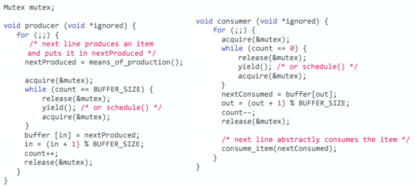
- **issue**: (some conditions) busy-waiting: acquire locks, check conditions again and again, waste CPU resources

#### 2. **Conditional Variables**
- **purpose**: used to synchronize threads based on a specific condition. It allows threads to wait (sleep) until waken up by the signal sent from other threads. **Solve busy-waiting**
- **interface**:
  1. void cond_**init**(Cond *cond, ...); : initialize CV at cond
  2. void cond_**wait**(Cond *cond, Mutex *mutex); : automatically release mutex (lock) and sleep until conditional variable is awakened (signaled), it reacquires the mutex
  3. void cond_**signal**(Cond *cond); : wake up the thread waiting on conditional variable cond
  4. void cond_**broadcast**(Cond *cond): wake up all threads waiting on CV cond
      - Broadcast can replace signal. It is not affecting mutual exclusive, but it will hurt performance since it may wake up all wait process. 
      - Signal can't replace broadcast. Both of them avoids race conditions, but may never make progress. Broadcast ensures better utilization and prevents potential thread starvation
  5. destroy(): If not, cause resource leaks, kernel resources drain

- **usage**: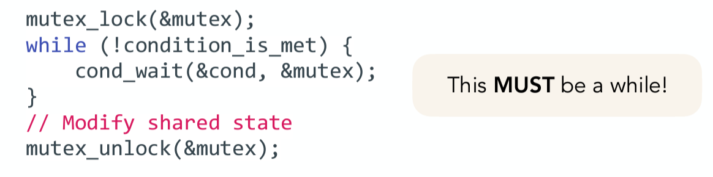
  - why must while: avoids race conditions. If using if instead of while, when broadcast happens, it won't test condition and continue execution 
- **example**: 
  ```c 
   void producer(void *ignored) {
      for (;;) {
         nextProduced = means_of_production();
         acquire(&mutex);
         while (count == BUFFER_SIZE) {
            cond_wait(&not_full, &mutex);  // Wait for space in the buffer
         }
         buffer[in] = nextProduced;
         in = (in + 1) % BUFFER_SIZE;
         count++;
         cond_signal(&not_empty);  // Signal that an item is available to consumer
         release(&mutex);
      }
   }

   void consumer(void *ignored) {
      for (;;) {
         acquire(&mutex);
         while (count == 0) {
            cond_wait(&not_empty, &mutex);  // Wait for an item to be produced
         }
         nextConsumed = buffer[out];
         out = (out + 1) % BUFFER_SIZE;
         count--;
         cond_signal(&not_full);  // Signal that space is available to producer
         release(&mutex);
         consume_item(nextConsumed);
      }
   }

#### 3. **Semaphores**
- more than mutex + conditional variables
  - allow multiple threads access, unlike a basic mutex
  - manage a count, mutex+CV do not inherently do this
- **Interface**
  1. **sem_init**(&s, 0, 1):
     1. flag (second parameter): 
         - 0: shared between threads within a single process; 
         - non-zero: shared across processes
     2. value of the semaphore (binary semaphore) (third parameter):
         - 0: lock state 
        - 1: unlock state (represents mutex)
        - other non-zero: unlock state representing availble resources
  2. int **sem_wait**(sem_t *s): decrement the value of semaphore s by one, wait if value of semaphore s is negative
  3. int	**sem_pos**t(sem_t *s): increment the value of semaphore s by one, wake one if there are one or more threads waiting. 
- **example**: 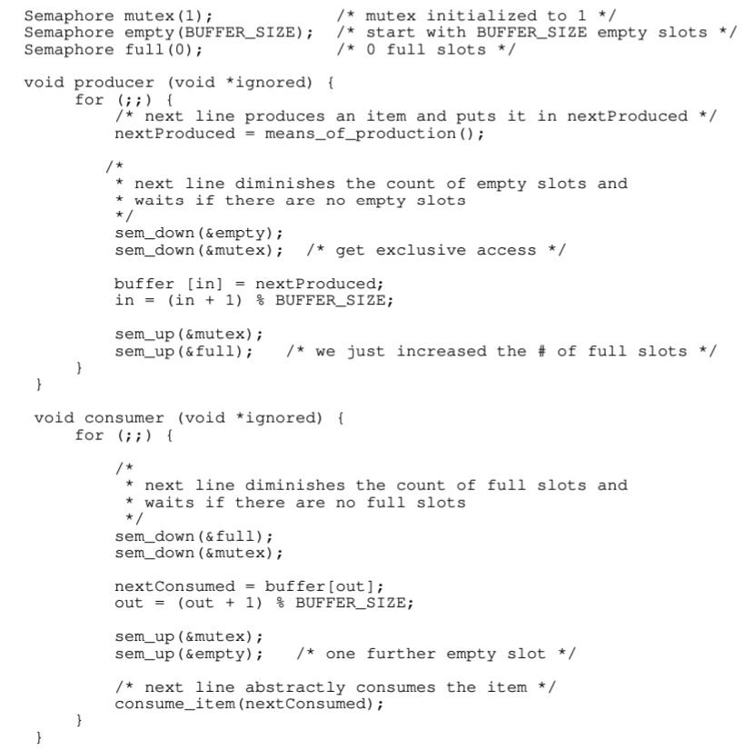
  
#### 4. Monitor
   - **idea**: 
      - **wrap all method calls accessing shared resources by a mutex**
      - seperate program logic inside threads from the shared object, which means handle synchronization internally so threads don't need to worry about locking, unlocking, signaling
   - **usage**
     1. acquire/release at beginning/end of methods
     2. hold lock when doing condition variable operations
     3. a thread that is in wait() must be prepared to be restarted at any time, not just when another thread calls "signal()"
     4. don't call sleep()
   - example: 
   
      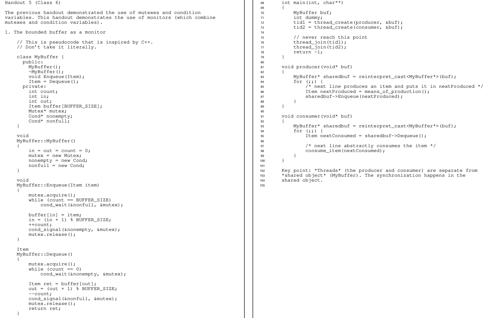

#### 5. Other implementation not using mutex
##### 5.1. Peterson's algorithm
   - **main variable**:
      - **flag[]**: bool list representing whether threads are ready to enter the critical section. flag[i] means thread i is ready to enter the critical section
      - **turn**: int that shows which thread has the priority to enter the critical section--> to prevent deadlock
   - **example**: 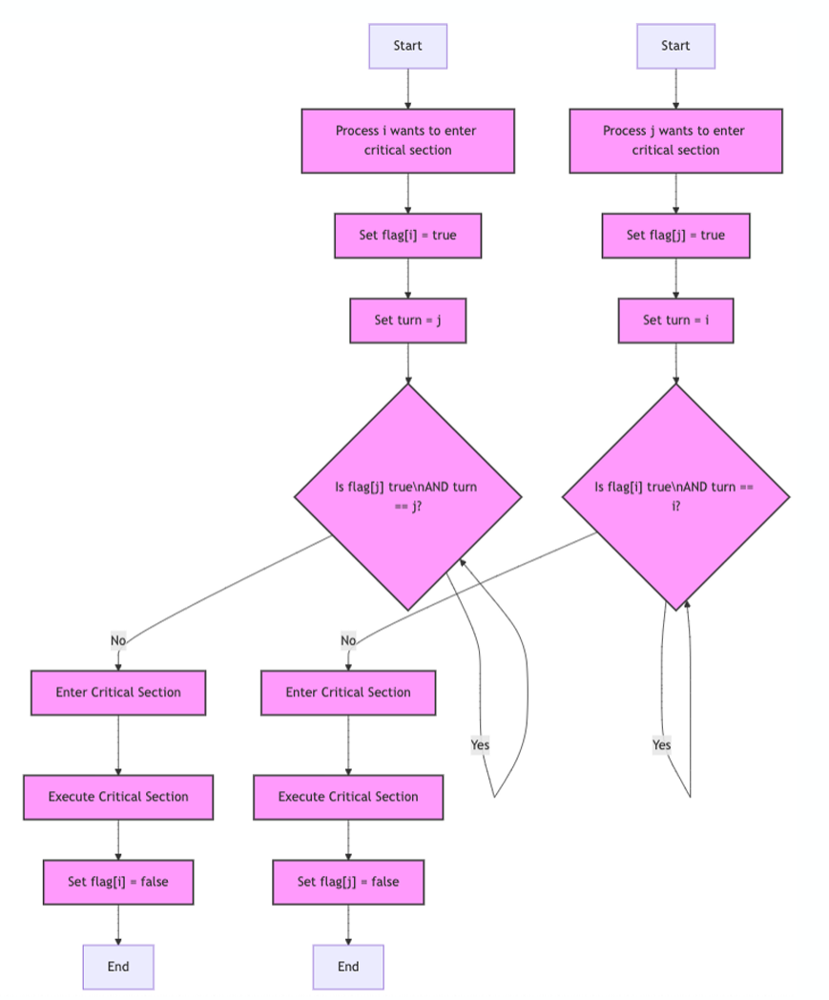
   - **pros**: 
      1. **deadlock-free**: two threads won't wait for each other endlessly. One thread is waiting to enter the critical section, the another thread must quit
      2. **starvation-free**: threads have equal chance of entering critical section. Each thread won't be blocked for a long time. Threads enter the critical section in turns.
   - **cons**:
      1. **busy-waiting**
      2. **requires fixed number of threads**

##### 5.2. Spinlock
   - **idea**: spinlock works like a manager to tell whether lock is available and give lock
   - **example**: 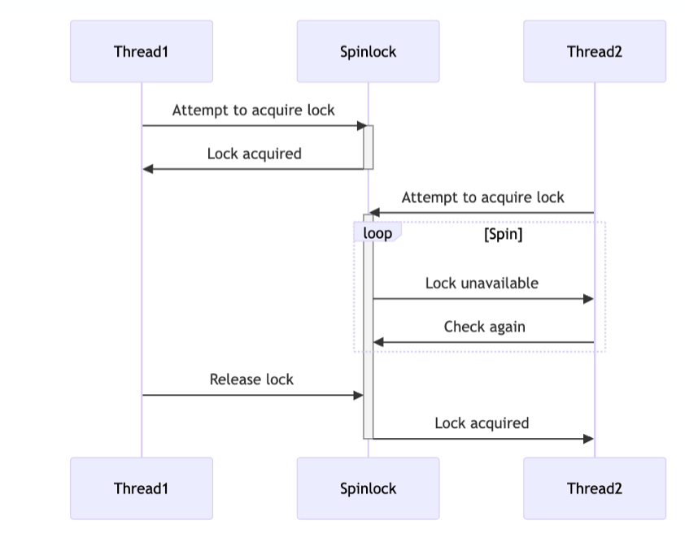
   - 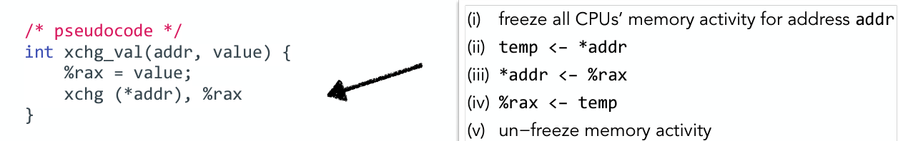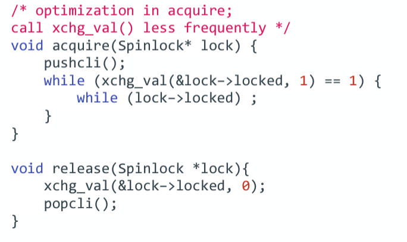
     - **&lock->locked**: 0: no one holds the lock, 1: someone is holding the lock 
     - **int xchg_val(addr, value)**: each the value inside of address and the value, return the original value inside of address
     - **xchg_val(&lock->locked, 1)==1**: If lock is locked, go to the loop. If not locked, make it lock, skip the loop
     - **pushcli()**: **disable interrupts** to prevent preemption while acquiring lock
     - **popcli()**: enable interrupts
   - **techniques**: **Atomic Instruction, implicit memory barrier, busy-waiting**
   - **issues**: busy-waits, starvation, cross-talk among CPUs, fairness issues

##### 5.3 Spinlock + queue
   - **implementation**: **atomic instruction, implicit memory barrier, Busy-waiting**
      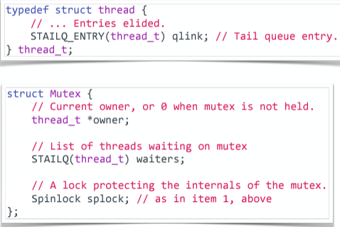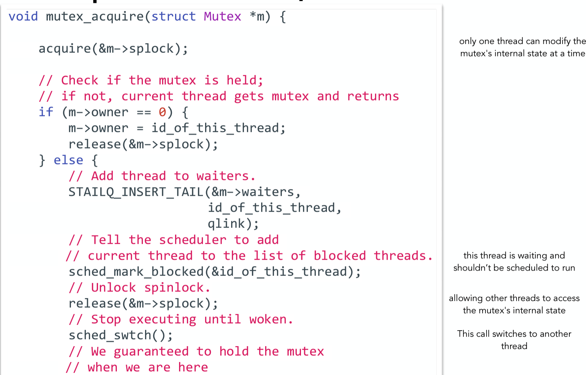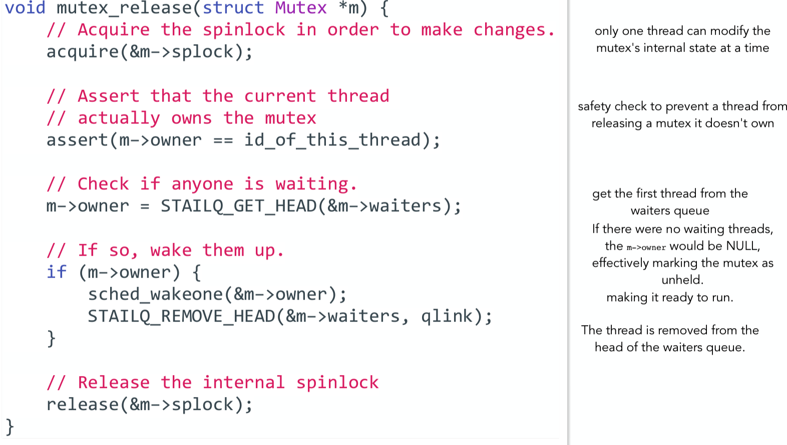

#### 6. Issues
##### 6.1 Dead locks
- **happens condition**
  1. Mutual exclusion
  2. Hold and wait
  3. No pre-emption
      - preemption: take resources away from processes that are waiting for other resources
      - force car2 to release sec 2 is preemption
  4. Circular wait
      - car1 acquires sec 1, but wants sec 2; car2 acquires sec 2, but wants sec 1
##### 6.2 **prevent deadlock**
1. know how each other work-> know other program logic ->

static analysis: hard to scale (if )

##### 6.2 Starvation
- **def**: Thread waiting indefinitely

##### 6.3 Priority inversion
- eg: 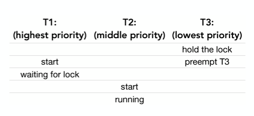
- solution: 

#### 7. Techniques
| Technique | Mutex | Mutual Exclusion | Busy Waiting | Atomic Instruction | Implicit Memory Barrier | Queue of Waiter | Deadlock Possible |
| :--: | :--: | :--: | :--: | :--: | :--: | :--: | :--: |
|Explaination | blocking threads trying to acquire it | Prevents multiple threads from accessing a critical section simultaneously. | continuously checks a condition in a loop until it's satisfied. | instruction that ensures atomicity of operations to avoid race conditions. | Protection on shared memory | queue to hold threads waiting for a resource | Circular wait and No preemption |
| CV | independent  | Yes | No | No | Yes | Yes | Yes |
| Semaphore | independent | Yes | No | Yes | Yes | Yes | Yes |
| Monitor | Yes | Yes | No | No | No | Yes | Yes |
| Peterson's Algo | No | Yes | Yes | No | No | No | No |
| Spinlock | No | Yes | Yes | Yes | Yes | No | Yes


### System/Kernel Level
- **mutex_lock(&m)** that m is already held by another thread
  - state: RUNNING->BLOCKED
  - READY condition: mutex is available. OS won't let thread continue executing without holding the lock
- **cond_wait(&cv, &m)**
  - state: RUNNING->BLOCKED
  - READY condition: (and also need mutex be available, else BLOCKED)
      1. signal or broadcast
      2. kernel can wake it up through spurious wakeup or other system event


### Advice for Concurrent programming
- safety first
   - put much code in lock, correctness first, then performance
- **usage**
   1. identify unit of concurrency (How many threads, what does each thread for)
   2. identify chunks of state (which part for synchronize state, what's going to be shared)
   3. write down high-level main loop of each thread
   4. write down the synchronization constraints, and the type (mutual exclusive ...)
   5. create a lock or CV for each constraint
   6. implement the methods, using the locks and CVs
- **good**
  1. mutual exclusive
  2. fairness: each thread get a shot at acquiring mutex once it is free
  3. What is the time overheads added by using the lock?
