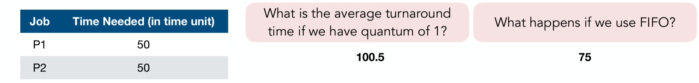

## Scheduling
- Operating system decide scheduleing (what next thread/process to run) 
- 
  - **preemptive scheduling**: os can forcibly stop the currently running thread, send it back to ready or waiting state, and switch to a higher-priority thread
  - **non-preemptive scheduling**: currently running thread will continue executing until it calls a function like cond_wait(), waits for I/O, or finish its execution even if a thread with higher priority is in the ready state

### 1. metrics
1. **Turnaround time**: time for each process to complete (time difference between start and complete)
2. **Waiting/Response/Output time**
   - ***Response time***: time between when jobs enters system and starts executing. (mostly only care)
   - output time: time from request to first response
3. **System throughput**: # of processes that complete per unit time
4. **Fairness**: -free from stavation, -all user get equal CPU time, -high priority job get most of CPU

### 2. context switch cost
- CPU time in kernel : save (restore) register, switch address spaces
- Indirect cost: manupulate cache (not important)
  
**More frequent context switches will lead to worse throughput (higher overhead)**

### 3. Scheduling disciplines (without I/O)
1. **First Come First Serve (FCFS)/ First In First Out (FIFO)**: Run each job until it's done

2. **Shortest Job First (SJF) and STCF**: Shedule the job whose CPU burst (time to complete) is the shortest at current time

- for SJF: |----P1(7)----|--P3(1)--|----P2(4)----|----P4(4)----|

   - **pros**: good disk utilization, low overhead (no needless preemption), minumum average turnaround time
   - **cons**: low running job get staved, does not optimize response time, require predicting the future

3. **Round-robin (RR)**
   - Considering response time: preempt CPU from long-running jobs (per time slice/quantum). If a job hasn't finished by the end of time slice, put it back to the ready queue.
   - **pros**:
      - "fair" allocation of CPU accross jobs
      - low average **respoonse time** when job length vary
      - good output time if you run a small # of jobs
   - **cons**
      - it does not care about turnaround time
   - 
     - Turaround time if RR: (100+101)/2 = 100.5 (since context swich); If FIFO: (50+100)/2 = 75
   - **choose quantum size**:
     - Want much larger than context switch cost (amortization)
     - Majority of bursts should be less than quantum
     - If too small -> spend too much time context switching
     - If too large -> response time suffers (and reverts to FIFO)

4. **MLFQ (Multi-Level Feedback Queue)**
   - Maintains multiple queues with different priority level.
   - **Mechanism**
     - **Dynamic Priority Adjustment**: Processes that uses up of its time allotment, it moved to lower-priority queue
     - **Aging to prevent starvation**: Process's priority increases if hasn't been executed for a while (Give higher priority that use less CPU time)
     - **Preemption**
     - Process B will only run only if there's no process that is in higher priority queue
     - When a job enters the system, it is placed at the highest priority queue
     - In a queue, processes run in RR using the given quantum length
   - **pros**
     - give higher priority to process that use less CPU time
     - reduce turnaround time, response time for short jobs
     - fariness

5. **Lottery scheduling**

- **higher ticket, higher chance of getting into lottery**

- **Stride Scheduling**: reduce the redomness in lottery sheduling, focusing on **fairness** more thhan ticket

6. **completely fair scheduler (CFS)**
- not really completely fair, **distribute CPU time fairly among all runnable processes using a virtual runtime metric**, by red-black tree
- **balancing fairness and efficiency**

### Scheduling disciplines with I/O

### Scheduling Policy Comparison
| Scheduling Policy | Preemptive | Track CPU usage | Starvation Possible | Opt Turnaround | Opt Throughput | Opt Response time |Fairness |Overhead (Context Switches...) | 
|:--: |:--:|:--:|:--:|:--:|:--:|:--: |:--:| :-:|
|FIFO/FCFS| depends | No | Yes | No | No | No | Low | Low |
|SJF/SJCF| depends | No | Yes | ****Yes*** | Yes |No |Low | Medium |
|RR| Yes | No | No | No | No |****Yes***| Medium (or ****high***) | High |
|MLFQ| Yes | ****Yes*** | ****No*** | No | No | Yes | ****high***| High |
|Lottery Scheduling| Yes | Yes | ****No*** | No | No | Yes | Medium | Medium |
|Stride Scheduling | Yes | Yes | No | No | No | Yes | ****high*** | High |
|CFS| Yes | Yes | No | No | No | Yes | High | High|

### Implicit Scheduler of CPU
1. **Interrupts**
   - Interrupts force interrupt handler to run to stop CPU from executing process
2. **Mutex**
   - Mutexes block threads, they are implicitly allocating the CPU