## Virtual Memory
- each processs has its own view of memory (address space of processes), this memory is **virtual memory**
- **pros**:
  1. **Programmability**: program think it owns the whole physical memory (but it doesn't); program don't need to be aware about available physical memory
  2. **Protection**: or isolatioin, program cannot read/write each other's physical memory
  3. **Efficient use of resources**: don't need worry about sum of the memory consumed by all active processes is larger than physical memory
- what is virtual address
  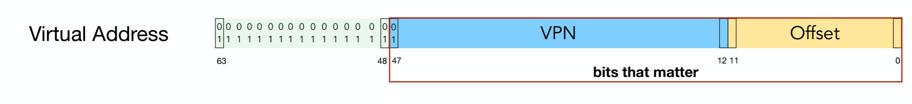
  In x86 architecture, only part of has 64-bit virtual address space in CPU is used. Bit patterns that are valid addresses are called **Canonical Addresses**
  - why not all 64-bit: don't have such hardware resources to support such large memory space
  - if bit-47 is 0 (or 1), then bit 63-48 is all 0 (or 1), otherwise invalid

### Mapping Virtual memory to physical memory
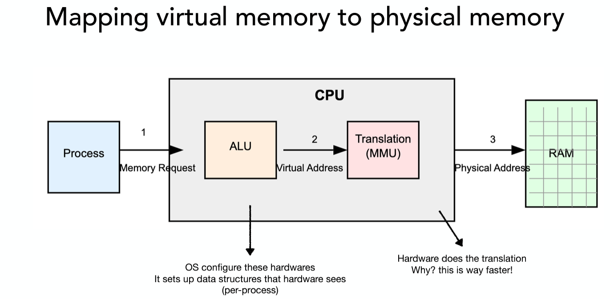
- memory request (movq (0x4100), %rax), here 0x4100 is actuallty virtual address
- **translation**: MMU uses page table stored in RAM to find the physical address that the virtual address is mapped

### Paging
- Divide all memory (physical and virtual) into **fixed-size same-size** chunks (pages)
  - traditionally, **page size is 4 KB = 2^12 B**
  - why same size? easy to management
- Each process has a seperate mapping (its **own page tables**)
- Each page is separately mapped (to physical memory)
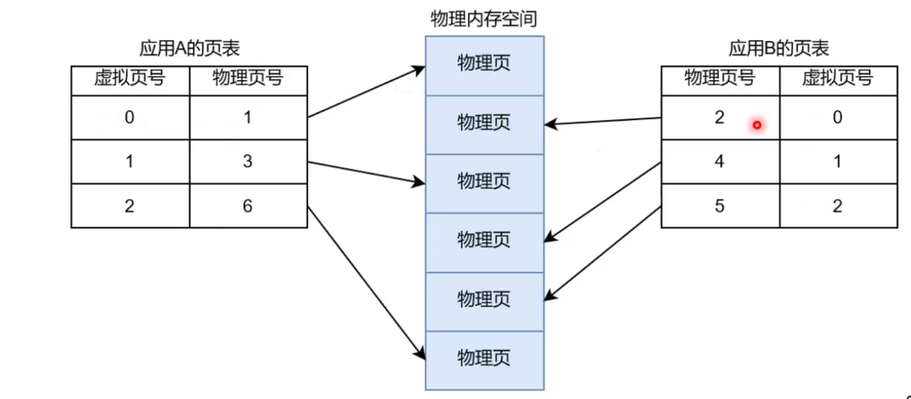
- Invalid operations trigger trap (OS take control)
  - a process tries to write to a page marked as read-only
  - a process tries to access a page marked as invalid
  
#### Page table
- **Page table stored in Physical memory, Virtual Page stored in Physical memory (if loaded), or Disks (if not loaded)**
- a map from VPN to PPN
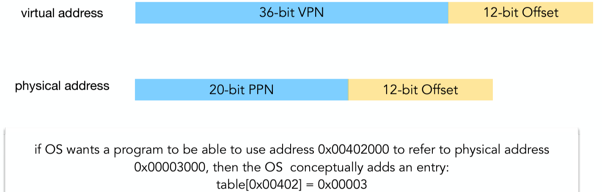
- each page table entry expresses a mapping about a contiguous group of addresses inside a physical page
- **issue**: **Could be terribly large** (36-bit VPN, in x86 system each page table takes 8 byte, then we use $2^36 * 8 = 512$ GB)

#### Multi-level page table
- cost efficient than linear page table
- use tree for different levels of page table, but only fill in parts that are actually in-use, **leafs are the pages for PTEs that shows PPN**
- Each level uses a portion of the virtual address to index into its table
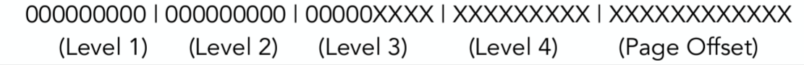

- **translation**
  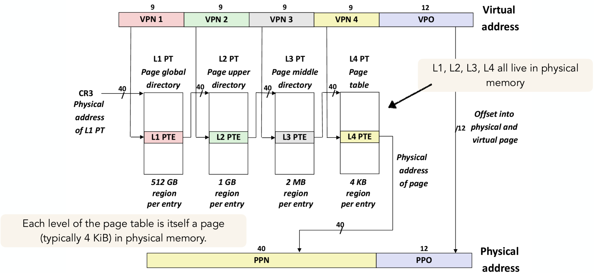
  - **%cr3**: Page-Directory Base register. It is a static pointer that always hold the base L1 Page Table address fo current running process. L1 PT address must be known to CPU.
  - **Process**
    1.`%cr3` holds the `Physical Address` of `L1 PT`. `bits 47-39` in `Virtual Address` gives the index of `L1 PTE`. `MMU` sends the calculated `L1 PTE address` to `Cache/Memory`, and get `L1 PTE` back to `MMU`
    2. `L1 PTE` holds the `PA` of `L2 PT`. `bits 38-30 in VA` gives the index of `L2 PTE`. `MMU` sends the calculated `L2 PTEA` to `Cache/Memory`, and get `L2 PTE` back to `MMU`
    3. `L2 PTE` holds the `PA` of `L3 PT`. `bits 29-21 in VA` gives the index of `L3 PTE`. `MMU` sends the calculated `L3 PTEA` to `Cache/Memory`, and get `L3 PTE` back to `MMU`
    4. `L3 PTE` holds the `PA` of `L4 PT`. `bits 20-12 in VA` gives the index of `L4 PTE`. `MMU` sends the calculated `L4 PTEA` to `Cache/Memory`, and get `L4 PTE` back to `MMU`
    5. `L4 PTE` holds the `PA` of the 4KB page. `bits 11-0 in VA` gives the offset of `PA`. `MMU` sends the calculated `PA` to `Cache/Memory`. 
  - $(2^{18}+1)$ allocations of size of $2^{12}$ bytes (4KB) of memory each:
    - $(2^{18}+1)$ (physical pages for the memory) + 1 (L1) + 1 (L2) + 2 (L3) + $(2^{9}+1)$ (L4)

- **Page Table Entries (PTEs)**
  - each PTE is $4KB/2^9 = 8 Byte$
  - **L1-3**: 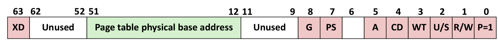
    - **P**: Child	page	table is	present	in	physical	memory	(1)	or	not	(0).
    - R/W:	Read-only	or	read-write	access	access	permission	for	all	reachable	pages.
    - U/S:	user	or	supervisor	(kernel)	mode	access	permission	for	all	reachable	pages.
    - WT:	Write-through	or	write-back	cache	policy	for	the	child	page	table.	
    - A:		Reference	bit	(set	by	MMU	on	reads	and	writes,	cleared	by	software).
    - PS: only set in L2  or L3. If set (1), it directly maps to a large page (2MB or 1GB) for more PTEs or performance. If 0, it maps to the next level 4KB page table as normal
    - **Page	table	physical	base	address**: 40 most significant bits that contains physical address that **only show PPN** (no offset), and it forces page tables to be 4KB aligned
    - XD: Disable	or	enable	instruction	fetches	from	all	pages	reachable	from	this	PTE

  - **L4**: 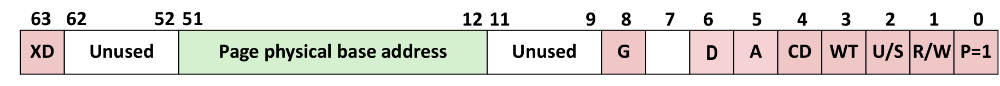
    - **P**: Virtual Page is presentg in memory (1) or not (0).
    - no PS: every address it points to is 4KB
    - **A: Set when page referenced; cleared by an algorithm like CLOCK**
    - **D:  Dirty	bit. Set when page modified; cleared when page written to disk**

- **tradeoffs**
  - **page size**
    - large: waste actual memory
    - small: too much page table entries
  - **level of mapping**
    - many: costly for hardware to walk
    - few: cost more spaces

#### Speed up MMU translation by TLB
- TLB inside MMU is a hardware cache of virtual-to-physical address translation (just tell mapping)
  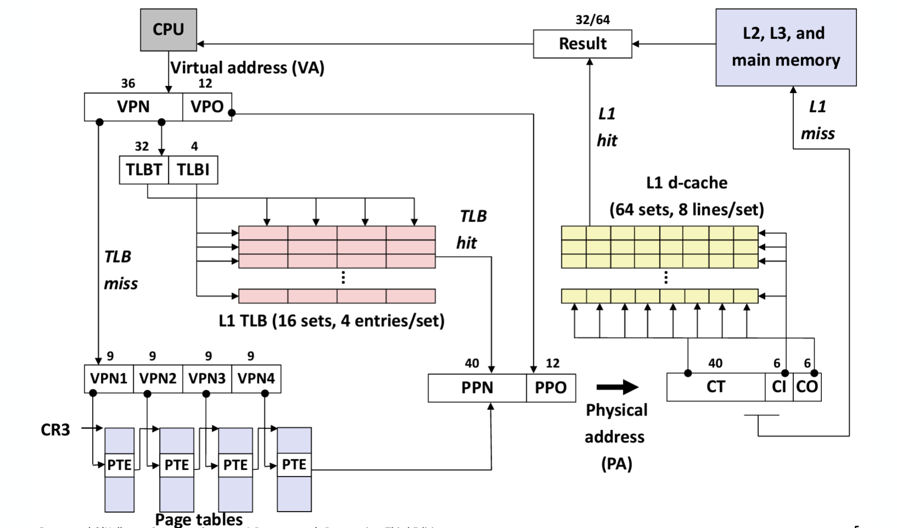
  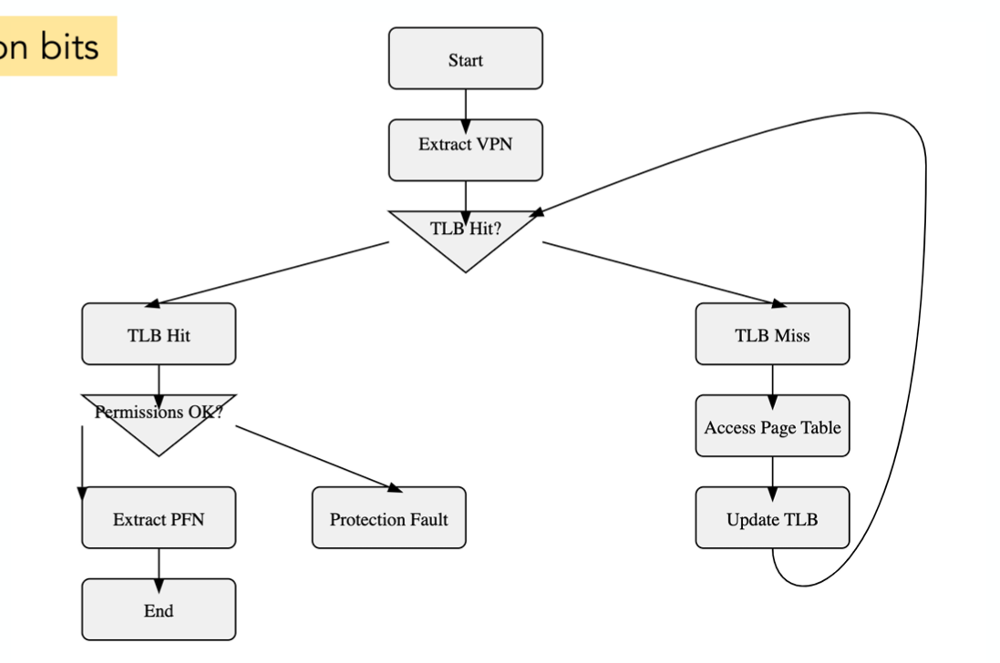
  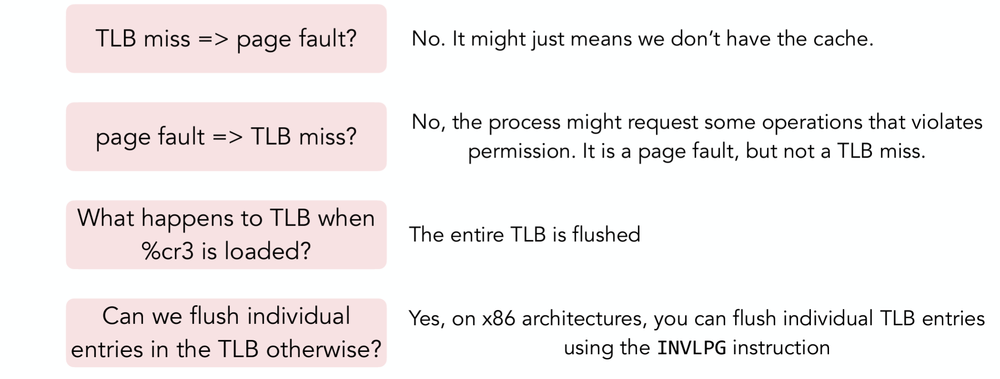
  - TLB miss but not page fault: TLB doesn't contains the mapping since it hasn't used for a while, but the page is stilled mapped in memmory.
  - Page fault but not TLB miss: TLB contains the entry for mapping, but access violate page's permission (trying to write to read-only or not present page)

#### Page Fault
- A reference is illegal (hardware think), either because it's not mapped in the page tables or because there is a protection violation.
- **How OS get involved**
  Process constructs a trap frame and transfer execution to an interrupt/trap handler
  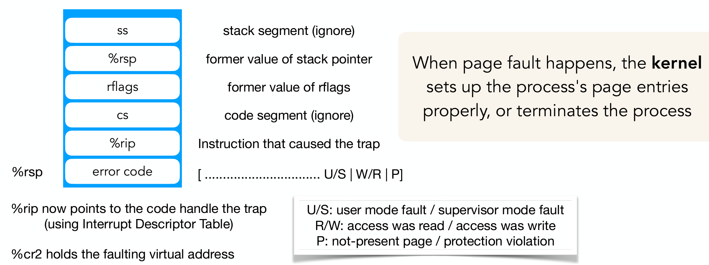

- **How occur**: **Overcommiting physical memory**
  - Disk is used to store memory pages
    - Pros: Huge address space
    - Cons: accessing disk is slow
  - **conditions**
    - kernel is out of memory
    - the page that it slects to write out is dirty

- **other cases**
  - ***copy-on-write (fork,mmap)***
    - when creating a copy of another process, don't copy its memory, but just copy the page tables, mark these pages as read only
    - when a new process writes to the memory, it triggers a page fault -> kernel will copy the pages (that is going to be used) to new location with write permission
  - Accounting
    - sample what percentage of the memory pages are written in any time slice
  - Store memory pages accross the network
  - **malloc handle page fault**:
    - prior to first
      - malloc lay out the allocated memory so that the first legitimately allocated byte is exactly on the first byte of the allocated page (which may waste the latter part of the page)
      - Mark the prior virtual page as not in use by setting present bit to 0 in its PTE
    - next to last
      - malloc lay out the allocated memory so that the last legitimately allocated byte is exactly on the last byte of the allocated page (which may waste the first part of the page)
      - Mark the next virtual page as not in use by setting present bit to 0 in its PTE
- **implementation**
  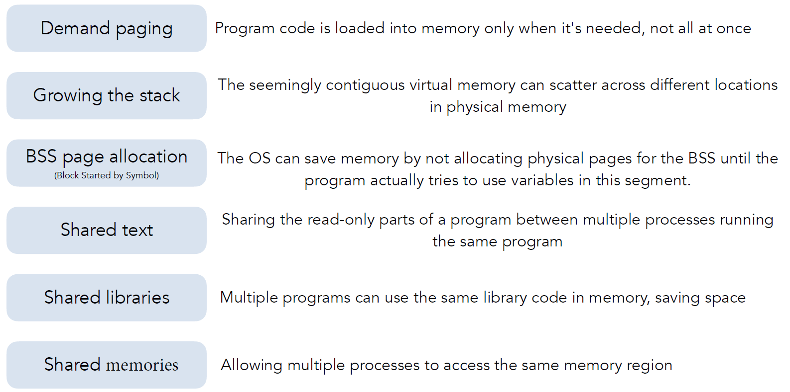

- **Demand paging**: page-not-present in memory
  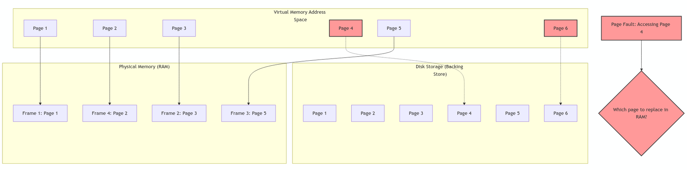
  - **Page Replacement policy**
    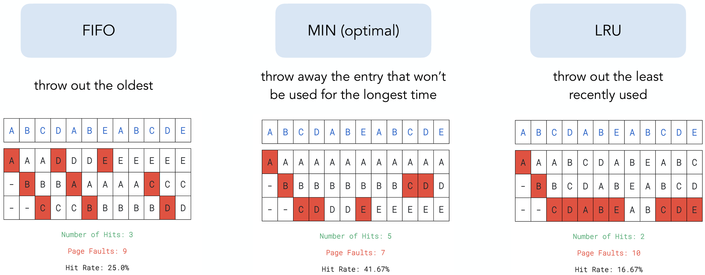
    - **Min**: requires forecasting future memory access
    - **LRU**: keeps updating the data structure
       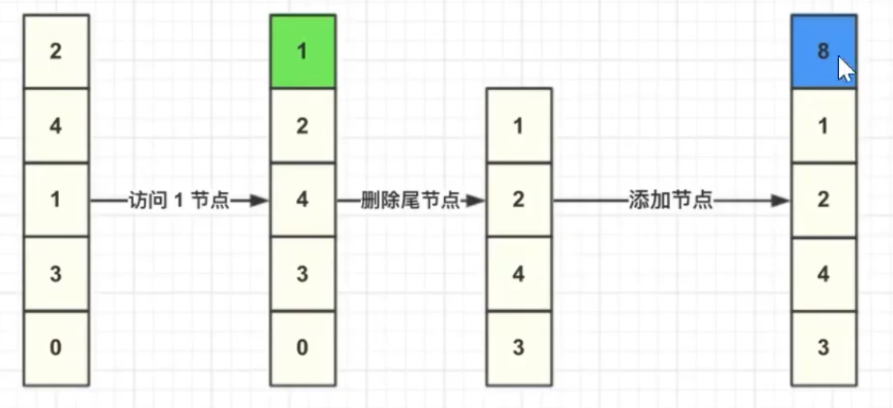
      - approximate OPT when principle of temporal locality holds strongly
      - **implementation: CLOCK**
        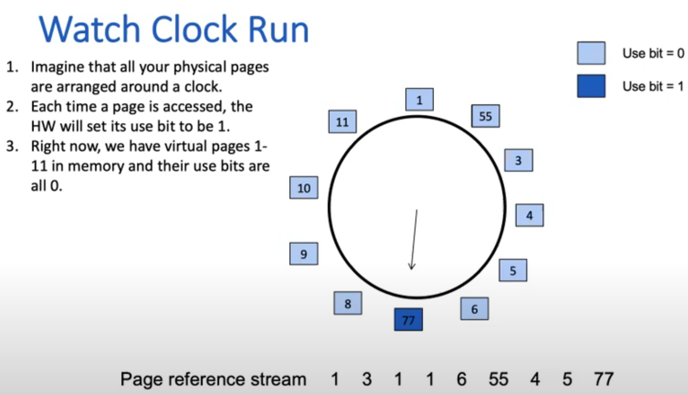
        - if page is in physical memory, set use-bit = 1
        - if not, starting from the clock hand
          - if the pointed page has use-bit = 1, set its use-bit to 0, go to the next page
          - if the pointed page has use-bit = 0, kick it out and put the target page in, and set its use-bit to 1

- **cost**: **expensive**
  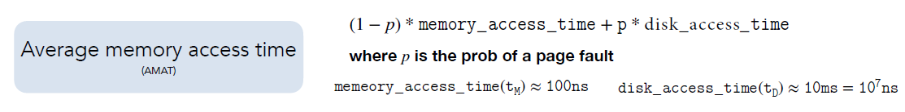

- **Thrashing**: system spends more time swapping pages than executing actual processes
  - **cause**: each processes fit the memory individually, but too much to fit for all processes in the system
  - **Working set**: set of pages that the process is actively using at given time
    - solution: only run set of processes s.t. the union of their working sets fit in memory
  - **Page Fault Frequency** = # page faults/instructions executed
    - solution: if above a threshold, and there's no enough memory, swap out the process

