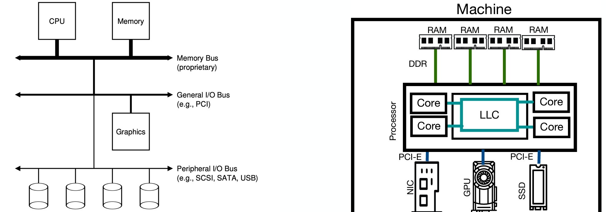
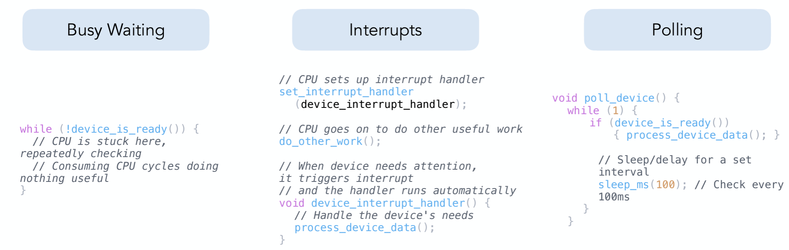
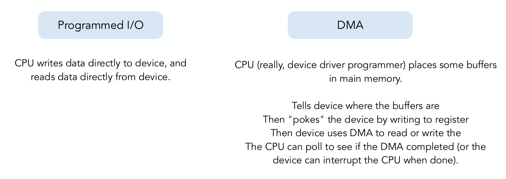
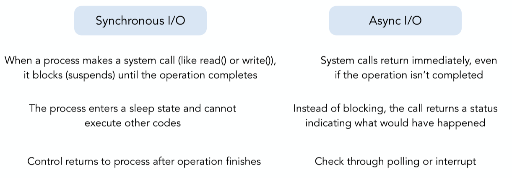
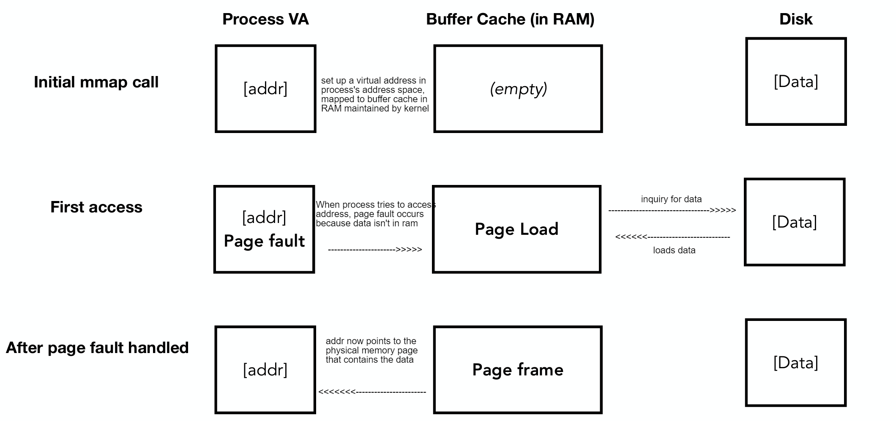
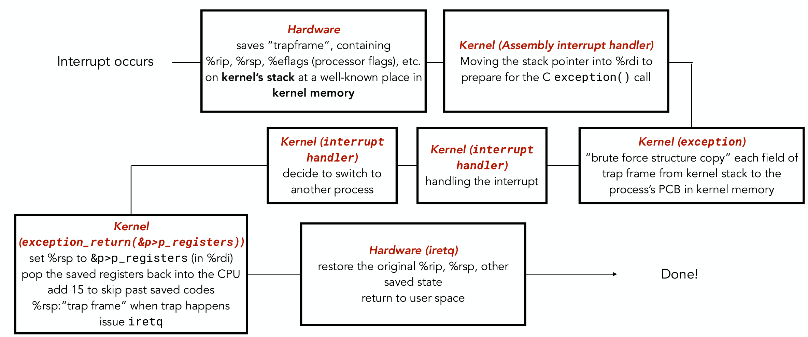
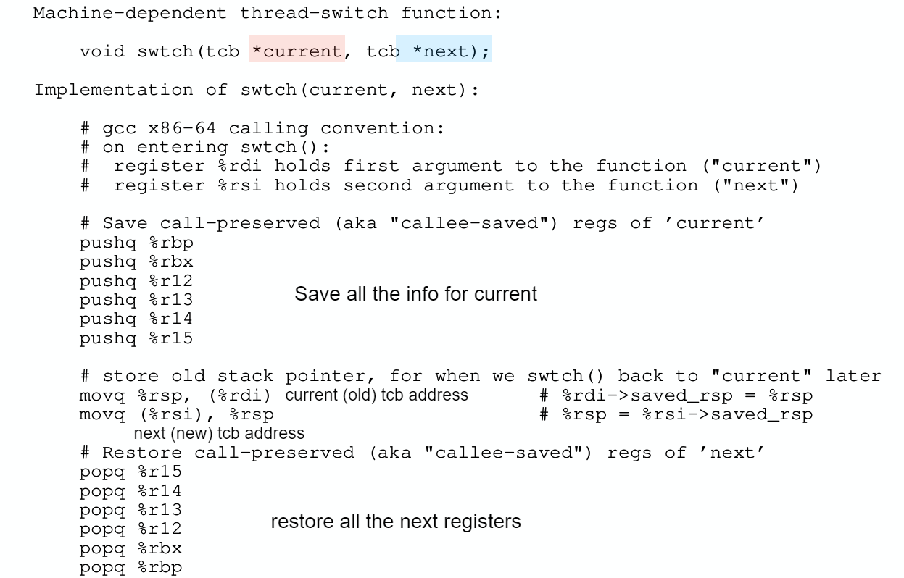
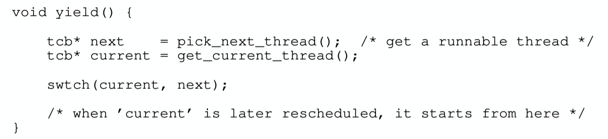

## Virtual Memory Usage

### 1.I/O
- I/O architecture: 

#### **Mechanics of CPU(kernel)/Device Interaction**
  - **1. Explicit I/O instructions** 
    - **outb, inb, outw, inw**: w(word), 2 byte; b(byte), 1 byte
    - **keyboard_readc()**
    - **console_show_cursor()**
    - LBA (**disk**): linear block addressing, each sector get a unique # starting from 0, totally $2^{28}$ sectors
    - Command Block Registers:
      - Address 0x1F1 = Error 
      - Address 0x1F2 = Sector Count -> how many sector you will read
      - Address 0x1F3 = LBA low byte 0-7
      - Address 0x1F4 = LBA mid byte 8-15
      - Address 0x1F5 = LBA hi byte 16-23
      - Address 0x1F6 = 1B1D 24-27   TOP4LBA: B=LBA, D=drive 
      - Address 0x1F7 = Command/status
    - status register (address 0x1F7):
       |7| 6 |5 |4 |3| 2| 1| 0|
        |:-:|:-:|:-:|:-:|:-:|:-:|:-:|:-:| 
        |BUSY| READ| FAULT| SEEK| DRQ |CORR |IDDEX| ERROR|
  - **2. Memory-mapped I/O**: lower memory address (650K-1MB) don't refer to actual RAM
  - **3. Interrupts**
  - **4. Through memory**: Both CPU and the device see the same memory, so they can use shared memory to communicate

##### Polling vs. Interrupt
  

##### Programmed I/O vs. DMA (direct memory access)
  

#### Device Driver
  - Device drivers act as a bridge between hardware devices and the operating system kernel
  - **Interface**
    - reset(): Initializes or resets the device
    - ioctl(): Provides device-specific controls 
    - read()/write(): Standard data transfer operations 
    - handle_interrupt(): Manages hardware interrupts
  - **Pros**: simply development
  - **cons**: have to "know" what OS doing even it don't know; buggy

#### Synchronous vs. Asynchronous I/O
  
  more task to handle v.s. efficiency

### 2. mmap()
- **how does the OS ensure that it's only writing back modified pages?**: using **dirty bit**: maked as dirty if written back to disk

#### 2.1 normal memory
- **interfaces**
  - fd = open (pathname, mode)
    - **fd (file descriptor): indexes into file descriptor table maintained by the kernel on behalf of the process**
  - write(fd, buf, sz)
  - read(fd, buf, sz)
- steps when process want to perform an operation on an opened file
  1. process's file descriptor table maps fd to an entry in open file table (in kernel) --- (process level)
  2. open file table contains pointer to inode entry --- (system level)
  3. inode table contains metadata (file size, permission, disk location) for each file --- (system level)
  4. if file's data is cached in kernel memory, retrieve it to buffer in user space directly. Else, retrieve it from disk using inode table to buffer
  
#### 2.2 with mmap()
**`void* mmap(void* addr, size_t len, int prot, int flags, int fd, off_t offset);`**
- **parameters**
  - `addr`: virtual memory in process's address space
  - `prot`: bitwise OR of `PROT_READ`, `PROT_WRITE`, ...
  - `flags`: mapping sharing options to other process: `MAP_SHARED`, `MAP_PRIVATE`, ...
- **purpose case**
  - creates a mapping between the file data (may be cached or demand paging) in **pysical memory maintained by kernel** and **process's virtual memory**
- **usage**
  - **Copying a file to stdout without transferring data to user space**: in normal operation, we need move page data to process's buffer from kernel
  - **reading big files** (by demand paging): in normal operation, we manual break down the big file and move each chunk of them to memory
  - **shared data structure** (when flag is `MAP_SHARED`): different process can create their own mappings to same physical address maintained by kernel
  - **file-based data structures**

- **steps**
   

#### 3.Context Switches
- **process**
  

##### Kernel-level Threading
- Kernel directly manage the threads
- Multiple threads within the same process share the same %cr3 value  (which points to a page table, meaning threads share the same memory space)
- Kernel threads are **always preemptive**!

- **switched**:
  - Switching the view of memory (%cr3)
  - Switching the registers

##### User-level Threading
- managed in user space by a threading library/package, kernel only sees a single process
  - package is responsible for: 1. maintaining TCBs; 2. Make a new stack for each new thread; 3. Scheduling 
- **switched**
  - only switch registers (by **swtch()**):  
    - swtch is called by **yield()**: 
      - yield() is called by any thread that couldn't make further progress

- can be **non-preemptive** and **preemptive**
  - non-preemptive: **Cooperative Multithreading**
    - call **yield()** to give up control voluntarily (block on I/O would also call yield())
  - **preemptive Multithreading**
    - send **signals** (eg. a timer interrupt) periodically to the thread scheduler
    - it's good for performance, but add complexity
  - **limitations**
    1. **no true parallism** (only 1 thread can execute at a time within a process even if multicore)
    2. **page fault happens**