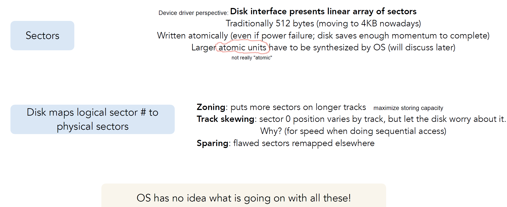

## Disks

- **Geometry of a disk**
  

- **device driver interfaces**
  
  - **sector is the smallest unit of storage that the disk drive can access**

- **Performance**
  
  - **Rotational Delay**: time to rotate to the target **sector**
    - average rotational delay = $\frac{1}{2} * \frac{60\ (s)}{Spindle\  Speed \ (RPM)}$
  - **Seek Delay**: time for heads to move to target **track**
  - **Transfer Time**: time from disk to memory or memory to disk
    - transfer time for each sector = $\frac{Sector \ Size}{Transfer \ rate }$
  - example:
    
    
    
  - **sequential reads are MUCH faster than random reads**

- **optimization**
  

- **Technology and System Trends**
  