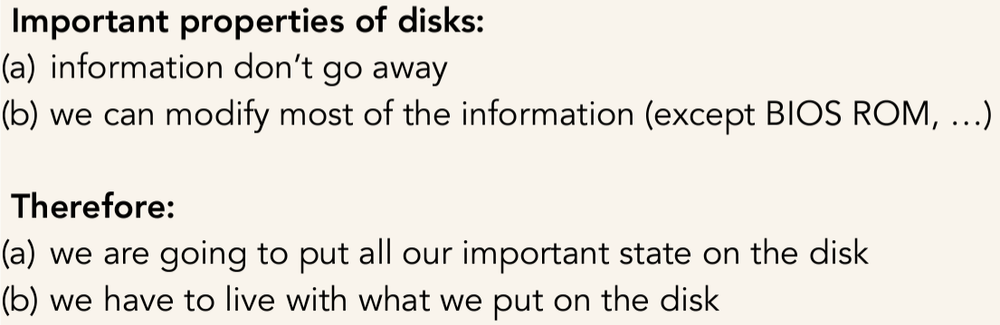
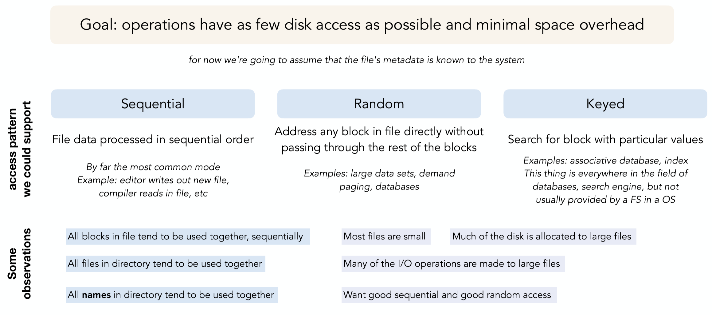

## File System

- **what does it do**:
  - provide persistence
  - files: provide a way to "name" a set of bytes on the disk
  - directories: Provide a way to map from human-friendly-names to “names”

- **where it implement**: Disk, over network, in memory, in NVRAM, on tape, with paper
  - **disk block**: the smallest unit of data that file system can read or write. File is a collection of disk blocks
  - 
  - **disk partition**: chunks of blocks (in this class each one is 4KB). First few blocks are reserved for inode, the rest are for data. 

- **what it does**: **Map name and offset to disk blocks**
  - **Goals**: **operations** (create, delete, read, write) **have as few disk access as possible and minimal space overhead** 
    - aware space utilization: it affect **cache utilization** and **I/O efficiency**

- **Address translation**
      1. With **file name**, the file system uses the **directory** to locate **file's inode** (unique ID in the system)
      2. With **offset**, the file system uses **file's inode** to find which **disk block address** the target data is stored
      3. With **disk bblock address**, retrieves the data


- **implementation** 

- **candidate designs**
  - **Contiguous** and **Linked Files**
    
  - **Indexed Files**
   
  - **Unix Inode Structure** 


#### **inode**
  - **Unique for each file**, it contains the **mapping between file offsets and disk block addresses**
  - **metadata inside a inode**
    - file size
    - file ownership
    - file permissions
    - time stamp
    - file type
    - link count
    - block pointers
      - **direct pointers**: point directly to blocks address containing **file's data**
      - **indirect pointer**: point to **indirect block** containing additional pointer to data blocks, used for **larger files** that cannot fit within disk blocks addressed by direct pointers. Each indirect block can contain $\frac{Block \ Size}{Pointer \ Size}$ pointers, referring to this many blocks
        - Single Indirect Pointer: Inode -> Indirect Block -> Data Blocks
        - Double Indirect Pointer: Inode -> Double Indirect Block -> Single Indirect Block -> Data Blocks
        - Triple Indirect Pointer: Inode -> Triple Indirect Block -> Double -> Single -> Data Blocks
    - **not in**: filename
  - **storage**
    - inodes are stored in a **fixed-size array** on **disk**, so **multiple inodes per disk block**
    - **i-number**: index of inode in the array
    - originally at one side of disk, now in pieces across disk to close to data
    - **When file is opened, inode brought in memory, and written back to disk when modified and file closed or time elapses**


#### Directories
- **purpose**:
  - **map names to file blocks on the disk**
  - use human-friendly names to represent files so that users remember where on disk their files are
- **benefits**
  - provide a structured way to organize files
  - convenient naming interface that allows the separation of logical file organization from physical file placement on the disk 
- **usage**
  - Directories stored on the disk just like regular files: a list of entries tuple (file name, inode #)
    - ```
      / (root directory) -> inode 2
      ├── file1.txt -> inode 1234
      ├── file2.txt -> inode 5678
      └── subdir    -> inode 9101
      ```
  - **naming**
    - root directory always inode #2 (0 and 1 historically reserved)
  - **Hard Link**
    - multiple directory entries point to the same node, unix stores count of pointers to inode
      - ```
        Directory A:
        file1 -> inode 12345
        file2 -> inode 12345
        ```
    - if one link removed
      - inode's link count - 1
      - actual file data and inode remain on disk
    - if all links removed
      - inode's link count = 0
      - file system marks inode as free and release the associated data blocks
    - if circular links (usually won't happen)
      - infinite loop
  - **Soft Link / Symbilic Link**
    - point to a file/dir name, but the "pointed" file/dir might not exist
    - Create a new node with a special “symlink” bit set and contains name (path) of the linked target


#### Performance
  
  - **fast file system: improvement**
    - **1. make block size bigger**
      - if data is smaller than block size
        - data transfer overhead increases
        - block wastage (internal fragmentation) increaces
    - **2. Use Bitmaps**
      - **Bitmaps**: track free blocks or inodes
        
        - bitmap size = disk size / block size / 8 (each bit represent a block)
      - **benefits**
        - easier to find contiguous blocks
        - can keep the entire thing in memory
    - **3. Clustering related objects**
      

    - **4. others**
      - big file cache
      - reduce rotation delay
      - work with big chunks
      - cluster files in the same directory
      - make data blocks and inodes closer to each other

  - **still not the best**
    - meta-data writes happen synchronously, which really hurts performance.  but making asynchronous requires a story for crash recovery


#### Problem setup (what if Fail)
- **Key issue**: crashes or power failures
  - **problematic optimizations**
    - **write-back caching**: OS delays writing back modified disk blocks
    - **non-ordered disk writes**: modified disk blocks can write to disk in an unspecified order
  - what if crash after `add to inode (new data block allocation)` and before `write the data to data block`: read garbage data
  - what if crash before update the bitmap: may be overwrite
- **background**
- **fixation: atomicity**
  1. **increase the atomic unit size**
     - **atomic**: smallest amount of data that can be guaranteed to be written or updated atomically: block size, sector size
     - **challenge**: metadata and data is spread across several disk blocks
  2. **make `adding data to file` to look atomic** (on application level)

- **Crash Recovery**
  1. **Ad-hoc (fsck)**
       - **Goal**: metadata consistency (not data consistency since too expensive)
         - if metadata (data structures) say it exist, then it must exist
       - **Arrange to send file system upstates to the disk in a way that, if there is a crash, fsck can clean up inconsistencies** 
          - inode not mark allocated in bitmap: if reachable, bitmap mark inode as allocated
          - inode is allocated, data block is not marked allocated: fsck must update bitmap to mark referenced blocks as allocated
          - file created, not in directory: fsck delete files eventually
     - **disadvantages**
       - need to get reasoning exactly right
       - poor performance: multiple updates to the same block require that they are issued separately
       - slow recovery: need to scan the entire disk
  2. **Copy-on-write**
      - **Goal**: provide both metadata and data consistency, by using more space
      - **Idea: Never modify a block, instead always make a new copy**  
      - **pros and cons**
      
      - **we can achieve data consistency when modifications do not modify the current copy**

  3. **Journaling**
      - **ensure ACID**: atomic, consistent, isolated, durable
      
      - **commit point**: update uberblock to point to new version of blocks 
      - **Implementation**
        - **Redo Logging**: logs after-images (new values) 
          - **crash recovery**: read through the logs, find **committed operations** and apply them  
          - **pro cons**: 
        - **Undo Logging**: logs before-images (original values) 
          - **crash recovery**: 
          - **pro cons**: 
        - **Combining Redo/Undo Logging**: allow dirty buffers to be flushed as soon as their associated journal entries are written. Transactions are committed as soon as logging is done 
          - **crash recovery**: 
          - **benefits**: Reduce memory pressure when necessary, and have greater flexibility when scheduling disk writes


#### NFS (Network File System)
1. **RPC (Remote Procedure Call)**


2. **Client/Server System** 


3. **NFS**


  - **Statelessness of NFS**: Every network protocol request contains all of the information needed to carry out that request, without relying on anything remembered from previous protocol requests.
  - **idempotent in NFS operation write**, but not all operations
   - pros and cons
     - pros: simplifies implementation, failure recovery
     - consL mess up with traditional unix semantics
   - **Transparency**: the system calls mean the same things
     - **question**: what if client A deletes a file and client B creates a new one using the same i-node
     - **solution: Generation Number**
       - each inode has a generation number
       - when an inode is reallocated, its generation number +1
       - **how it work**
          - when a client ask for a file (like LOOKUP), the server provides the file handle (FH) including current generation number
          - when a client ask for read or write, the server checks two generation numbers, from client's file handle and current generation number of inode in server.
          - If match, the file is still valid. If not, the client get a stale FH error
     - **Non-traditional Unix Semantics**
        - **Error returns on successful operations**
          - NFS does not keep track of client state. Request might sent but response may lose
        - **Close-to-open consistency**: when client A writes and close a file, all changes are flushewd to server during close(), then Client B will see those changes after opening the file
          - server must flush to disk before returning. It needs to make sure inode with new blcok number and new length safe and indirect block safe on disk
          - no performance issue because there are caching
          - **issues**
            - error might occur on close() rather than write()
            - legacy application don't check close() return values might fail
            - certain usage pattern, tools like tail -f don't work well since changes made by other client might not be immediately visible
        - **server failure**
        - **deletion or permission change of open files**
          - eg. A delete / make file inaccessible to others while B has file open()
     - **Security**
       - **Only security measure: IP address verification** (weak)
       - FH make it not extreme vulnerable, but does not solve all attack