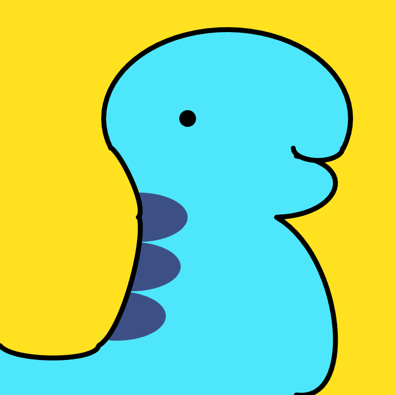
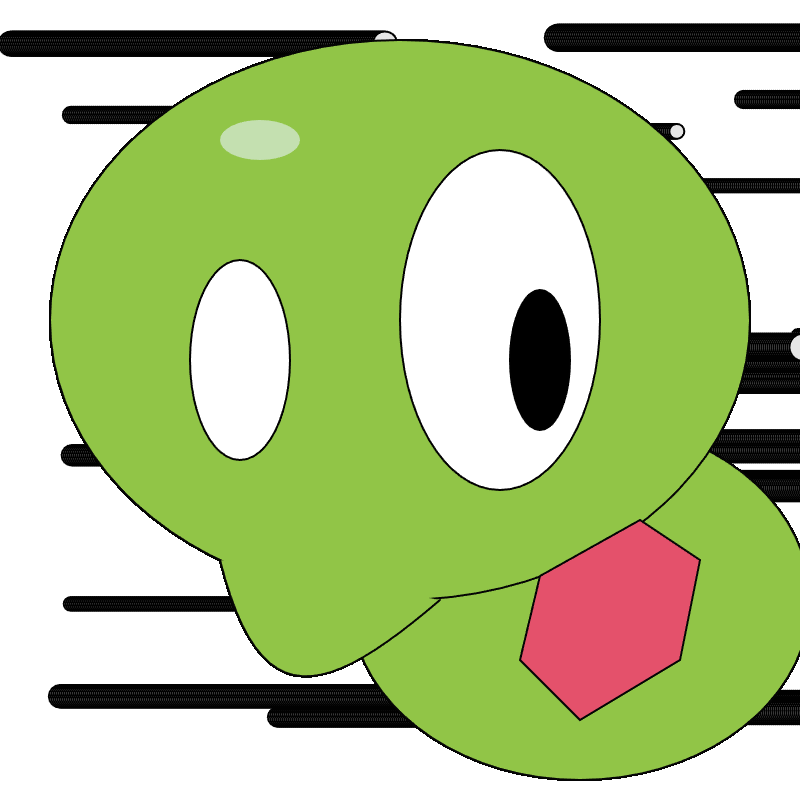

# Code !

## Introduction

**Author：Ruian7P**

My javascript projects from Code! lol

Only for Personal Records and Reviews: Freshman 2024 Spring (second semester)

----

## Menu

Let's Code!

#### [Project 1: Quagsire from Pokemon]()

I drew Quagsire from Pokemon. Quagsire is a light blue, bipedal, amphibious Pokemon. Its head is broad and round, having little neck to distinguish it from the rest of its body. A wavy, purple stripe runs down its back. I originally intended to draw Relaxaurus from Palworld, a game I'm playing recently. After I drawing the mouse, I found my work more similar to Quagsire, so I continued my work based on the features of Quagsire. I outlined Quagsire first, then filled the color of the body. During the process, I found it pretty hard to fill the color inside of the outlined body. Since there's some curvation on the body, I need to use arc() method, which can't fill the color on the backside of curve. Also, I didn't find any method that can fill the color inside of irregular shapes. Thus, I have to create several ellipses to fill blue into Quagsire's body.

#### [Project 2: Interactive Squishy from Pokemon](https://editor.p5js.org/Ruian7P/sketches/SGU8Btc68)

For my module 2 assignment, I draw the Squishy from Pokemon. It's a pretty cute Pokemon with a round head, body, and core. For this week's assignment, I find myself able to draw those irregular shapes more fluently than my first week's project. Like the irregular shape of Squishy's mouth, I could use the curve to draw it. After watching the video from this module, I could make viewers interact with my project. For instance, Squishy's eye can track the mouse and follow the mouse when viewers move their mouse. Not only that, when viewers click the mouth, the color of Squishy's core will change into "pink" or "sky blue" randomly. However, coding for these two functions is the main challenge for me. I originally intend to use function mouseClicked() to get the random color. When I tried to use this random color in function draw(), there happened an issue. Finally, I have to use if (mouseIsPressed) to get my intended result. Also, when making the eye movement, I have to constrain the scope of the motion of the eye. It's not an easy work, but I learned a lot. I'm excited for what I will learn in the future.

#### [Project 3: Ball Game](https://editor.p5js.org/Ruian7P/sketches/uja3T7CaU)

For this assignment, I created a game inspired by the pong game. I extend from the bouncing ball by incorporating human interaction. I create a board at the bottom of the canvas which follows the mouse in the X-axis. Then I added a counting machine in the top-right of the canvas to count the time the board missed the ball. What's more, If the player clicks the mouse, the moving speed of the ball will increase and the ball will change into a random color. During my process, I found it hard to count the missed time. I set that the count number will increase by one when the board touches the canvas's bottom. However, when the speed of the ball became relative high, the missed time won't be counted. Also, if I set touch line to be a space, missed time will be counted several times. Thus, I set missed condition to be a status, when it is true, the missed count will increase by 1.

#### [Project 4: Ball Game 2.0](https://editor.p5js.org/Ruian7P/sketches/09H36_Pjo)

For this week's assignment, I continued with my work from the last module. I made a ball game last module, which is inspired by a pong game. This week, I re-designed the structure of my code, using functions to separate code into different parts. For example, I made drawBoard(), drawBall(), and ballReflection() functions, which really make my code organized and readable. Then, to make the game much more interesting, I added some cases. For instance, the board will be larger if the missed time of the ball is greater than 10, and if the speed of ball is greater than 7, another ball with a constant speed of 5 will appear joining the game. For these cases, I optimized my code. I set a new variable boardlength for the changeable length of the board, which is useful for judging whether the board missed the ball.

#### [Project 5: Ball Game 3.0](https://editor.p5js.org/Ruian7P/sketches/k-x3EekGw)

For this week' assignment. I continued with my bounce ball game. Last week I tried to add another ball into the canvas by directing copy all the code of the first ball and set new names for the parameters and methods of the second ball. However, this week with Class, I can realize that in a easier and more convenient way. I move all the methods about ball, like drawBall() and ballReflection() inside of the class ball. However, when I try use function mousePressed() to change the speed of ball, I encountered a problem that I can't manage the speed of either ball, since the speed parameter is inside of class ball. I tried to directly move mousePressed function into the class ball, but it couldn't work. Then I had to set a new parameter upper limit inside of the class ball to interact the parameter increament in function mousePressed to increase the speed of both balls. 

#### [Project 6: Falling Particles](https://editor.p5js.org/Ruian7P/sketches/JXL6chDfV)

This week, my project is about falling particles. In the project, each click will create a new random color particle that leaves a colorful trail behind. The particles will slowly fade away after a certain period, keeping the sketch running smoothly. During my coding, I found a method, createVector, can be very useful to track the motion of the particles. I set the class Particle with a random generated speed, fixed horizontal acceleration (simulate gravity), and used mousePressed function to set the original position of particles. In order to change the velocity or position of particles, I found simply "+" can't be applied on vector computation, so I used add function. What's more, I used push method to add the new Particle formed by clicking mouse into the particles array. 

#### [Project 7: Final Ball Game](https://editor.p5js.org/Ruian7P/sketches/k-x3EekGw)

For my final project, I was inspired by the traditional break-out game that I played a lot in my childhood. You can find the game rule of break-out game here: https://www.youtube.com/watch?v=V1eYniJ0Rnk. I created a board that will follow the player's mouse in the X-axis and used class to create multiple balls that can be reflected from the borders. There is a scoreboard that will record the miss time. So if the board misses any ball, the miss time will +1. However, this counting is not noticeable, especially for players focusing on playing the game, so I added an effect to the game. When the board misses the board, there would be firework-like effect appears on the mouse place, reminding the players that they have just missed the ball. This firework-like effect comes from my Module 6 project, where I utilized array and for loop. What's more, I created a new mode, the viewing mode, where players were able to see the beautiful image when the ball moved at a relatively high speed. Please take a look at this mode and keep clicking the mouse to make the ball move faster. The original mode is the viewing mode. If you want to change into the game mode click the button on the top-right. You can change back to the viewing mode by clicking the button again. I haven't show this project to anyone else. Please give me some feedback and advice so that I can make my work better. In the future, I want to improve it by adding some blocks on the top so it will be a real break-out game that would be more playable and interesting.
