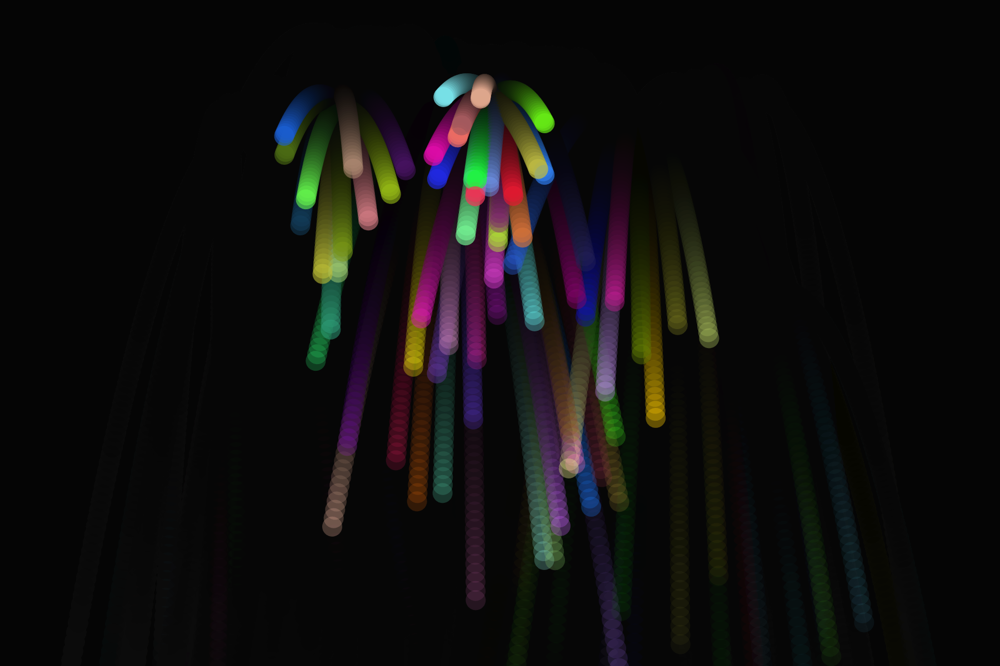
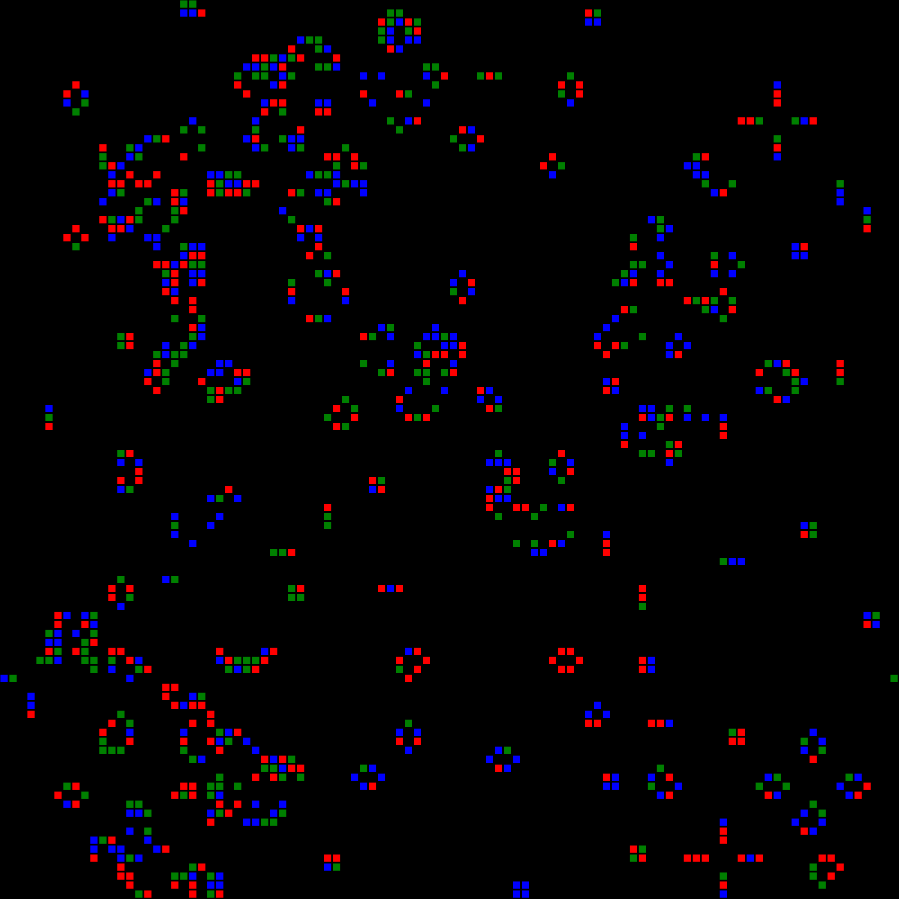
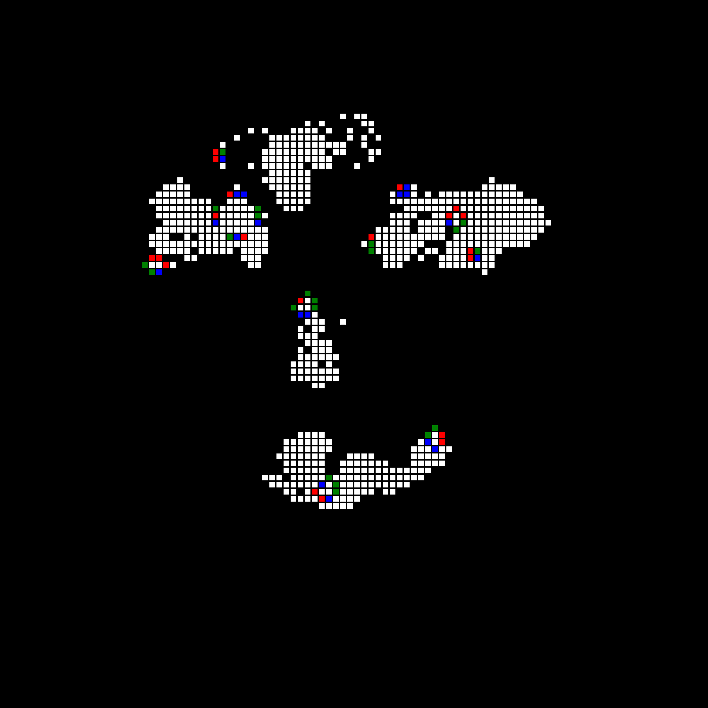

# Code ! 2

## Introduction

**Author：Ruian7P**

My javascript projects from Code! 2

Only for Personal Records and Reviews: Junior 2025 Fall (fifth semester)

----

## Menu

Let's Code!

#### [Project 1: Snorlax from Pokemon](https://editor.p5js.org/Ruian7P/sketches/2-PVSGBe9)

#### [Project 2: Fireworks with Sounds](https://editor.p5js.org/Ruian7P/sketches/-Mq1CrocJ)

#### [Project 3: Bouncing Ball Game using p5 play](https://editor.p5js.org/Ruian7P/sketches/l7Nne2EFs)

#### [Project 4: Generative Art: Game of Life](https://editor.p5js.org/Ruian7P/sketches/jr1-ht5zR)

#### [Project 5: Joker Face: Face Tracking](https://editor.p5js.org/Ruian7P/sketches/bleMlUTbJ)

#### [Project 6: Your Game of Life](https://editor.p5js.org/Ruian7P/sketches/9lUifiCgn)

This project is a generative visual arts accompanied with interactive gaming elements. People have been wondering how the human civilization developed. This game allows players to be the god to manipulate the thrive and end of civilizations. The game starts with full dark background, where there's no life signals. The game manipulation is simple. Players can create life on this blank land by draging their mouses and clicking on each pixels. Then, by the game of life algorithm, the civilization will develop on its own. The civilization may spread, assimilate, or even die. Once lives die, they will leave white signals on the background to show their existence before. During the process, players can intervene the development of civilizations by creating new life. 

This project extends the two modules, Generative Art and Game Development. It provides transcendent visual experience of how civilization creates and thrives, and how that's related to simple digital computation. At the same time, it allows players to interact with the game, to see and feel the process in the way they want. The game contains detailed instruction before the game start. Players can create as many life as they want by draging and clicking mouse on each pixel. After press key enter to start the game, players can create new life in the same way.

