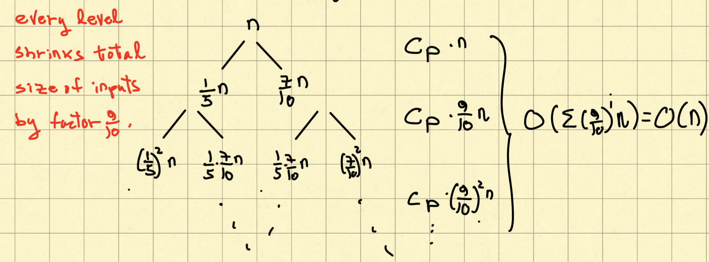
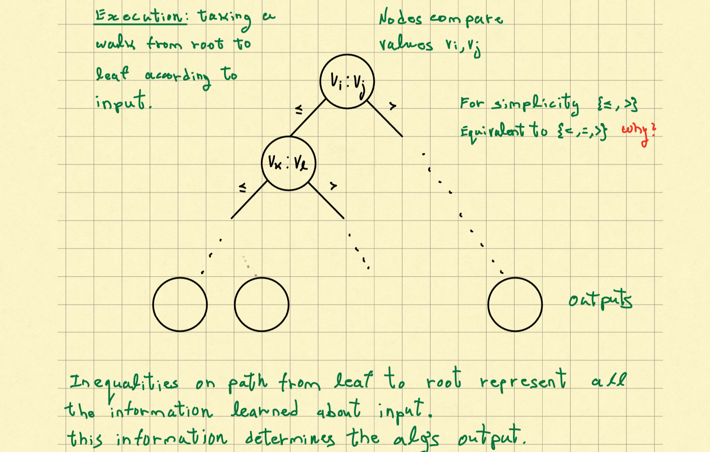
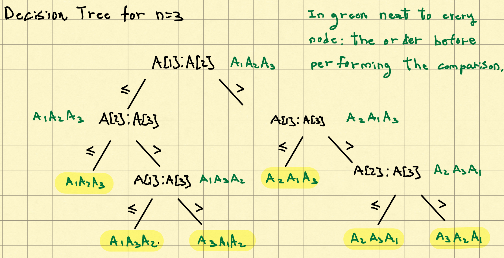
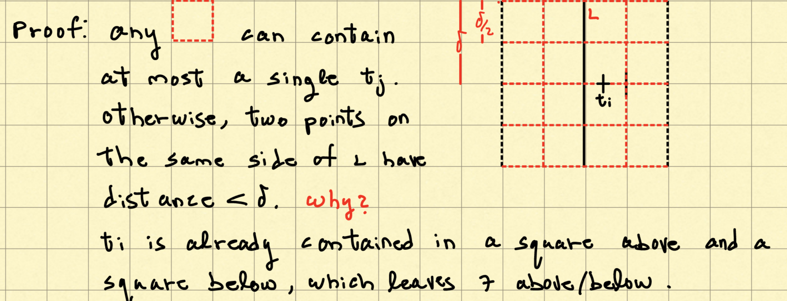

## Comparison Sorting

### 1. Merge Sort

1. (divide) divide to smaller instances of same problem 
2. (conquer) solve smaller instances recursively
3. (merge) combine solutions for small instances into solution for original instance    ($\Theta(n) work$)

```pseu code
1. MergeSort(A[1, .., n/2])
2. MergeSort(A[n/2+1, ..., n])
    Base case: n=1, return;
3. Merge(A[1,..., n/2], A[n/2+1, n], C[1,...,n])
4. A<-C
```

#### 1.1 **merge** ($A[1, 2, ..., n], B[1, 2, ..., m], C[1, 2, ..., m+n]$)
    **pseu code**
    1. i<-1, j<-1
    2. while i+j <= m+n:
    3.      if j>n or (i<=n and A[i]<= B[j])
                C[i+j]<-A[i]
                i<-i+1
    4.      else
                c[i+j]<-B[j]
                i<-i+1


#### 1. 2 Running time

$T(n) = T(n/2) + T(n/2) + \Theta(n)$

1. **recurrence tree**: get intuition

   |   level of recursion   | num_blocks |   Total work on this level $\Theta(n)$   |
   | :--------------------: | :--------: | :--------------------------------------: |
   |           0            |     1      |               $\Theta(n)$                |
   |           1            |     2      |   $2* \Theta(\frac{n}{2}) = \Theta(n)$   |
   |           2            |     4      |   $4* \Theta(\frac{n}{4}) = \Theta(n)$   |
   |           i            |   $2^i$    | $2^i* \Theta(\frac{n}{2^i}) = \Theta(n)$ |
   | **i $\geq \log_2{n}$** |     n      |       $n * \Theta(1) = \Theta(n)$        |

   **Total work on all level**: $\sum_{i=0}^{logn} \Theta(n) = log_n * \Theta(n) = \Theta(n logn)$

2. **Substitution Method** to verify $T(n) = O(nlogn)$

   - **proof by induction**: exists constant $n_0, c$ such that for all $n\geq n_0, T(n) \leq c* nlogn$
     - **Base case**: $n_0, T(n_0)=t_0$ (worst case running time of size $n_0$), e.g.: $n_0 = 1$
       - **want**: $T(n_0) \leq c*n_0log{n_0} = t_0$
     
     - **Inductive Step**: assume for all $k<n, T(k) \leq c* klogk$
       - **want**: $T(n) \leq c*nlogn$
         - **plug into recurrence $\Theta(n)$**
           - $T(n) = 2*T(n/2) + a*n \leq 2*c*n/2 * log{n/2} + a*n = c*n*(log_n-1)+a*n \leq cnlogn$

#### 1. 3 Properties
1. Stable
2. Not In-place (not allocate lots of memory: $\Theta(n)$ memory allocated at each level)
3. Bad Best-case: $\Theta(nlog_n)$


### 2. Quick Sort

1. **(divide)**  choose a pivot p

2. **(conquer)** recurse on each part (left side and right side)

   ```pseudocode
   QuickSort(A[1,..., n]):
       k = Partition(A)
       QuickSort(A[1, ..., k-1])
       QuisckSort(A[k+1, ..., n])
   ```

   

#### 2.1 Partition(A[1,..., n])

**Invariant**

| $\leq p$ | $a$  | $> p$ | $b$  | yet to explore |  p   |
| :------: | :--: | :---: | :--: | :------------: | :--: |
|          |  i   |       |  j   |                |      |

```pseudocode
Partition(A[1,.., n]): 
    p = A[n]
    i = 1, j = 1
    while j < n
        If A[j] > p
            j++
        else A[j] <= p
            swap(A[i], A[j])
            i,j ++
    swap(A[i], A[n])
    return i (location of the pivot)
```


#### 2. 2 Running Time

$T(n) = T(k-1) + T(n-k) + c_p * n$: **based on final pivot location**

- **worst case: k = n** (already sorted) : $T(n) = T(n-1) + c_p * n = c_p * \sum_{i=0}^n i = \Theta(n^2)$
- **best case**: pivot always median: $T(n) = 2* T(\frac{n}{2}) + c_p * n = \Theta(nlogn)$

- **realistic case**: pivot is not too extreme: $T(n) = T(pn) + T((1-p)n) + c_pn = \Theta(nlogn)$ 
  - total work at each level: $c_pn$
  - level of recursion: $log_pn = log_p(2^{log_2n}) = log_2n * log_p2 = \Theta(logn)$, not related to $p$


#### 2. 3 The Selection Problem

```pseudocode
Select(A, i)  # want to know what is the ith smallest element in array A
eg. median(A) = select(A, n/2)
```

##### 1. Select(A[1,...,n], i)

1. Find good pivot (not in top/bottom 30%)
2. Recursively select from the appropriate pivot
   - k is the location of pivot
   - i  is being selected
     - i<k: select from left
     - i>k: select from right
     - i=k: return the pivot

```pseudocode
Select(A[1,...n], i):
	If n = 1, return A[i]
	pivot = GoodPivot(A)
	k = Partition(A, pivot) 	# similar to QuickSort 
	If i == k, return A[k]
	If i < k, Select(A[1, ..., k-1], i)
	If i > k, Select(A[k+1, ..., n], i-k)
```

##### 2. Find a Pivot: Median of Medians

- **good pivot guarantees throw away at least 30% elements**

```pseudocode
GoodPivot(A):
1.	Divide to groups of 5 elements  
2.	Sort each group of 5 and locate its median 		 # constant time
3.	Return median of the n/5 medians
	recurse: Select([A[3], A[8],..., A[last median]], n/10)
```

- **proof**: resulting median $p$ is a good pivot (not in top/bottom 30%)
  - there are $\frac{1}{2} * \frac{n}{5}$ of the medians that are $< p$. Each one is larger than 2 elements in its 5-group. Hence, there are at least $3* \frac{n}{10}$ elements $< p$. Similarly, there are $3* \frac{n}{10}$ elements $> p$. 

##### 3. Running Time

**T(n) = T($\frac{1}{5}n$)** (recursion in GoodPivot()) **+ T($\frac{7}{10}n)$**( throw away at least $\frac{3}{10}n$) **+O(n)** (other operations)

##### 


### 3. Lower bounds on Comparison-based algos (nlogn)

- proof:  **Sorting boxes**
  - we have black boxes, each box i has value $v_i$
  - **Goal**: Sort boxes according to $v_i$
  - **comparison-based algos** can be described by **decision trees**



 **A decision tree for sorting learns\outputs a full ordering of the elements**

- claim: Assume that S is an algo that manipulates the input array elements in one of two ways:
  1. compares elements
  2. swap elements or move them around the memory

​	Let $T^S(n)$ be the worst-case running time of S, then S can be described by decision tree $D^s_n$ of depth at most $T^S(n)$

- example: Insertion Sort 

  ```pseudocode
  For j = 2....n
  	i = j-1
  	while i > 0 and A[i] > A[i+1]
  		swap(A[i], A[i+1])
  		i = i - 1
  ```

  

**lower bound running time of comparison-based sorting shows lower bound on the depth of sorting decision trees**

- show that any sorting decision tree $D_n$, must have depth $\Omega(nlogn)$: $min(T^S(n)) \geq mindep(D^S_n) \geq mindep(D_n)$
  - For any sorting decision tree $D_n$, #leaves $\geq$ #orderings (permutations of n elements)
  - A tree with depth $\leq d$ has at most $2^d$ leaves ==> depth of any sorting decision tree $dep(D_n) \geq log(n!)$
  - $n^n \geq n! \geq \frac{n}{2}^\frac{n}{2}$ ==> $nlogn \geq log(n!) \geq \frac{n}{2}(log(n)-log(2))$ ==> $dep(D_n) \geq log(n!) = \Theta(nlogn)$


## Non-Comparison Sorting

### 4. Small-key Sort (counting sort)

```pseudocode
1. Initialize k empty lists L_1, ..., L_k         O(k)
2. For i = 1, ..., n:                O(n)
		add A[i] to L_key[A[i]]
3. Append the lists to generate output L_1, L_2, ..., L_k       O(n)
```

- **Running time**: $\Theta(n+k)$

- **properties**: stable

  

### 5. Radix Sort

keys are numbers in base k (radix) with d digits. A key $x = \sum_{i=0}^{d-1}x_ik^i$ has digits $x = x_{d-1}x_{d-2}...x_{0}$, like numeration with base k

After sorting according to digit, the array is sorted

- **Running Time: ** $d * \Theta(n+k)$

  

## Other Divide and Concur

### 1. Closest Pair

**Goal**: Given n points $p_1, ..., p_n \in Z$, Find closest pair $p_i, p_j$

**Approach**: 

1. 1. Sort; 2. Compute each adjacent pair
      - Time: $O(nlogn) + O(n) = O(nlogn)$

2. **divide and conquer**

   - 1-D

     1. sort 

     2. Given $p_1 \leq p_2 \leq ... p_n$

        $closestparis(p_1 ... p_n):$

        ​	a. $(l_1, l_2) = closestpairs(p_1 ... p_{\frac{n}{2}})$

        ​	b. $(r_1,r_2) = closestpairs(p_{\frac{n}{2} +1} ... p_n)$

        ​	c. return closest among $(l_1, l_2), (r_1, r_2), (p_{\frac{n}{2}}, p_{\frac{n}{2} + 1})$

     3. Time: $O(nlogn)$

   - 2-D

     ```pseudocode
     closest(p_1,..,p_n):
         1. sort by x-coordinate
         2. recurse closestpair(p_1,...,p_n):
         		(l_1,l_2) = closestpair(p_1, ..., p_n/2)
         		(r_1,r_2) = closestpair(p_n/2+1, ..., p_n)
         3. 		combine
                 a. Let L be the vertical line seperating points by half, s = min{d(l_1, l_2), d(r_1, r_2)}
                 b. Consider only points within distance s of L
                 c. sort remaining points t_1 ... t_k by y-coordinate
                 d. For i = 1...k, compute d(t_i, t_j) for j in {i-7, ..., i+7}
                     Let (c_1, c_2) be the closest pair found
                 e. find closest among (l_1, l_2), (r_1, r_2), (c_1, c_2)
     ```

     - Why 7:

       

     - **Time**: $T(n) + O(nlogn) + O(n) = 2T(\frac{n}{2}) + O(nlogn) + O(n)$ 

       ​	recursion + sorting + scanning

