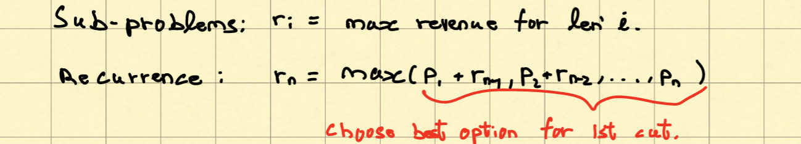
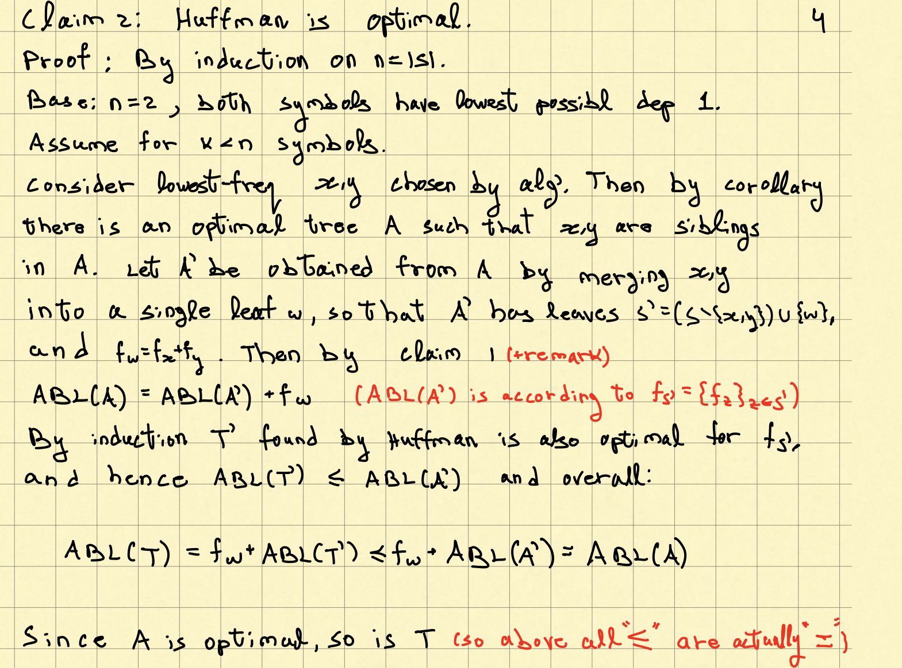

# Dynamic Programming

- **rational / central idea**
  - solve problems of increasing size (small problem first, then large)
  - use solutions to smaller problems solve solutions to bigger problems
  - solutions are typically reused
- **structure**
  - sub-problems: smaller optimization problems
  - solution to optimization desired from solution to smaller optimization problems
  - An optimal choice made for every problem size

### 1. Fibonacci numbers


- since many subtrees have been counted twice or multiple times, which increase time complexity, we need optimize it

  - **Bottom up**

    ```pseudocode
    Init empty A[1, ..., n], A[1] = A[2] = 1
    for i = 3, ..., n
    	A[i] = A[i-1] + A[i-2]
    output A[n]
    ```

    - Running Time: $\Theta(n)$

  

  

### 2. Rod Cutting


- **naive solution**: try all partitions

  

- **DP solution** (bottom up)

  

  ```pseudocode
  CutRod(p1, ..., pn):
  Init empty r[1, ..., n]
  For j = 1 to n:
      M = p_j
      For i = j-1 to 1:   # r = max(p1 + r_{j-1}, p_2 + r_{j-2}, ..., p_j)
          M = max(M, p_i + r[j-i])
      r[j] = M
  Return r[n]
  ```

  **Running Time**: $\Theta(1+2+..+n) = \Theta(n^2)$


### 3. Largest common Subsequence

- **DP solution** 


- Running Time: $O(mn)$


### 4. Knapsack


- **DP solution**

  

​	- **running time**: $O(nW)$


#### Fractional Knapsack (Greedy Approach, not DP)


- **Greedy Approach**: as long as there's room, add as much as you can from the item that "seems best": maximizes $\frac{value}{weight}$

  

  

### 5. Interval Scheduling (Greedy Approach, not DP)


- **Greedy Approach**

  - always add to S* interval with earliest finish time (that doesn't intersect previous intervals in S*)

  - algo

    1. sort I[1, ..., n] by finish time

    2. ```pseudocode
       sched(I[1, ..., n]):
       	j = 2
       	if j > n return empty set
       	while s_j < f_1:
       		j = j + 1
       	return I[1] U sched(I[j, ..., n])
       ```

  - running time: O(n), O(nlogn) if include sorting
  - **proof**: output is optimal
    - If there exists an optimal solution that does not include the interval with the earliest finish time $I_1$, we can always swap the first interval in this solution with $I_1$, which won't change the result
    - Induction to prove that the algo finds the optimal solution
      - **Base case**: n = 1
      - **Inductive Step**: Assume the algo works for $n-1$ intervals $S_{n-1}$
        - Once $I_1$ is selected, $S_{n-1}$ U $I_1$ would be the optimal solution for $S_n$


### 6. Huffman coding

- **background**: For variable-length encoding


- **How to find optimal code**
  1. **lowest frequency symbols should be at lowest level**
  1. **lowest level has at least one pair of sibling leaves**
  1. **order of symbols inside a level doesn't matter**: ABL only affected by depth


- **Greedy Approach for constructing optimal trees**

  - Recurrence: 

   	1. Sort the frequency of each symbol
   	2. put the smallest frequency symbol x on the left leaf of root node w, second smallest symbol y on the right leaf
   	3. the frequency of this root $f_{w} = f_x + f_y$

  - ```pseudocode
    Huffman(f_S = {f_x}_{x in S}):
    	If |S| = 2:
    		return root with symbols on leaves (small on left node)
    	Find x,y in S with lowest f_x and f_y
    	Let w not in S and define f_w = f_x + f_y
    	S'' = (S-{x,y} + {w})
    	T'' = Huffman(f_{S''})
    	T = Add x, y as children leaf w in T''
    	return T
    ```

  - **Running Time**: T(n) = T(n-1) + O(n) = O(n^2)

    - we can optimize Finding Lowest pair O(n) to O(logn) by using priority queue

  - **correctness**

    - 

    - 
