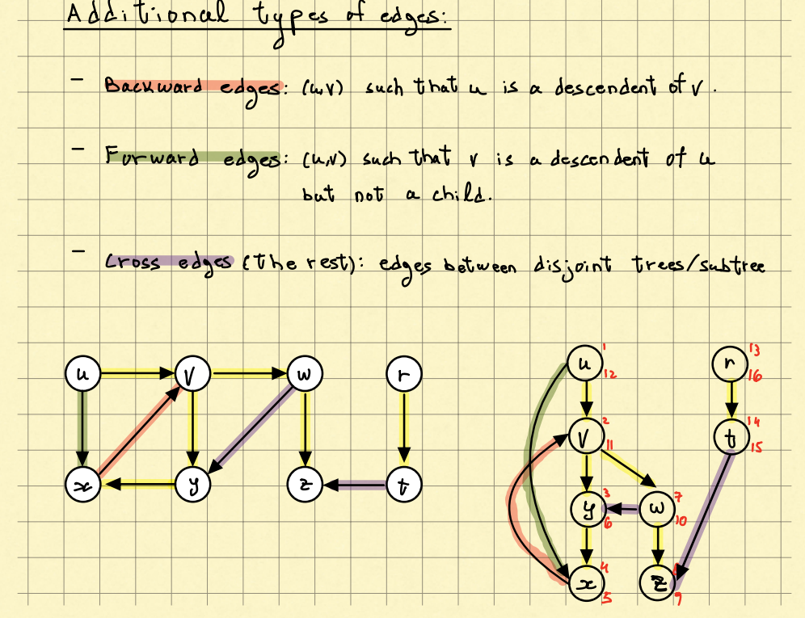
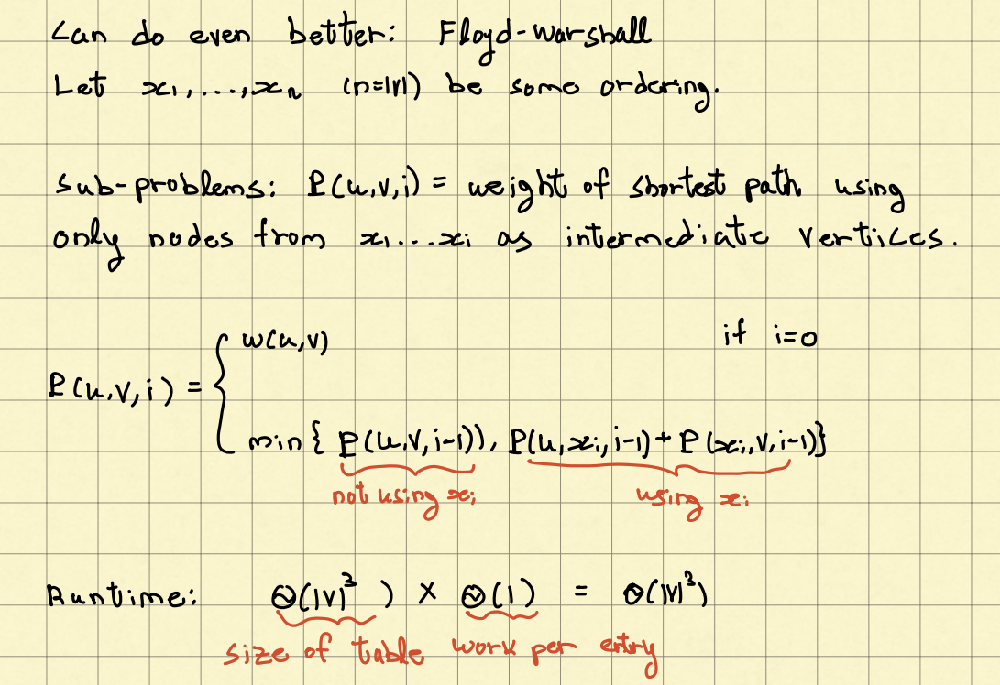

# Search

a graph $G = (V, E)$

- components

  - vertices V

  - edges E

- **directed or undirected**

  

## Breadth-First Search (BFS)

## Depth-First Search (DFS)

### 1. procedure

### 2. pseudocode

### 3. **edge types**

​		

- **tree edges**: v is child of u

- **backward edges**: u is descendent of v

- **forward edges**: v is descendent of u, but not child

- **cross edges**: the rest, edges between disjoint trees/subtree

  

### 4. **Theorem**

1. **In a DFS in undirected graphs, there's only tree and backward edges**

   

2. **G is acyclic iff no back edges in any DFS scan**

   

3.  

   

### 5. **Topological Sort**

- **example: Job scheduling**

  

  

### 6. **Strongly connected components (SCC's)**

#### 1. **definitions**

​	

#### 	2. Finding SCCs

- **Algo**

  1. **Call DFS G and record f[u]**, and **distinguish each tree**

  2. Let $G^T$ be the graph with reversed edges of G

  3. **Call DFS($G^T$) where we visit vertices in decreasing order of $f[u]$**, and **each visit should stop if comes to the vertices in different tree in G**

  4. **Output each tree in the result as SCCs**

- **running time: $\Theta(|E| + |V|)$**

- **Understanding with topological sort (why $G^T$)**

  

  - ​	We can't implement A since we don't know which vertices were in $C_k$

  

  - ​	Counterexample: (b, c) in the example above, more nodes will be find 

  

  - ​	because only edge goes forward in $G^T_{SCC}$ and $C_1,... C_K$ is a topological sort of $G_{SCC}$

  

# Find

## Find Minimum Spanning Tree (MST)

- **definitions**

  - **Safe**: e is safe for A if $A \cup e$ is contained in some MST
  - **Cut**: A cut of G = (V, E) is a partition (S, V \ S)
  - {u, v} **crosses** the cut if $u \in V, v\in V$ \ $S$
  - cut **respect** $A \subseteq E$ if no $e \in A$ crosses the cut
  - $e\in E$ is a **light edge** if it has minimal weight among all edges crossing the cut

- **Theorem**: Let $T\in E$ be an MST, let $A \subseteq T$ and $(S, V$ \ $S)$ be a cut respecting A, then any light edge $e \in E$ crossing the cut is safe for A.

  

- **Algo**

  

  Keep adding safe edges

### 1. Kruskal

- **idea**

  1. Sort edges by weight
  2. Add to A the next lightest edge that does not form a cycle in A

- **implemention**

  - use data structure **disjoint set union (DSU)** to judge whether a circle formed

  

### 2. Prim

- **idea**

  1. A is a tree throughout

  2. start from some node

  3. add lightest ${u, v} \in E$ connecting the tree A to a new vertex

     ( adding lightest edge crossing (A, V \ A), which is safe)

- **implementation**

  - **naive**: $\Theta(|V| \dotproduct |E|)$

  - **Priority Queue**

    

## Finding Shortest Paths

### 1. Single Source Shortest Paths (SSSP)

#### Dijksktra

### 2. All-Paris Shortest Paths

#### Floyd-Warshall

- remark: Assume no negative cycles (other wise some pairs will go infinitely small)

- **Central Idea: Gradually allowing more midpoints x (k midpoints) to see whether the path becomes shorter**

1. 

2. 

3. only allowing vertices with number $\leq i$ to be midpoints

# Match

## Max Matching in Bipartite Graph

- **Bipartite Graph** $G = (L, R, E)$: An undirected G = (V, E) is bipartite if $V = L \cup R$ (**disjoint union**) and $\forall u, v \in E, u \in L, v \in R$. 

- **matching**: A matching in an undirected G = (V, E) is a subset $\mu \subseteq E$ such that for every $v \in V$, there's at most one edge $e\in \mu$ touching v

  - $v \in V$ is matched if $v\in e$ for some $e \in \mu$, other wise unmatched

    

- **augmenting path**: an **odd**-length path connecting two unmatched vertices: unmatced $v_1$ ->  $v_2$ ->  $v_3$ -> .... -> unmatched $v_{2k}$

  

  - **symmetric difference**: For edge set $S, S' \subseteq E$,  S ⊕ S' $ = (S - S') \cup (S' - S)$

  - Apply on augmenting path P, $\mu' = \mu ⊕ P$, where $\mu$ is a matching

    - remove it if it's in both $\mu$ and P, add it if it's only in $\mu$ or P

    

    

    - | vertex | state     | next edge                |
      | ------ | --------- | ------------------------ |
      | v1     | unmatched | not in $\mu$ (in $\mu'$) |
      | v2     | matched   | in $\mu$                 |
      | v3     | matched   | not in $\mu$ (in $\mu'$) |
      | v4     | matched   | in $\mu$                 |
      | v5     | matched   | not in $\mu$ (in $\mu'$) |
      | v6     | unmatched | end                      |

      

    - **If there's a $\mu$ augmenting path exists, we can use it increase $\mu$ by 1**

      

- **Find $\mu$ augmenting path**: 

  - **idea**: find a path from an unmatched left vertex to an unmatched right vertex (since odd length), and force alternation of ($\mu$, $E-\mu$)

  - **steps**

    

  - **Running Time**: $\Theta(E V)$ where we have V iterations (V DFS) and E paths to go each iteration

## Stable Matching

- **question**

  

- **def**

  - **unstable**: For a matching $\mu \subseteq H \times R$, a pair $(h, r) \in (H \times R) - \mu$ is unstable if they are both matched but prefer each other to their current pairing: they all prefer each other compared to their matched partner
  - **stable**: A matching $\mu$ is stable if there is no unstable pair for $\mu$

- **Gale-Shapley**

  - **steps**

    

  - **claims**
    1. The algo terminates after at most $n^2$ executions (n hospital x n residents)
    2. upon termination, every h is matched with some r
    3. The matching $\mu$ is stable
