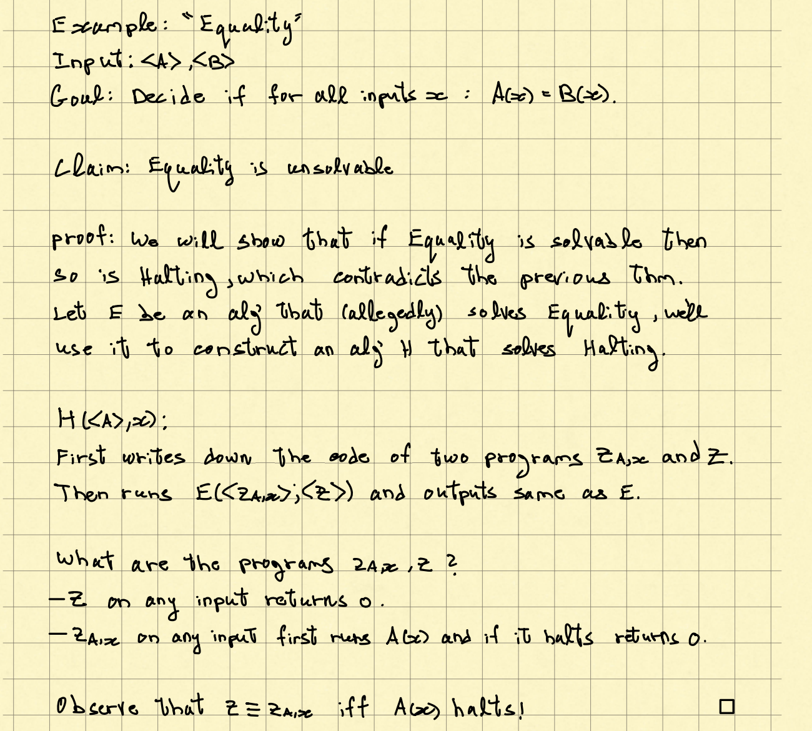
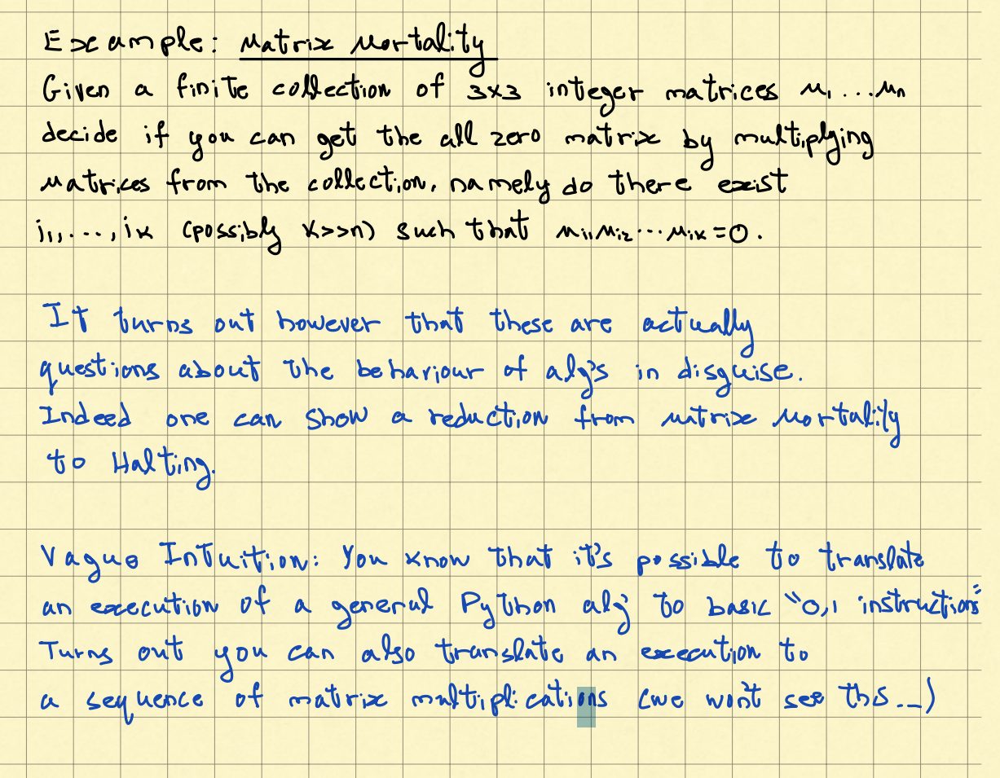

# Computabilty and Complexity

- Are there problems that algos cannot solve
- Are there problems that algos can solve but only inefficiently 

## The Halting Problem

### 1. Theorem (Turing): Halting Cannot be solved

- Flip(Z) is designed to against the prediction of H by intension
- If Flip(Flip) halts, it means H(Flip, Flip) didn't help, which is contradictory.
- If Flip(Flip) not halt, H(Flip, Flip) halt, which is also contradictory.

### 2. Theorem (Rice): Any Problem about the behavior of algo cannot be solved essential. 

#### **example: "Equality"**

- Since z == z_(A,x) if and only if z _(A, x) halts, and since z__(A,x)  cannot be solved, so this equality cannot be solved

#### Technique: Reduction

 

- To solve P (equality), we design an algo $A_p$, where subroutine $A_P'$ (turing's theorem) solve the problem P' (Halting)

- if P' is less hard, then we can't solve P with P'

1. we already proof $HALT(<A>, x) = 1 $ iff A(x) halts, otherwise 0
2. Construct H(A, x) that solves HALT(A,x) : 
3. Write the code of an algorithm A' using A(x)
   - H_2 solves HALT_2
   - Goal: to make H_2(A') output same as HALT (If halt, return 1, else return 0 ......)
4. output H_2(A')
5. Reasoning: If HALT_2 can be solved, then HALT can be solved. But HALT cannot be solved, so HALT_2 cannot be solved

#### example: Matrix Mortality

- matrix simulates programs' execution. For z= 0, z = $z_{A, x}$ if and only if A(x) halts, while $z_{A,x}$ cannot be solved.

## Efficient Algorithm

- An algo is considered efficient if it runs in **polynomial time**

### Class P

#### Examples of problems with no polynomial-time solution

#### Poly-time Reduction

**A poly-time reduction form original question Q to a problem Q' is a poly-time algo $A_Q$ that solves Q using poly-time $A_{Q'}$ that solves Q' as a subroutine**

- $Q \leq _PQ'$: **Q'** should be at least hard as Q

- **examples**

  1. **IS is the inverse of Clique, and VC is the complement of IS**

     

  2. **Claim: 3-SAT $\leq _PClique$ **

### Class NP (Nondeterministic Polynomial)

- **NP** is the class of problems for which a **given solution can be verified** in polynomial time. If we set a solution, it is easy to check it's indeed a solution.

- **NPC**: A problem is **NP-Complete** if 
  1. $Q \in NP$
  2. $\forall Q' \in NP: Q' \leq _PQ$ (NP-hard)

#### Reduction of 3SAT to Clique

- **If there's a k-clique in G, then we set those variables in the clique to True, so that we will have 3-SAT**

### Approximation Algorithm

- For NPC, purse approximate solution instead of exponential solution for accuracy

