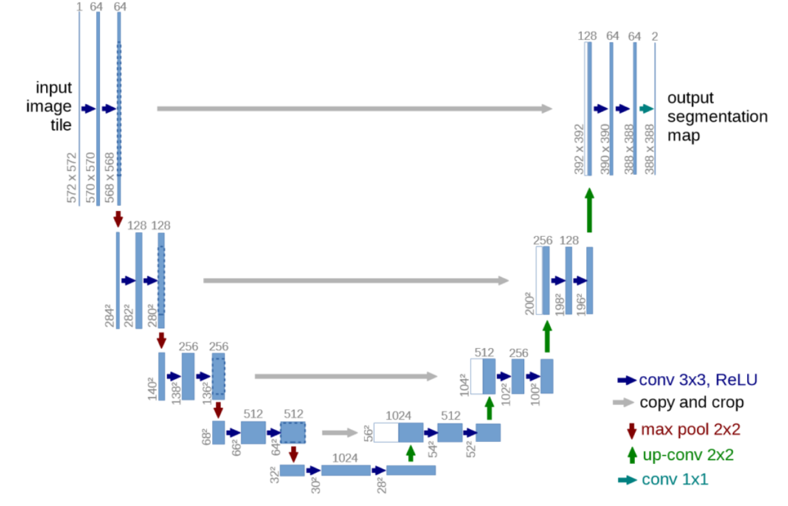
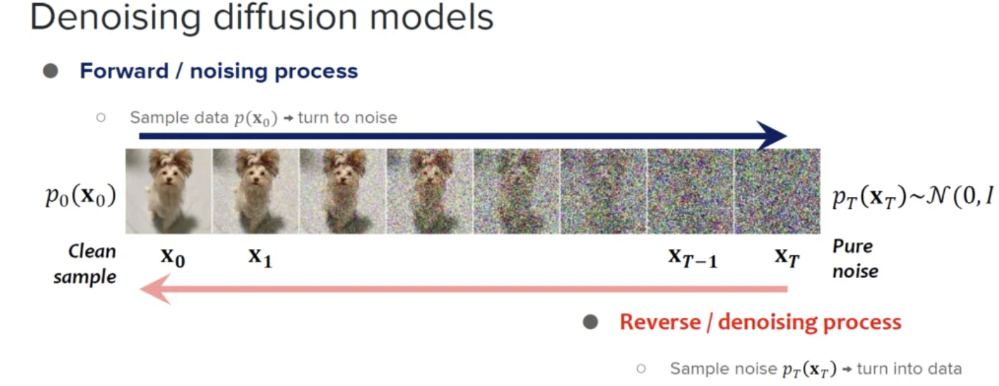
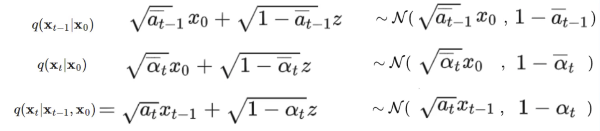
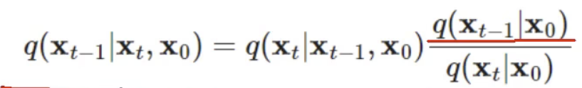
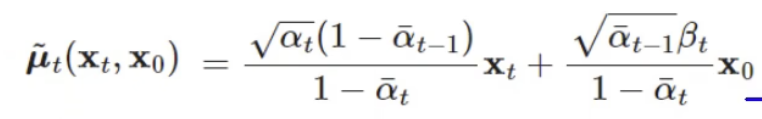
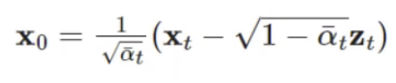
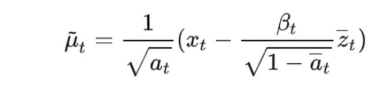
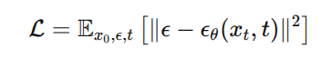

# Diffusion

## U-Net

- **copy and crop: For pixel accuracy**
- **up-conv: For semantic information**

## Diffusion Model

#### Forward (Diffusion)

- Gradually adds noise $\beta_{t}$ to data over a series of time steps.

- Transforms the data into pure noise.

- $\alpha_t = 1 - \beta_t$

  $x_t = \sqrt{\alpha_t}x_{t-1} + \sqrt{1-\alpha_t} z_1$, where $z_1$ just represents a Gaussian distribution

  $x_t   = \sqrt{\bar{a_t}}x_0 + \sqrt{1-\bar{a_t}}z_t$, where $\bar{a_t} = a_ta_{t-1}....a_1$

#### Backward (Denoising)

- train to predict either **noise added at each step** or **original data $x_0$**

- Use **Bayesian Theorem**

  

  

  - $\mu_t$ is the mean of the gaussian distribution of $x_t$ back to $x_{t-1}$
  - How to know noise $z_t$: **Train a neural network to approximate noise**

#### Loss Function

## Diffusion Model with U-Net

#### Training

- **Input: noised image $x_{t}$**, where $x_t   = \sqrt{\bar{a_t}}x_0 + \sqrt{1-\bar{a_t}}z_t$, and we have noise $z_t$ (B, img_channel, h, w)
- **For Conv Block at each level**
  1. Initialize Time step embedding (B, t)
  2. After first convolution layer, train a Linear Layer mapping time embedding to out channel (B, out_channel, 1, 1)
  3. add the time step embedding noise to the feature map (B, out_channel, h, w)
  4. Train second convolution layer
- After feed into the network, we get output noise (B, img_channel, h, w), as the predicted noise $\hat{z_t}$

- **Loss: MSE loss between $z_t$ and $\hat{z_t}$**

#### Inference

1. Start with given t, input image is $x_t$

2. For T =t, t-1, ..., 1:

   - predict $z_T$ with $x_T$

   - compute $\mu_{T}$

     

   - sample $x_{T-1}$ from $\mu_{T}$

3. $x_0$ is the desired output
