# Diffusion

## U-Net

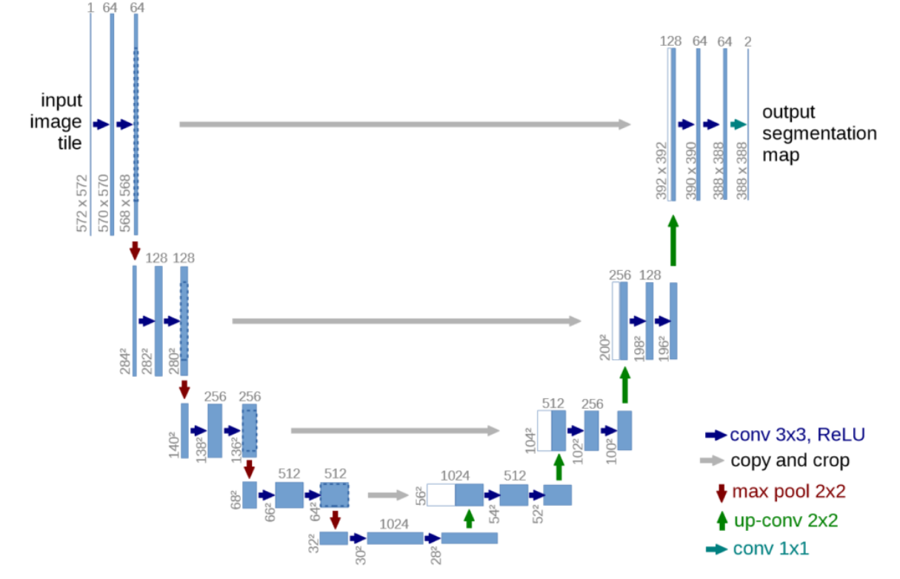

- **copy and crop: For pixel accuracy**
- **up-conv: For semantic information**

## Diffusion Model

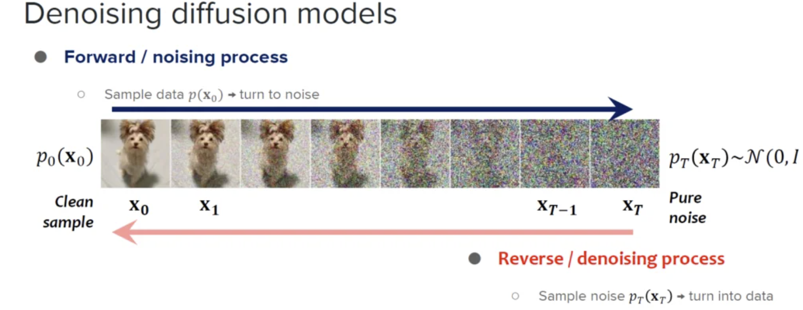

#### Forward (Diffusion)

- Gradually adds noise $\beta_{t}$ to data over a series of time steps.

- Transforms the data into pure noise.

- $\alpha_t = 1 - \beta_t$

  $x_t = \sqrt{\alpha_t}x_{t-1} + \sqrt{1-\alpha_t} z_1$, where $z_1$ just represents a Gaussian distribution

  $x_t   = \sqrt{\bar{a_t}}x_0 + \sqrt{1-\bar{a_t}}z_t$, where $\bar{a_t} = a_ta_{t-1}....a_1$

#### Backward (Denoising)

- train to predict either **noise added at each step** or **original data $x_0$**

- Use **Bayesian Theorem**

  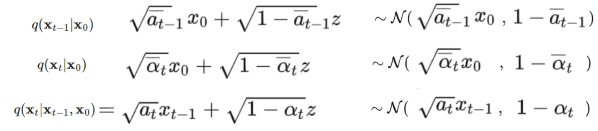

  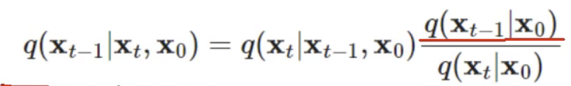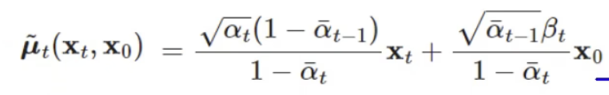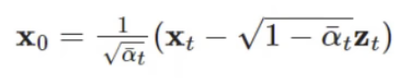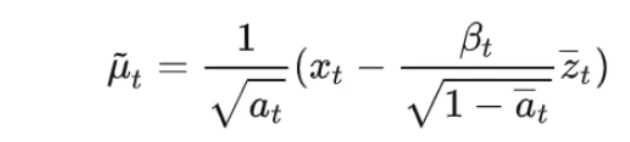

  - $\mu_t$ is the mean of the gaussian distribution of $x_t$ back to $x_{t-1}$
  - How to know noise $z_t$: **Train a neural network to approximate noise**

#### Loss Function

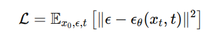

- **Overall**

  - **Forward**: 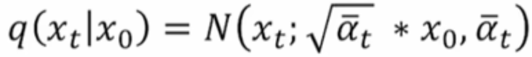
  - **Backward:** 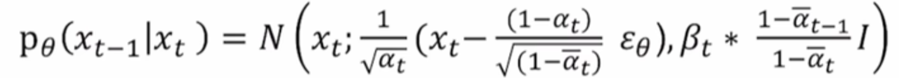

  - **Training**: Fit $\epsilon_{\theta}$ ($z_t$)

## Diffusion Model with U-Net

#### Training

- **Input: noised image $x_{t}$**, where $x_t   = \sqrt{\bar{a_t}}x_0 + \sqrt{1-\bar{a_t}}z_t$, and we have noise $z_t$ (B, img_channel, h, w)
- **For Conv Block at each level**
  1. Initialize Time step embedding (B, t)
  2. After first convolution layer, train a Linear Layer mapping time embedding to out channel (B, out_channel, 1, 1)
  3. add the time step embedding to the feature map (B, out_channel, h, w)
  4. Train second convolution layer
- After feed into the network, we get output noise (B, img_channel, h, w), as the predicted noise $\hat{z_t}$

- **Loss: MSE loss between $z_t$ and $\hat{z_t}$**

#### Inference

1. Start with given t, input image is $x_t$

2. For T =t, t-1, ..., 1:

   - predict $z_T$ with $x_T$

   - compute $\mu_{T}$

     

   - sample $x_{T-1}$ from $\mu_{T}$

3. $x_0$ is the desired output

# Stable Diffusion

 

## 1. LDM (SD1.5)

#### **LDM = VAE + DDPM**

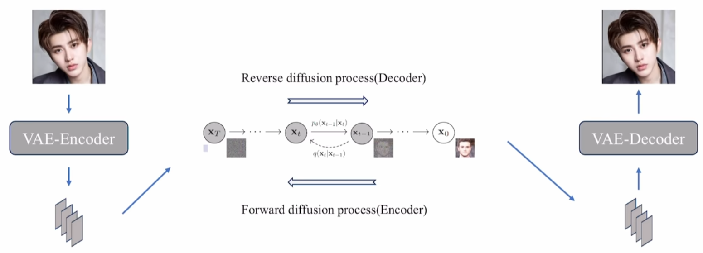

#### **Conduct Diffusion on Latent Space**

- Why? Why work?
  - In diffusion model, most pixels are used to describe details. 
  - **Cost less time, less resources, and reduce redundant cost for details**

#### **can intergrate more modals**

- how?

  1. **Classifier Guadance**

     - **Train a classifier separately, to guide DM generate sample in this class**

     - **How to add into the DM**

       - **all $x_0, ... x_t$ is under condition y, so their distributions are $p(x_0 | y), ..., p(x_t | y)$**

         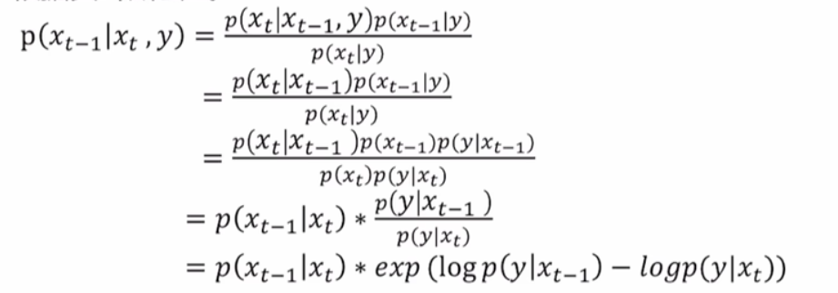

         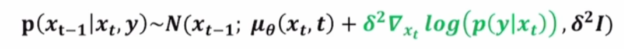

         **unconditioned + classifier adversarial gradient (green term)**

       - add scaling parameter to adjust generation

       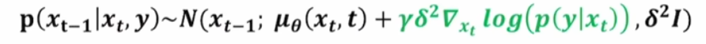

       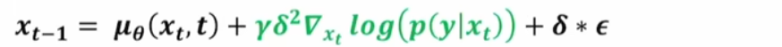

       - **Find classifier adversarial gradient**
         - Train a classifier $p(y|x_t)$, on noised image $x_t$
         - Calculate gradient 

     - **Inference**

       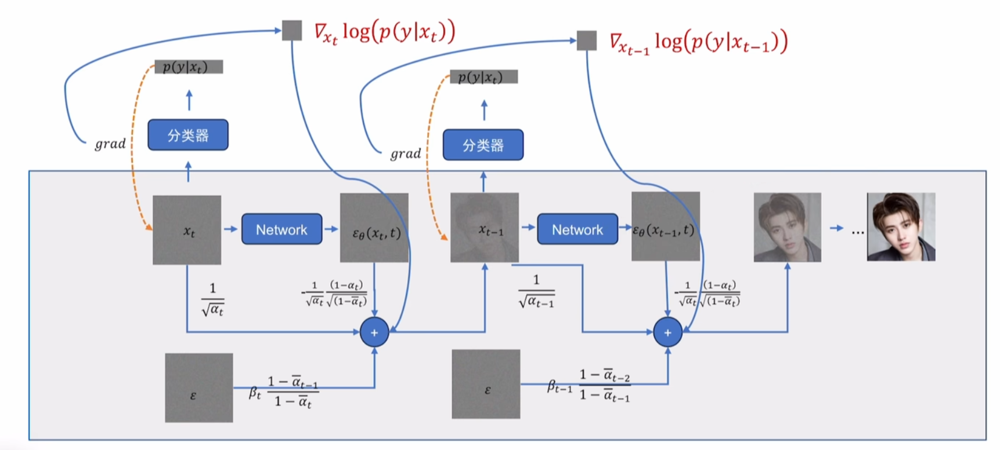

  2. **Classifier Free**

     - why?

       - don't need train a classifier seperately, and don't need noised image as input into classifier

     - **How to add into the DM**

       - **Sampling $p(x_{t−1}∣x_t,y)$**

         $p(x_{t−1}∣x_t,y)∝p(x_{t−1}∣x_t)⋅p(y∣x_{t−1})$

         approximate $p(y | x_{t-1})$ with $p(y|x_t)$

         $μ_θ(x_t,t,y)=μ_θ(x_t,t)+σ^2⋅∇_{x_t}logp(y∣x_t)$

         

       - **Inference**

         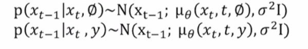

         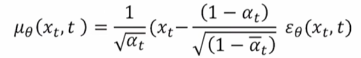

         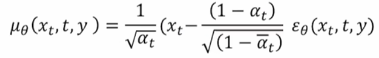

         ​	From Classfier guide:

         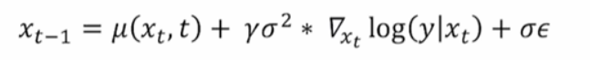

         ​	Since $μ_θ(x_t,t,y)=μ_θ(x_t,t)+σ^2⋅∇_{x_t}logp(y∣x_t)$:

         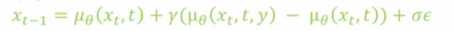

       - **Training**

         - **y is added as an embeded term as t**

         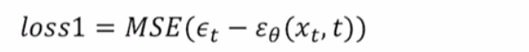

         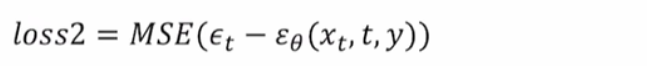

         ​	From Classfier guide:

         

         ​	Since $μ_θ(x_t,t,y)=μ_θ(x_t,t)+σ^2⋅∇_{x_t}logp(y∣x_t)$:

         

         -  **Process**

           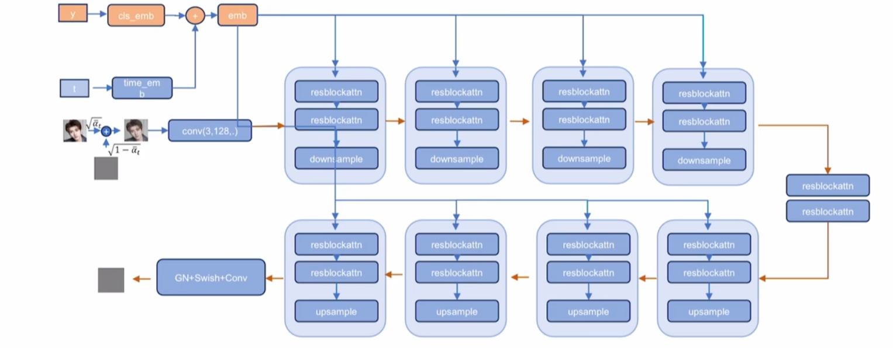

  3. **Text Guidance**

     - **similar to classifier free， different way to intergrate**

       - text use **cross attention** instead of adding with time

     - **Training**

       - **process**

         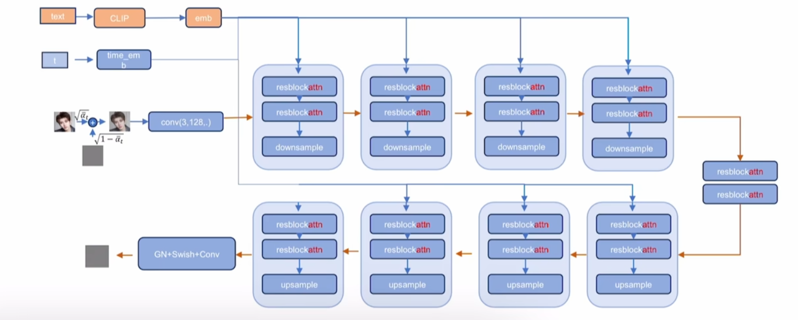

       - **cross attention**
         - Q mapped image features, K and V mapped text token. 

## 2. SDXL

#### 1. **Larger model structure**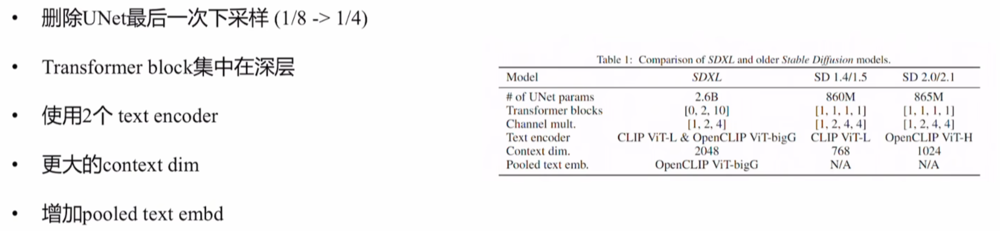

#### 2. More condition control

- **Conditions**

  1. **Add condition for original image size**

     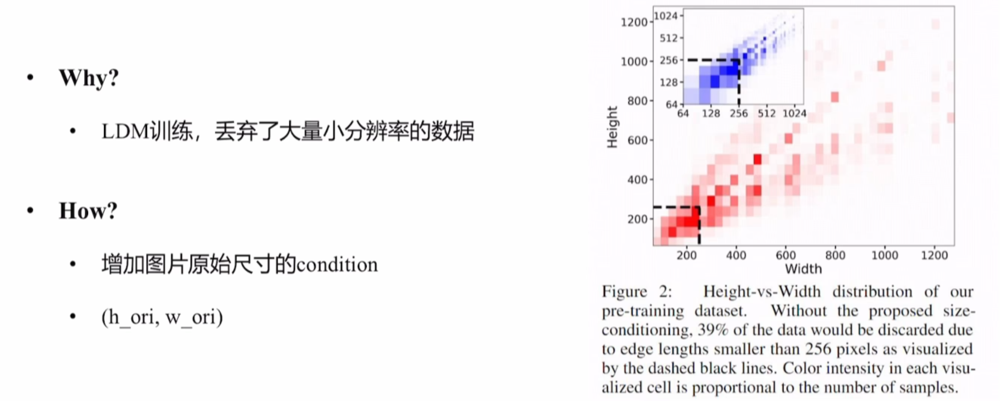

  2. **Add condition for crop parameter**

     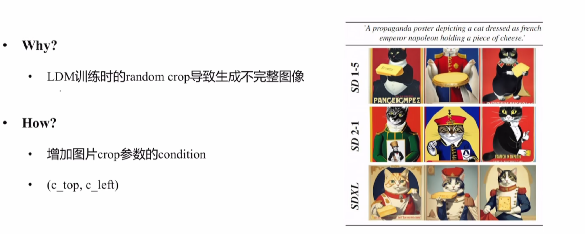

  3. **More resolutions**

     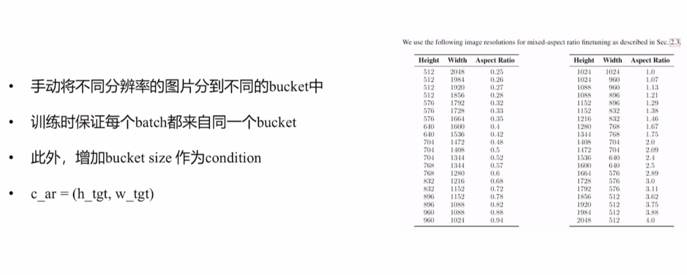

- **Intergrate condition controls into model**

  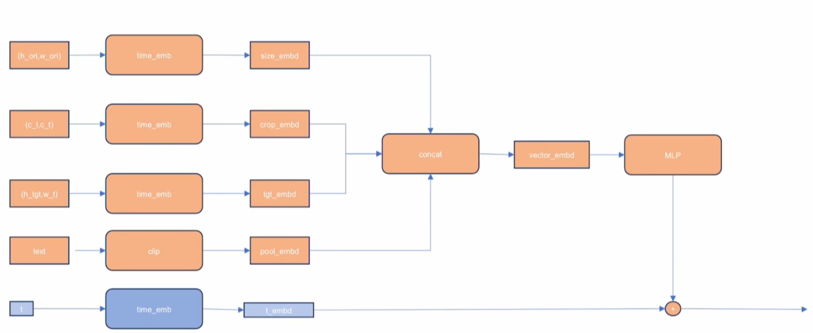

#### 3. Stronger VAE

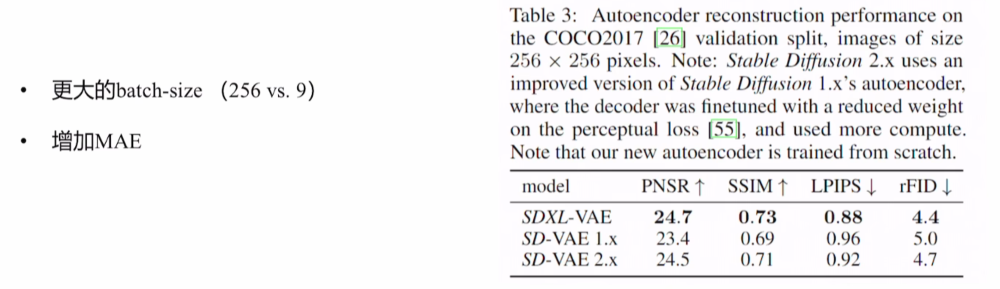

#### 4. Base + Refiner

- **Base training**

  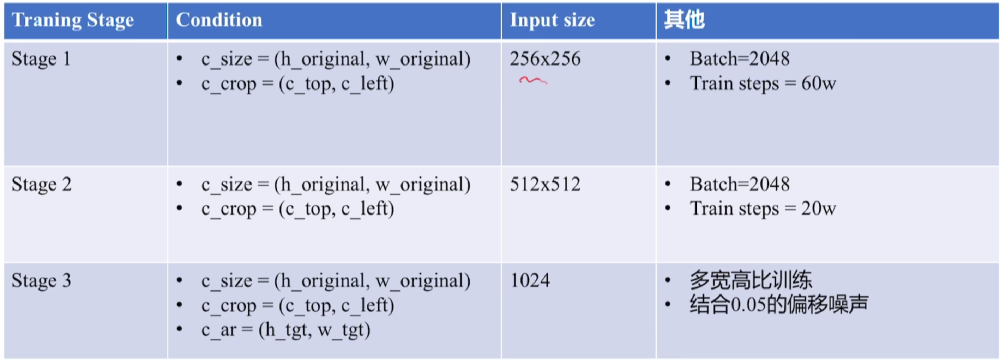

- **Refiner**

  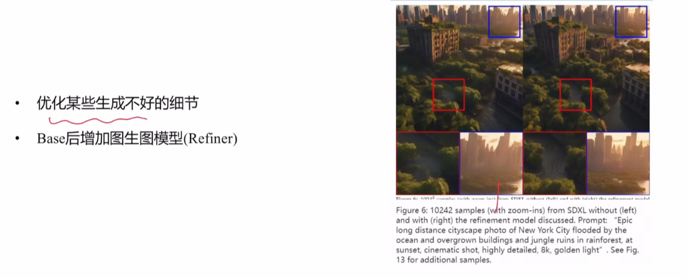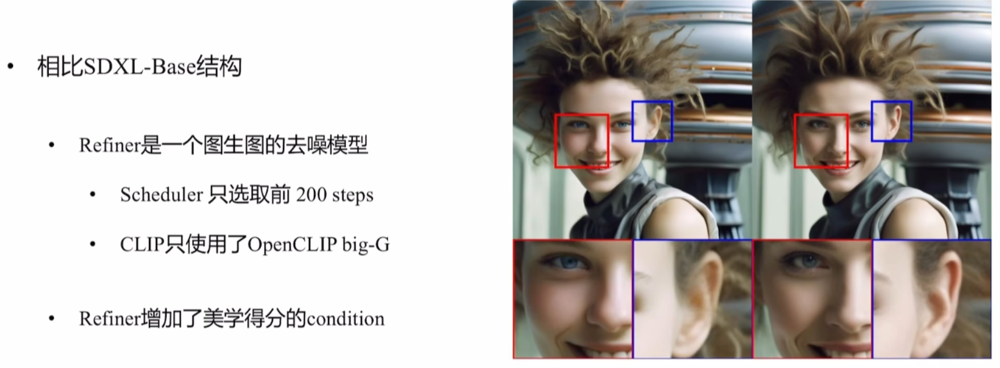

