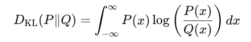
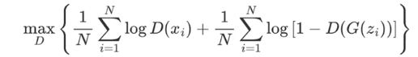
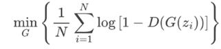
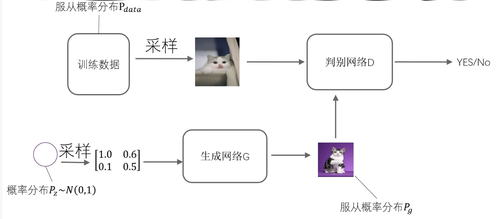
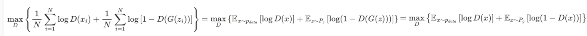
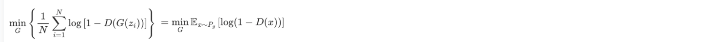
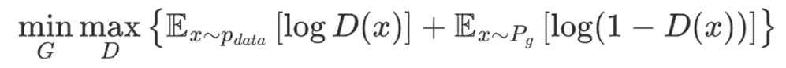
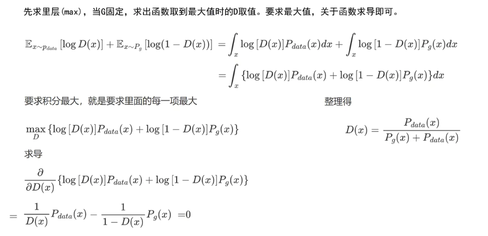
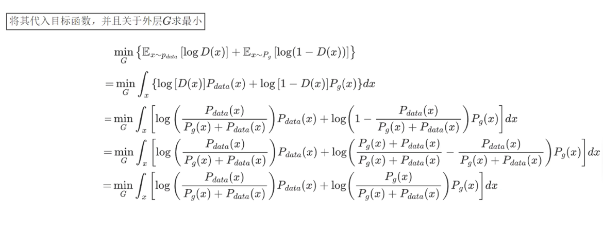
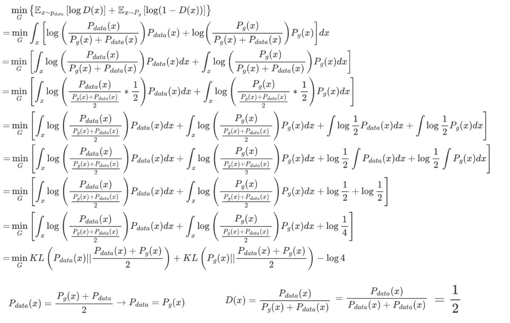

# GAN

## KL Divergence

For Probability Distribution P(x) and Q(x), $D_{KL}(P||Q)$ measures how much information lose when we use Q to approximate P

- **KL-Divergence is not symmetric**

  $D_{KL}(P||Q) \neq D_{KL}(Q||P)$

- **KL-Divergence is always non-negative**

  $D_{KL}(P||Q) \geq 0$

  $D_{KL}(P||Q) = 0$ if and only if $P(x) = Q(x)$ for all x

## GAN

#### Concept

- **Generator $G$**: Learns to generate data that resembles the real data.

- **Discriminator $D$**: Learns to distinguish between real and fake data.

- They play a **minimax game**:

  - The discriminator tries not to be fooled

    $max_DD(x_i) + min_DD(G(z_i))$

    $ = max_D[logD(x_i)] + max_D[log[1-D(G(z_i))]]$

  - The generator tries to fool the discriminator

    $\max_GD(G(z_i)) = min_G[log[1-D(G(z_i))]]$

#### **Training Goal**

- For **Discriminator**: 

- For **Generator**: 

#### **Work Flow**

- Try to make $P_g$ approximate $P_{data}$

#### **Loss function**

**Combined final Objective Function**

#### Prove: Why $P_{data} = P_g$ is optimal solution

