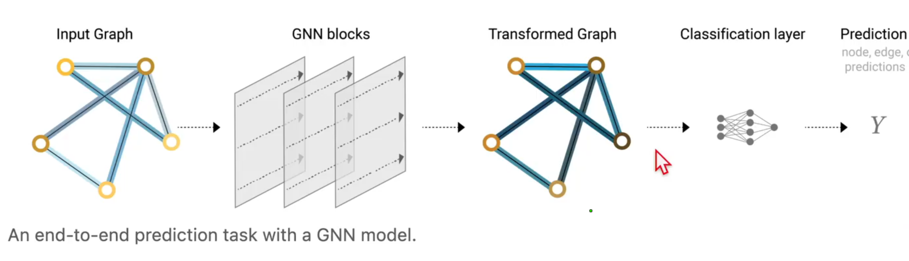
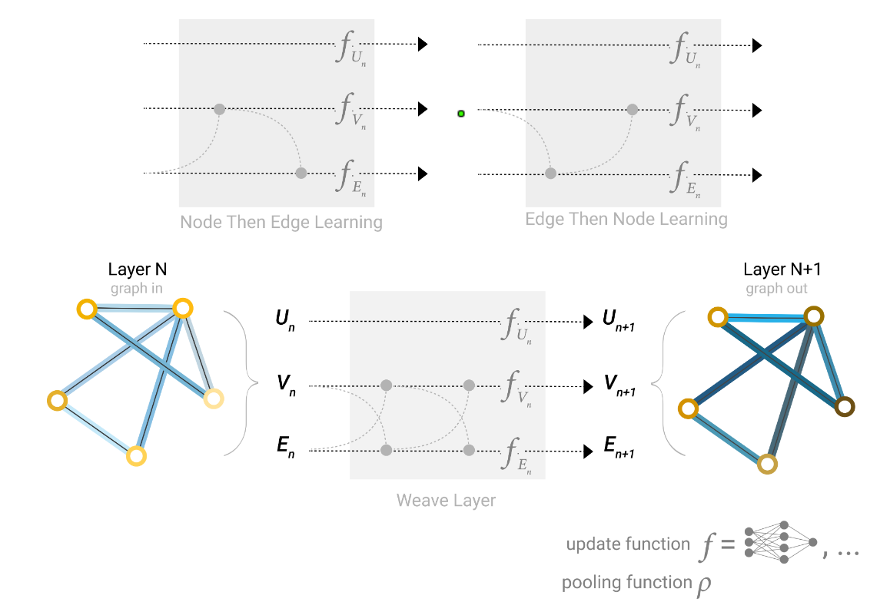
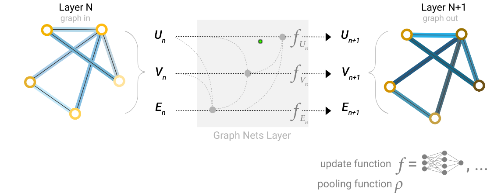

## GNN

### **multi-blocks 计算流程：**

**初始状态（Input Graph）**

- 每个节点 A、B、C、D 都有初始特征 $h_A^{(0)}, h_B^{(0)}, h_C^{(0)}, h_D^{(0)}$。

#### **Step 1: 第一层 GNN Block**

- **消息传递（Message Passing）**：
  - 节点 A 收集来自 B、C、D 的特征： $m_A^{(1)} = \text{Aggregate} \left( h_B^{(0)}, h_C^{(0)}, h_D^{(0)} \right)$
  - 这里的 `Aggregate` 可能是 **求和、均值、最大池化 (GCN)，或者带注意力的加权求和（如 GAT）**。
- **特征更新（Feature Update）**：
  - A 的特征会通过 FFN（前馈神经网络）进行变换： $h_A^{(1)} = \text{FFN}( m_A^{(1)} )$

#### **Step 2: 第二层 GNN Block**

- 现在，A 的特征变成了 $h_A^{(1)}$，而 B、C、D 的特征也变成了 $h_B^{(1)}, h_C^{(1)}, h_D^{(1)}$。
- 再次进行邻居信息聚合：
  - A 再次从 **更新后的** B、C、D 处获取信息： $m_A^{(2)} = \text{Aggregate} \left( h_B^{(1)}, h_C^{(1)}, h_D^{(1)} \right)$
  - 经过 FFN 变换： $h_A^{(2)} = \text{FFN}( m_A^{(2)} )$

#### **Step 3: 第三层 GNN Block**

- 继续同样的步骤，A 从 **第二层更新后的** B、C、D 收集信息，再更新自己： $m_A^{(3)} = \text{Aggregate} \left( h_B^{(2)}, h_C^{(2)}, h_D^{(2)} \right)$ 

  $h_A^{(3)} = \text{FFN}( m_A^{(3)} )$

#### Global Representation

- each block has a **master node / context vector (U)** connected to all other nodes and edges

  