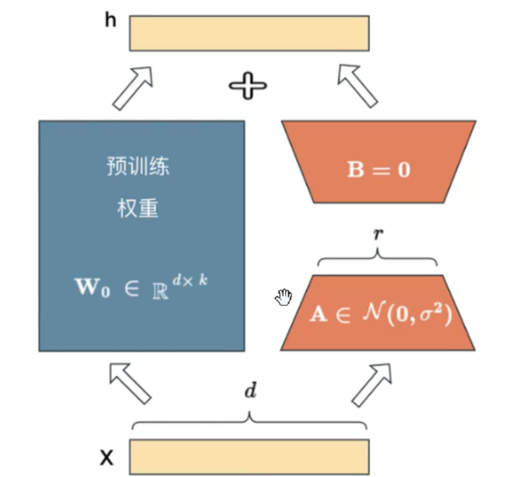
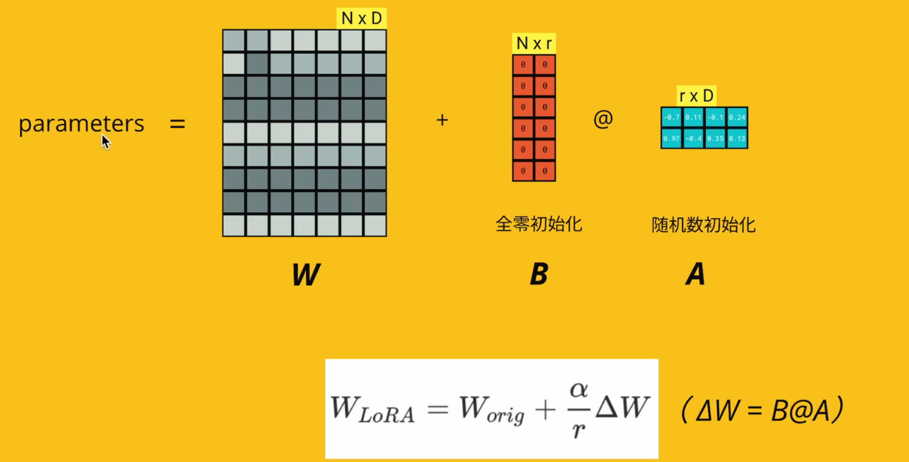
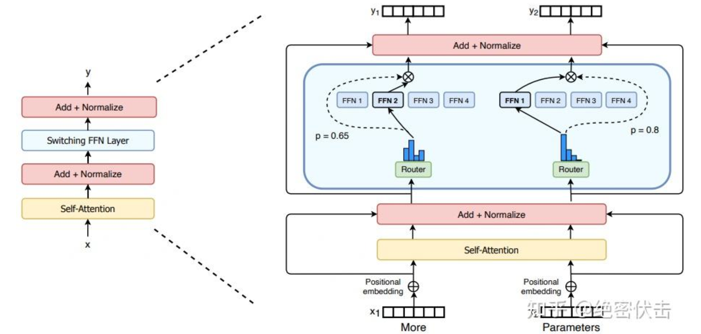

# LoRA





### Code

```python
import torch 
import torch.nn as nn
import torch.nn.functional as F
import math

class LoRALinear(nn.Module):
    def __init__(self, in_features, out_features, merge, rank=16, lora_alpha=16, dropout=0.5):
        super(LoRALinear, self).__init__()
        self.in_features = in_features
        self.out_features = out_features
        self.merge = merge
        self.rank = rank
        self.dropout_rate = dropout
        self.lora_alpha = lora_alpha
        
        self.linear = nn.Linear(in_features, out_features)
        if rank > 0:
            self.lora_b = nn.Parameter(torch.zeros(out_features, rank))
            self.lora_a = nn.Parameter(torch.zeros(rank, in_features))
            self.scale = self.lora_alpha / self.rank
            self.linear.weight.requires_grad = False
        
        if self.dropout_rate > 0:
            self.dropout = nn.Dropout(self.dropout_rate)
        else:
            self.dropout = nn.Identity()
        
        self.initial_weights()
    
    def initial_weights(self):
        nn.init.kaiming_uniform_(self.lora_a, a=math.sqrt(5))
        nn.init.zeros_(self.lora_b)
        
    def forward(self, x):
        if self.rank > 0 and self.merge:
            # F.Linear(x, W, b): output = x @ W.T + b
            output = F.linear(x, self.linear.weight + self.lora_b @ self.lora_a * self.scale, self.linear.bias)
            output = self.dropout(output)
            return output
        else:
            return self.dropout(self.linear(x))

```


# MoE



### Code

```python
import torch
import torch.nn as nn
import torch.nn.functional as F

class Linear(nn.Module):
    def __init__(self, in_features, out_features):
        super(Linear, self).__init__()
        self.fc = nn.Linear(in_features, out_features)
    
    def forward(self, x):
        return self.fc(x)
    
class MoELayer(nn.Module):
    def __init__(self, num_experts, in_features, out_features):
        super(MoELayer, self).__init__()
        self.num_experts = num_experts
        self.experts = nn.ModuleList([Linear(in_features, out_features) for _ in range(num_experts)])
        self.gate = nn.Linear(in_features, num_experts)
    
    def forward(self, x):
        gate_score = F.softmax(self.gate(x), dim=-1)
        expert_outputs = torch.stack([expert(x) for expert in self.experts], dim=1)
        output = torch.bmm(gate_score.unsqueeze(1), expert_outputs).squeeze(1)
        return output

input_size = 5
output_size = 3
num_experts = 4
batch_size = 10

model = MoELayer(num_experts, input_size, output_size)

demo = torch.randn(batch_size, input_size)

output = model(demo)

print(output.shape)  # 输出: torch.Size([10, 3])
```


# LoRA + MoE

- Replace Linear with LoRALinear


