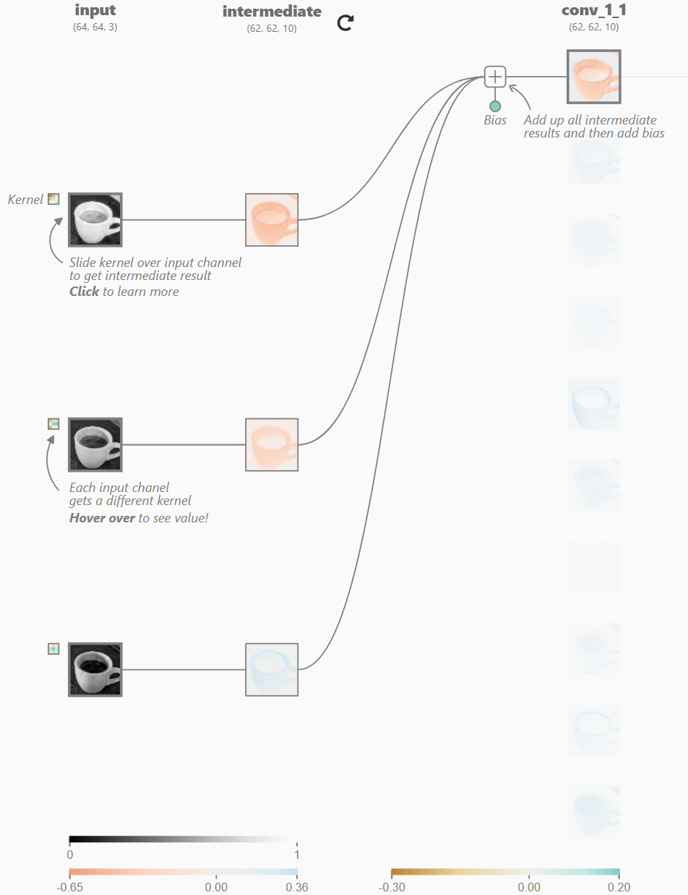

# Convolutions

## Normal Convolutions

- **Steps**

  1. For out_channels filters:

  2. ​            Apply each filter (kernel_size, kernel_size, in_channels) on each input channel

     ​             (which means each input channel is applied by one unique kernel channel)

  3. ​           Add each in_channels channel together, and add bias to get (h, w, 1)

  4. We have (h, w, out_channels)

- **Code: Conv2d(in_channels, out_channels, kernel_size, bias)**

- **Trainable Parameters: kernel_size * kernel_size * in_channels * out_channels**

- **Reasoning: Each filter extract a shared feature on input channel**

## Depthwise Seperable Convolution

- **Depthwise Seperable Convolution = Depthwise Convolution + Pointwise Convolution**
- **Depthwise Convolution catches spatial information, while pointwise convolution integrates channel information**
- **Why? : Reduce trainable parameters**

### Depthwise Convolutions

- **Steps**
  1. On each in_channel, apply a single channel kernel (kernel_size, kernel_size, 1)
  2. We have (h, w, in_channels)
- **Code: Conv2d(in_channels, in_channels, kernel_size, groups = in_channels, bias)**
- **Trainable Parameters: kernel_size * kernel_size * in_channels**
- **Reasoning: Each input channel decide its result**

### Pointwise Convolutions

- **Steps**
  1. For out_channels filters:
  2. ​            Apply each filter (1, 1, in_channels) on each input channel
  3. ​           Add each in_channels channel together, and add bias to get (h, w, 1)
  4. We have (h, w, out_channels)

- **Code: Conv2d(in_channels, out_channels, kernel_size = 1, bias)**
- **Trainable Parameters: 1 * 1 * in_channels * out_channels**
- **Reasoning: Use 1*1 kernel to integrates information between each channel**

