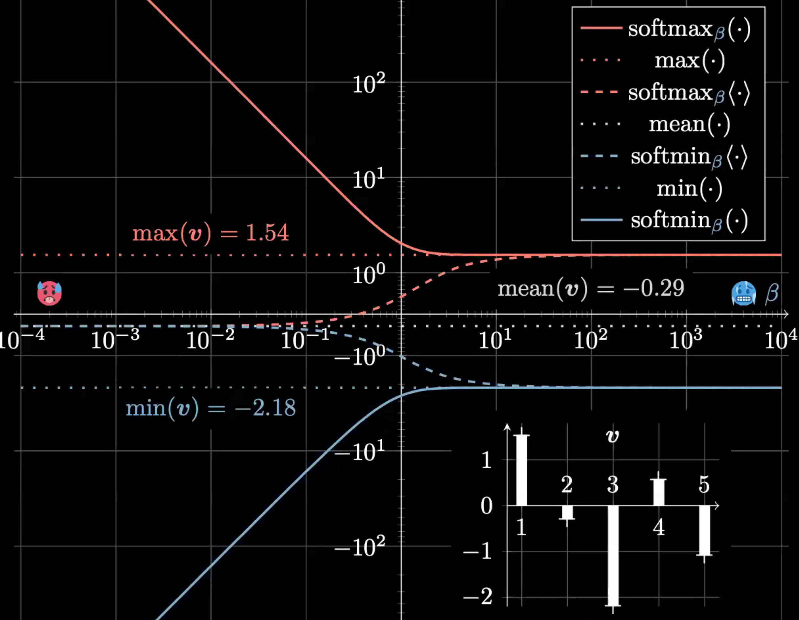

### Soft(er) Maximum and Minimum

- **$softmax_\beta(e)$**

  - as $\beta$ approaches infinity, $exp(\beta*max(e))$ dominates the whole term (sumation), thus the result approaches $max(e)$

  - as $\beta$ gets smaller, each $exp(\beta * e_n)$ becomes close, so the result contains the sumation 

- **$softmin_\beta(e)$**
  - as $\beta$ approaches infinity, $exp(-\beta*min(e))$ dominates the whole term (sumation), thus the result approaches $min(e)$
  - 

- since each term gets close as $\beta$ gets smaller, by diving the total number N, it gets closer to the average

