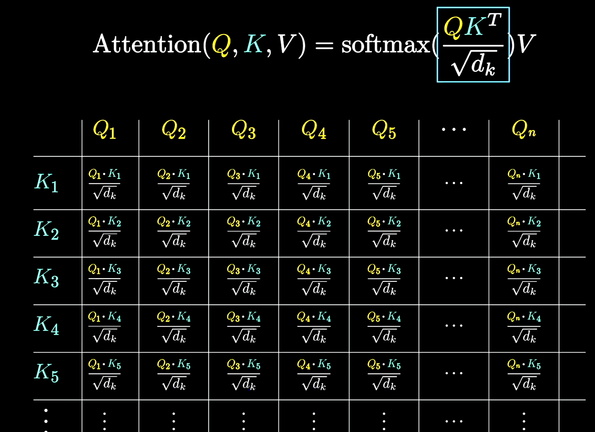

## Self-Attention

- $X = \begin{bmatrix} E_{t1} \\ E_{t1} \\ E_{t3} \end{bmatrix}, \in R^{n \times d_{model}}$ , where $d_{model}$ is the word embedding dimension and $n$ is the number of token
  - Normal Attention: Q, K, V might from different sequence (machine translation)

- $Q = XW_Q = \begin{bmatrix} Q_1 \\ Q_2 \\ Q_3 \end{bmatrix}, \in R^{n \times d_k}$, **Query**. **Idea**: Each row represents the question/query for each token, mapped in $d_k$ space
  - eg. for column $x_5$ which represents a noun 'creature'. $Q_5$ represents whether there's adj for it 
- $$K = XW_K =  \begin{bmatrix} K_1 \\ K_2 \\ K_3 \end{bmatrix}, \in R^{n \times d_k}$$, **Key**. **Idea**: Each row represents an answer/key, mapped in $d_k$ space
  - eg. $K_3, K_4$ is 'blue', 'cute'.

- **diving $\sqrt{d_k}$**: for numerical stability, divide query and k space dimension
- **softmax(...)** $\in R^{n \times n}$: **attention scores**, represents the compatibility/similarity of Query of each token and answer from other token. 
  - eg. token 3 and 4 is highly compatible with token 5, so they have high softmax probability
- $V = X W_V, \in R^{n \times n}$, **Value**. **Idea**: Each column represents the change of that token on embedding space
  - optimize on parameter numbers: $V = X V_{down}V_{up}$, where $V_{down} \in R^{n\times d_k}, V_{up} \in R^{d_k \times n}$
    - training parameters = $2 d_kn$
    - map token to smaller space ($V_{down}$), then map back to embedding space $V_{up}$
  - eg. $V_3, V_4$ is the displacement/change of meaning 'blue', 'cute' on the embedding space, which makes embedding 'creature' approach 'blue cute creature'

### Multi-headed

$H = concat(H_1, H_2, ..., H_h)$, where

- Input in each head $X_i \in R^{n\times \frac{d_{model}}{h}}$

- $W_Q, W_K, W_V$ is different for each head. In standard transformer, W mapped to same space, so $W_{Q,K,V} \in R^{\frac{d_{model}}{h}\times \frac{d_{model}}{h}}$
- $H_1, H_2, ... H_h \in R^{n\times \frac{d_{model}}{h}}$
- after concat(), $H \in R^{n \times d_{model}}$

## Transformer

### **Encoder**

​	$h_1 = LayerNorm(FFN(Attention(X)) + Attention(X))$

​	**$h_2 = LayerNorm(FFN(Attention(h_1)) + Attention(h_1))$**

​				$\dots \dots$

​	words embedding + positional encoding + self-attention + residual connection

### Decoder

​	words embedding + positional encoding + self-attention + encoder decoder attention + residual connection

