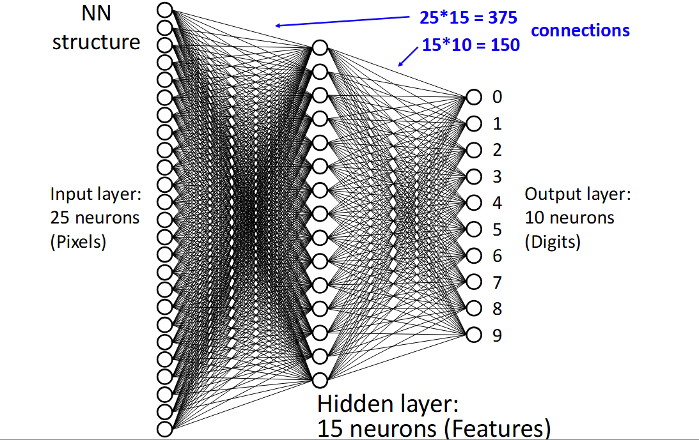
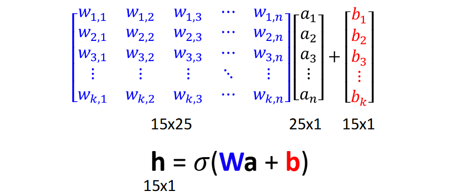
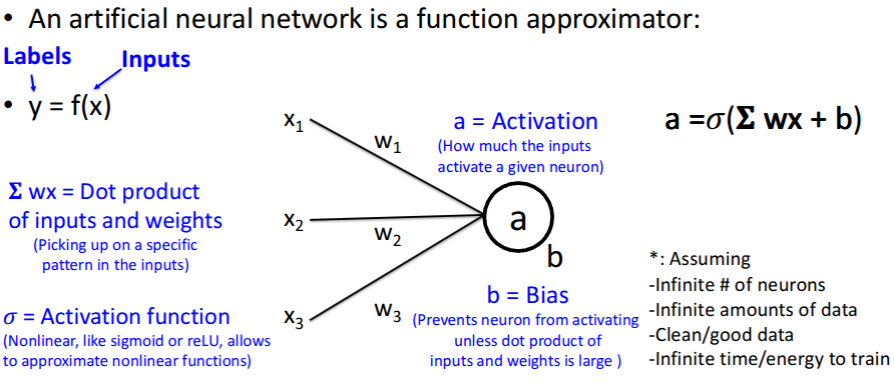
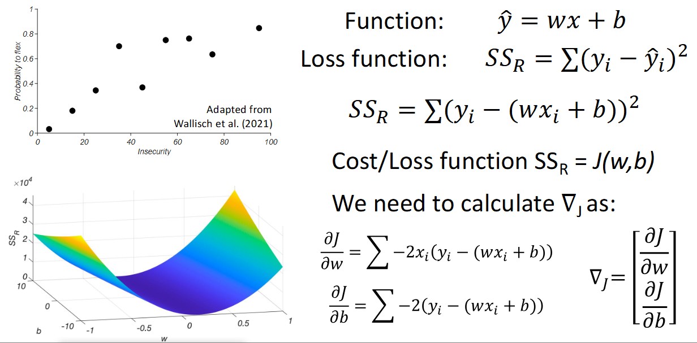
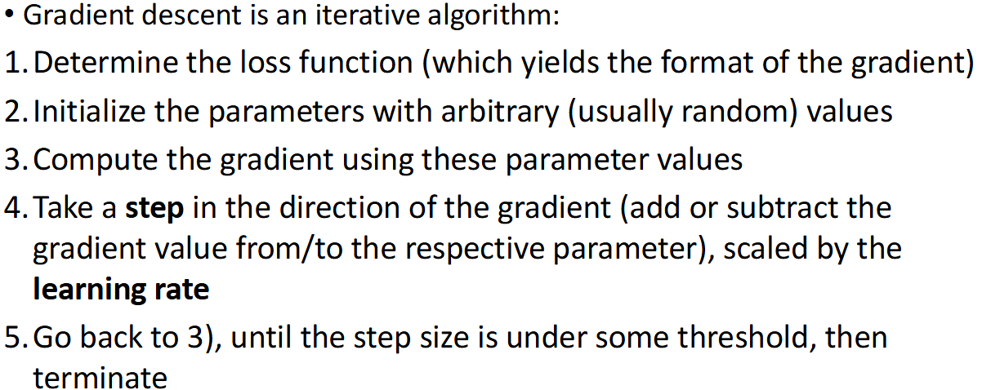
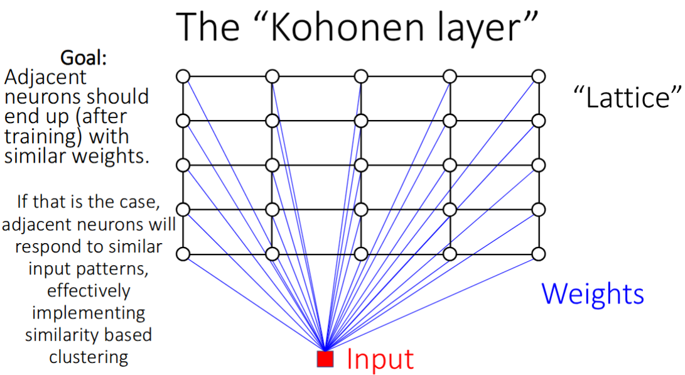
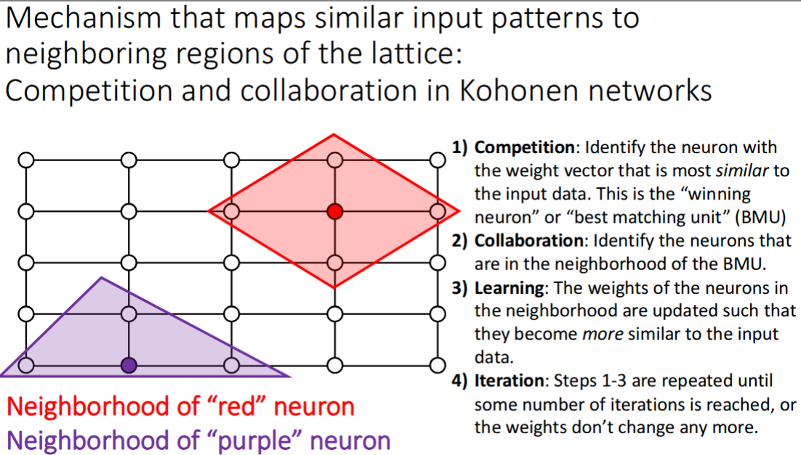
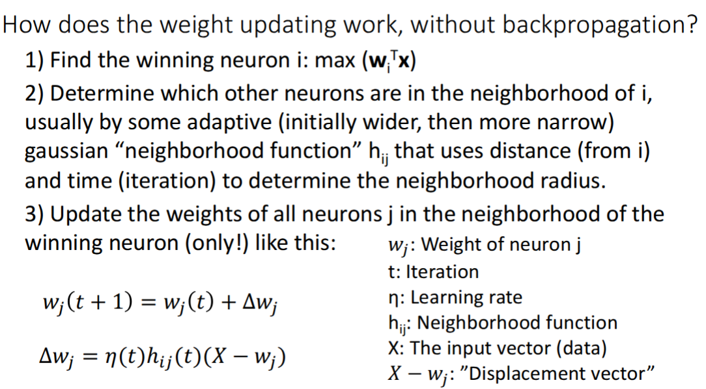
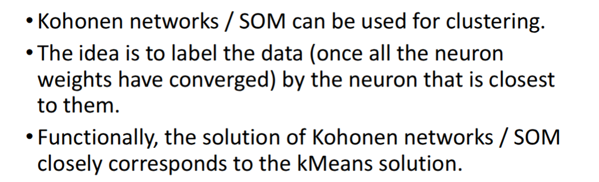

# Neural Network

## Fully Connected Feedforward network

- #parameters = $input \ neurons \times hidden \ neurons + hidden \ neurons \times output \ neurons + hidden \ neurons + output\  neurons$

- **forward pass**

  

- **Structure**

  

- **Learning: Adjusting the weights and biases to minimize the output of the cost function**

  - **Cost function**: only one number: Average cost over all training data

  - **Adjusting: backpropagation**: -delta to lower cost

    
  
    
  

- Extracted features in the hidden layer are usually meaningless (not interpretable)

## CNN

- why CNN: In fully connected layers, hidden layer activations are hard to interpret. CNN take advantage of local correlations in neighboring pixels
- **kernel**: filter, weights we train
- **feature map**: convolved image after applying filter and bias
- **problem with deep network**
  - **vanishing gradient**: component derivatives are < 1
  - **exploding gradient**: component derivatives are > 1

## Autoencoder

- **Loss function measure reconstruction error (same input output size)**
- **Dimensionality reduction here to find latent space that represents the structure of data in fewer dimesions**

**Self Organizing Map**

