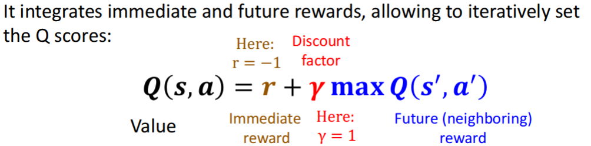

# Reinforcement Learning

- reward $r_t$: scaler feedback signal that denotes how the agent is doing at time t
- **Reward Hypothesis**: The agent's goal is to **maximize expected cumulative reward**
- **States **s: The cells in the grid the robot can occupy
- **Actions** a: A set of operations that allow robot to transition from state to state
- **Immediate reward**: cost of an action. eg. -1
- **Future reward**: The value obtained by reaching a terminal cell

**Bellman equation (Q-Learning)**

- **Steps**
  1. Initialize Q(s, a) arbitrarily
  2. Observe current state `s`
  3. Choose action `a` (e.g., ε-greedy)
  4. Observe reward `r` and new state `s′`
  5. Update Quality Q

Policy in **Markov Decision Processes (MDP)**

- **state fully observable (no hidden state)**
- **not path-dependent**: Future not dependent on the past, only depends on current state
- **All relevant info of past is contained in current state s**
- **policy maps state to an (optimal) action**

**Issues**

1. **The explore/exploit tradeoff**
   - exploit: choose best-known action
   - explore: Try new action to discover better paths
   - **solution:** represents options as samples of probability distributions. As gain more confidence about the parameters of distributions, choose random options less often
2. **Rewards are sparse**
   - then not sufficient to learn optimal behavior
   - **solution**: reward exploration itself
3. **Rewards validity**
   - What is learned with this reward
4. **Memorization vs Learning**
5. **Scores are essential**
   - If score not available, and we use human judgment, how to get super-human performance that way?
6. **Large state spaces**
   - small robot, big world --> not remotely tractable some move
7. **Delayed feedback -> the credit assignment problem**
   - don't know which move is winning / losing move
   - **root cause**: Rewards/outcomes are much less frequent than actions
   - **solution**: **Reward shaping**: Give partial credit

**Deep Q Network**

- **Training Steps**

  1. Input: State `s`

  1. Output: Q-values for each possible action

  1. Choose action using ε-greedy

  1. Store experience `(s, a, r, s′)` in **replay memory**

  1. Train network using batches sampled from replay memory

- **Replay Memory**
  - state sequences are often highly correlated as agent explores environment, which would not be efficient
  - replay memory is a buffer containing last N experiences
  - prevent correlated state sequences from destabilizing learning
  - encourage learning from diverse, uncorrelated experience