# Supervised Learning

### *functional framework of (supervised) machine learning*

- $ \theta^* = argmin (\sum L[Y_i = f(X_i; \theta, \lambda)])$
  - parameters $\theta$ (eg. learning rate, batch size)
  - hyperparameters $\lambda$ (eg. weight, bias)
  - linking function f
  - loss function L

### 1. Linear Regression

1. **predictor and outcome**
   - estimates the **regression coefficients** $\beta_0, \beta_1$ that map X to f(x) by **minimizing the sum of squared differences** between **predicted and actual outcome (residuals)**
     - **linear** in the **parameters**, not necessarily variable

2. **pros and cons**
   - pros: fast, scales well, low risk of overfitting
   
   - cons: tendency to underfit, needs lot data if many predictors, many situation not linear, no causality
   
   - 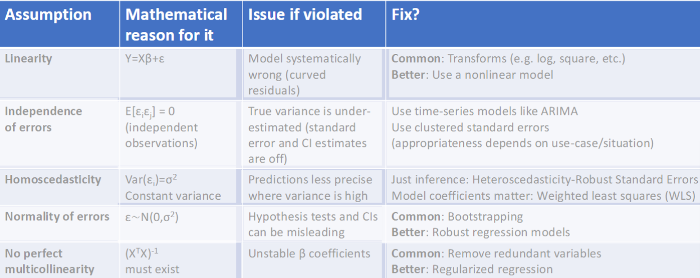
   
3. **Interpret model coefficients**

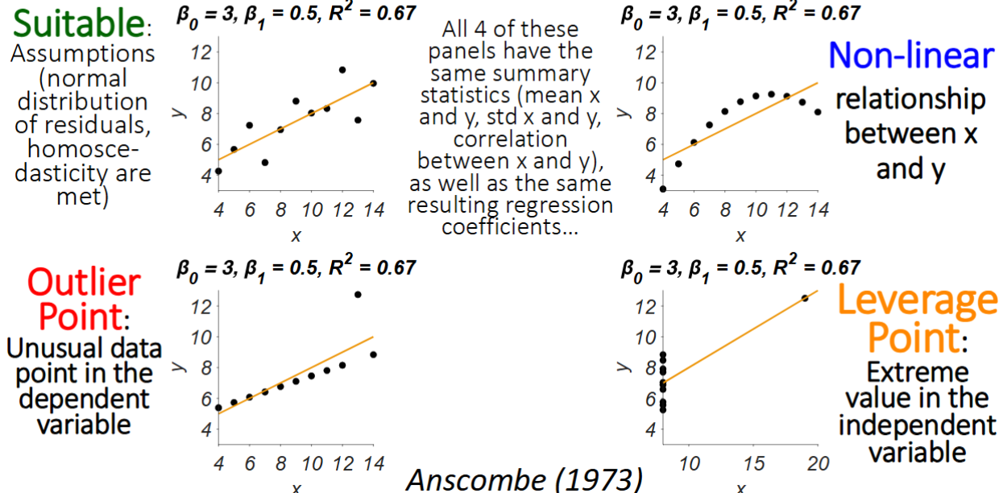

4. **expansion models**

   1. **multiple regression**

      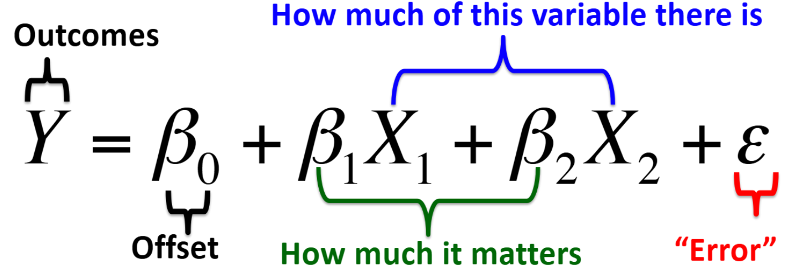

      - adding predictors increases the variance of the outcomes that is explained of a regression model

   2. **polynomial regression**

      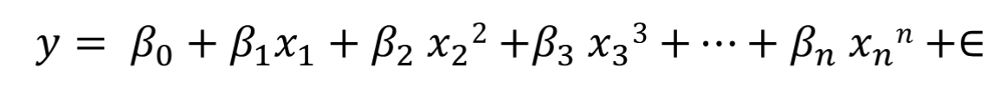

      - still linear regression since linear with respect to parameters, though nonlinear with x

5. **assessment**

   - **RMSE =** $\sqrt{\frac{\sum(\hat{y}-y)^2}{n}}$, the SD of the residuals

   - $COD$/$R^2 = \frac{SS_{explained}}{SS_{explained}+SS_{residual}}$: The squared multiple correlation. Proportion of the variance that can be accounted for by the model. Ranges between 0 and 1, negative indicates a model is systematically guessing worse than the mean of the outcomes

   - $R$: the multiple correlation /pearson correlation. Correlation between $\hat{Y}$ and y. 1: no regression to the mean effect. 0: strongest regression to the mean effect, no linear relationship (but maybe nonlinear)

     

6. **issues** when adding predictors

   - **overfitting**
     - fix: **cross-validation** into training set and test set
       - if each set not independent, **leakage occurs**

   - **collinearity**
     - problem: 2 predictors that are each highly correlated

7. **fix by Regulation: Regularized Regression**

   - **Bias / variance tradeoffs**

     - **high bias**: function too simple (less variable), underfit, model doesn't fit well

     - **high variance**: function too flexible (much variable), overfit, fit doesn't transfer to other dataset well
       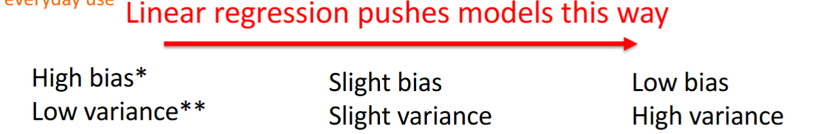

   1. **Ridge Regression**: **add a regularization term** biases the estimator a litter, but reduces the variance a lot

      L2: Penalize on Absolute value

      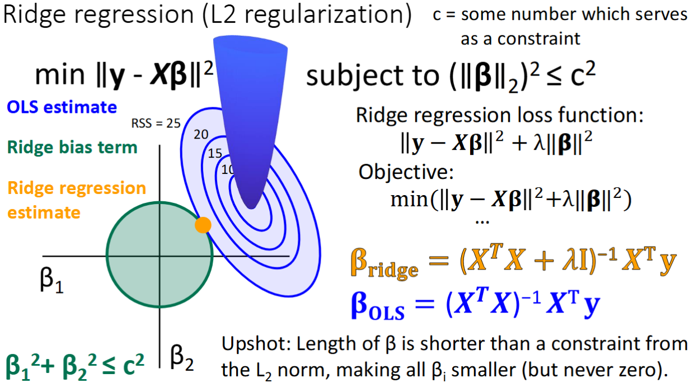

   2. **LASSO （L1 regularization)**

      L1: Penalize on squared value
   
      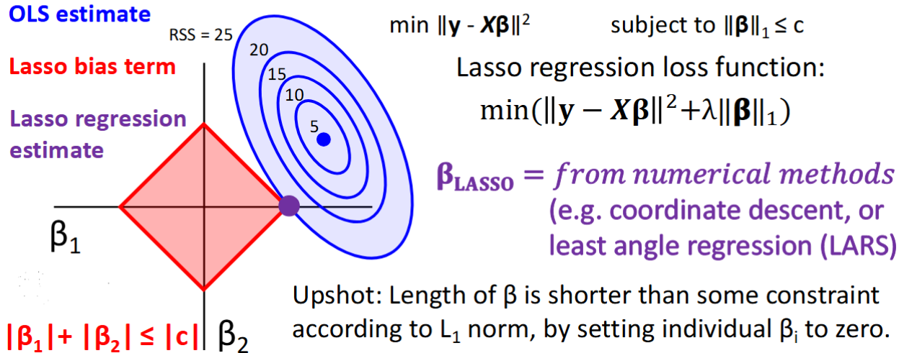
   
      - $\lambda$ increases, the radius of the constraint diamond shrinks, setting some $\beta$ to 0, while shrinking others slightly

### 2. Logistic Regression

- Mapping continuous inputs to **discrete outcomes**, while using a **nonlinear linking function (cross entropy loss)**
- Logistic regression gives **odds** that an outcome happens compared to it not happening, for a given predictor value
  - **Odds**: Probability of an event occurring divided by the probability of the event not occurring $\frac{p}{1-p}$
  - **Logit Function**: Links the values in the predictor variable to the probabilities of the outcomes. 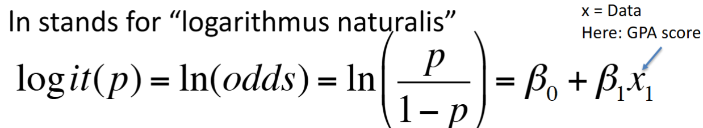
  - **Logistic Function / Sigmoidal Function**: inverse logit function 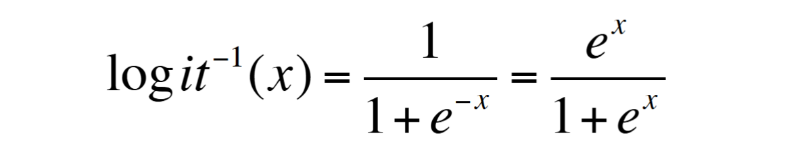
    - why inverse: On logit function, probability is on x-axis; inverse make probability on y-axis 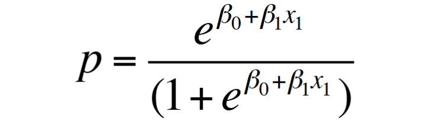

- **metrics**

  - **accuracy** is not enough: most real datasets imbalanced

  - **AUC (area under ROC curve) / AUROC**

    - **ROC (Receiver Operating Characteristic)** 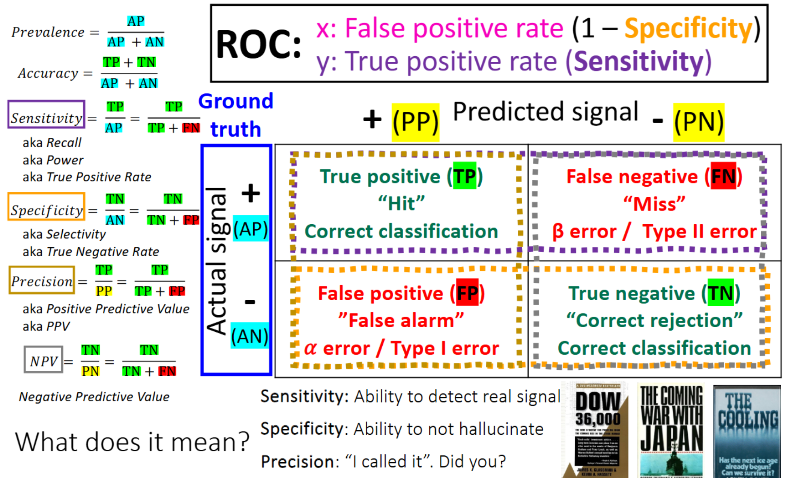
      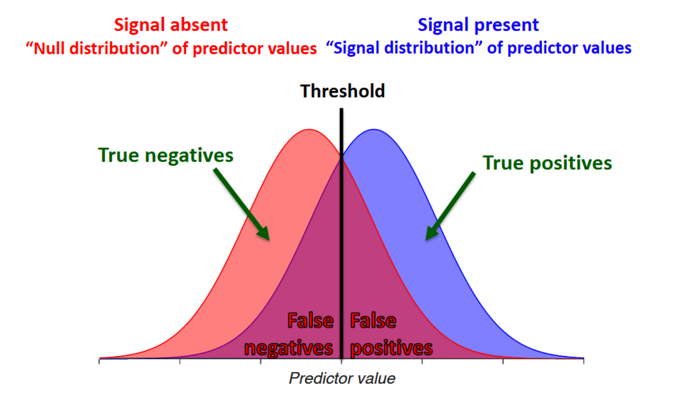

    - **AUC (Area under the ROC curve)**: assess the performance of classification models 

      - plotting **sensitivity (true positive rate)** as a function of **1-specificity (false positive rate)**
      - it  captures the classification accuracy of an algorithm for the entire range of different criteria (thresholds)
      - 1.0: perfect classification; 0.5: random performance, isn't learning any useful signal from data
      
      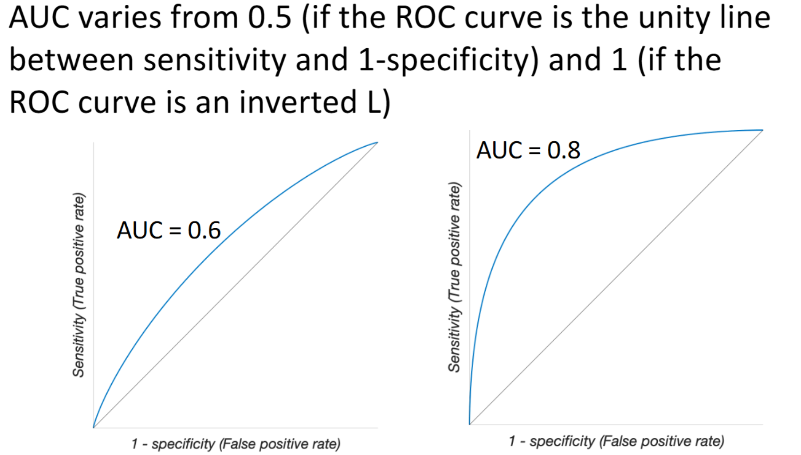

  - **the precision recall (PR) curve**
    - use case: **imbalanced dataset, focus on positive**
    - 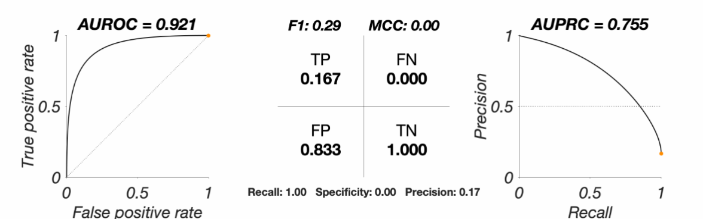

### 3. Support Vector Machines

- **basic idea:** use **maximal margin classifiers** to pass a **linear separable hyperplane** through data to classify it into 2 groups s.t. the **margin is maximized**

- **find optimal hyperplane efficiently**
  - 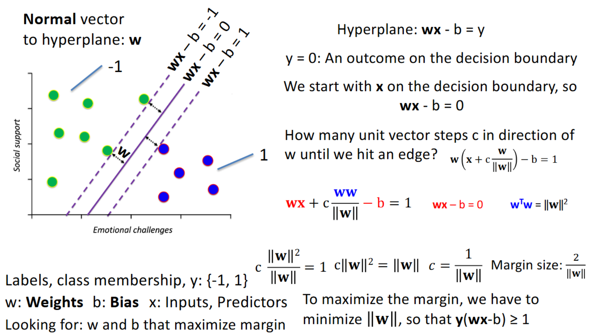
  - **why maximize margin**: more stable, not easy to overfit to new sample
  
- **Loss function: Hinge Loss**
  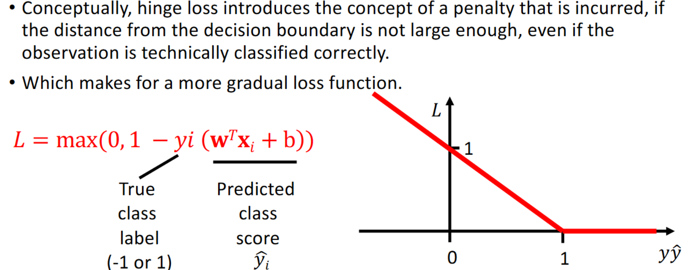
  - **If predict wrong, $y_i (\mathbf{w}^T x_i + b) \leq 0$**
    - L will be greater than 1, large loss
  
  - **If predict correct, but outside the margin (high confidence),** $y_i (\mathbf{w}^T x_i + b) \geq 1$
    - L will be 0. No loss on these points
  
  - **If predict correct, but inside the margin (low confidence),** $0 \leq y_i (\mathbf{w}^T x_i + b) \leq 1$
    - L will be between 0 and 1, but too close to the decision boundary, so still some loss
  
- **soft margin classifiers**: allowing for misclassifications in the margins of the training set 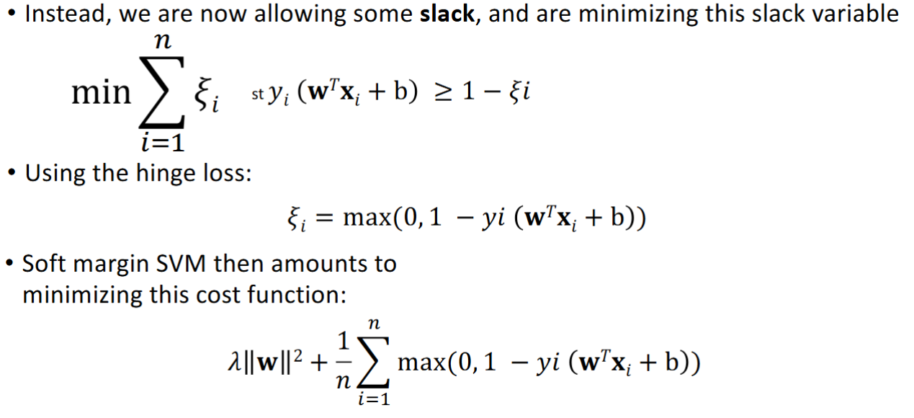

- **SVM kernels tricks**
  - 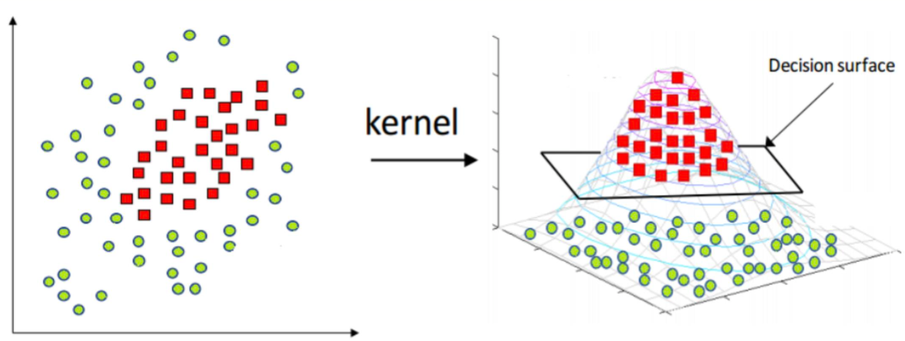
  
  - **use case: For non-linear classification problem**
  - **Intuition:** transform original space into a **higher dimensional space** by creating synthetic features with kernel function (not mapping like neural network) so that the data will be **linearly separable** in higher dimensional space 

### 4. Decision Tree

- **Why tree**: Allow for the classification of highly complex, linearly non-separable dataset; Intuitive, Interpretable

- splitting boundary / quantify leaf impurity
  - **Gini Impurity**
    
    - $GI = 1- \sum_{i=1}^n p_i^2$
    - p_i: The probability of class i in this leaf node
    - **Goal**: find variable with the smallest **GI** (pure leaf), the more likely it can classify samples
    
  - **Entropy**
    
    - $H(x) = -\sum p(x)log p(x)$
    - **Goal**: find variable with the smallest **Entropy** (pure leaf), the more likely it can classify samples
    - **Entropy has larger penalty to mixed sample to maximize information gain from the split**
    
    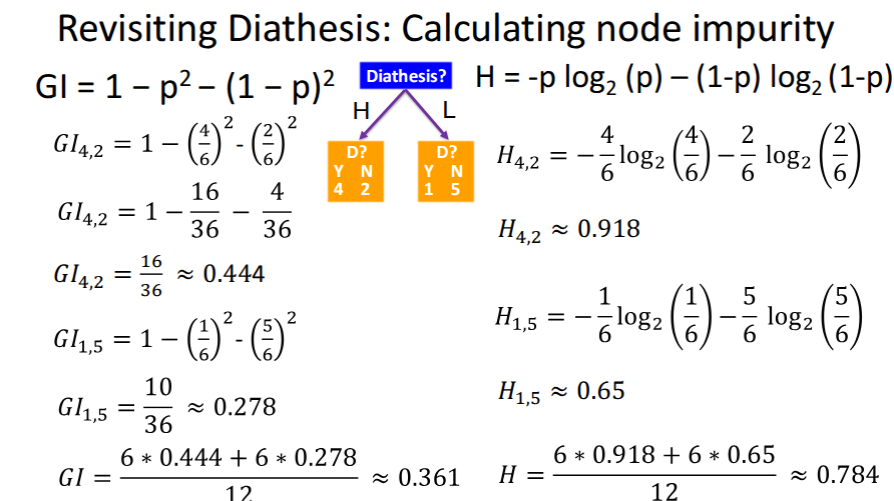
  
- **Ensembles** to improve performance

  - **why:  single tree is weak learner due to high variance (easy to overfit)**

    - **strong learner**: get the model error below some small threshold with high probability

  - **methods**

    - **bagging (bootstrap aggregating)**

      - **random forest**: random sampling from sample to train multiple trees, then use voting or average result to reduce variance

    - **boosting**

      - first tree learns first, second tree learn what first tree classify wrong to reduce bias

      - **AdaBoost**: forest of stumps

        1. first stamp, set weights of each sample to $\frac{1}{N}$

           **recurrence:**

        2. pick variable minimize Gini (maximize classification purity)

        3.  The error is the sum of the weights of incorrectly classified cases

        4. Use the error to determine the **voting power** of the stump, $vp = \alpha = \frac{1}{2}ln(\frac{1- e}{e})$

        5. update the weights for the next stump, and normalize

           - $w_{new-correct} = w_{old-correct} * e^{-\alpha}$: decrease weight
           - $w_{new-incorrect} = w_{old-incorrect} * e^{\alpha}$: increase weight

      - **Gradient Boosting**

        **Recurence:**

        1. calculate the log of odds for instance, then convert to probability. $p(depressed) = \frac{e^{ln(odds)}}{1+ e^{ln(odds)}}$
        2. calculate **residues** of each leaf between predictions and actual outcomes
        3. take the gradient of the loss and step in the negative direction
        4. update: $new \ ln(odds) = old \ ln(odds) + lr * tree \ prediction$
