# Unsupervised Learning

**process** 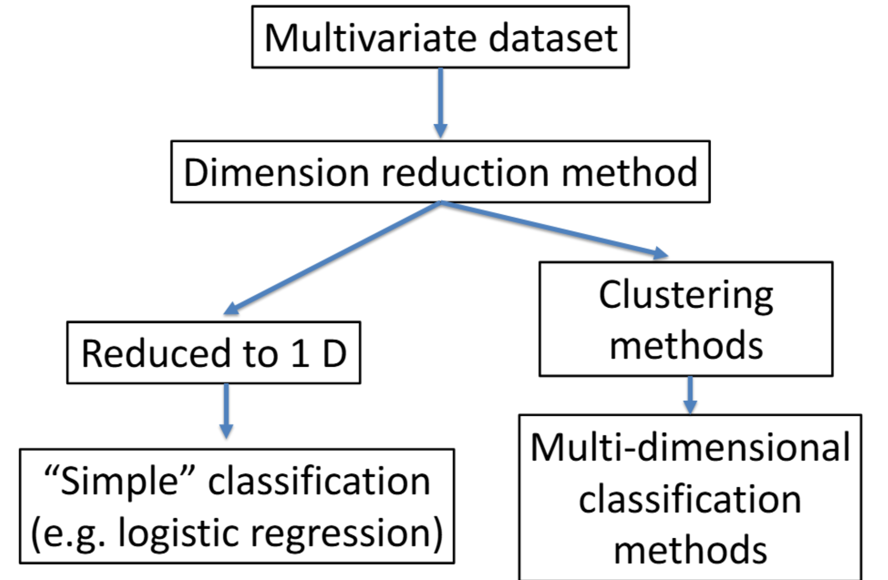

## Dimensionality Reduction

- **motivation**: too much going on on multi dimension, correlated information is redundant

### Linear

#### 1. Principal Component Analysis (PCA)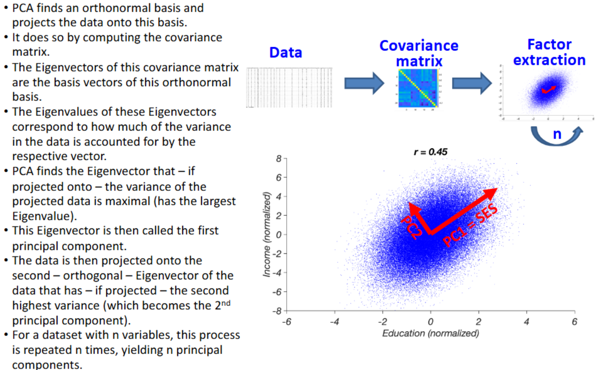

- **steps**
  1. start with dataset with many correlated features
  2. standardize the data
  3. compute the covariance matrix
  4. Find the eigenvectors of the covariance matrix
  5. project the data on these principal components (PCs)
  6. retain as many PCs as needed to retain an acceptable proportion of variance

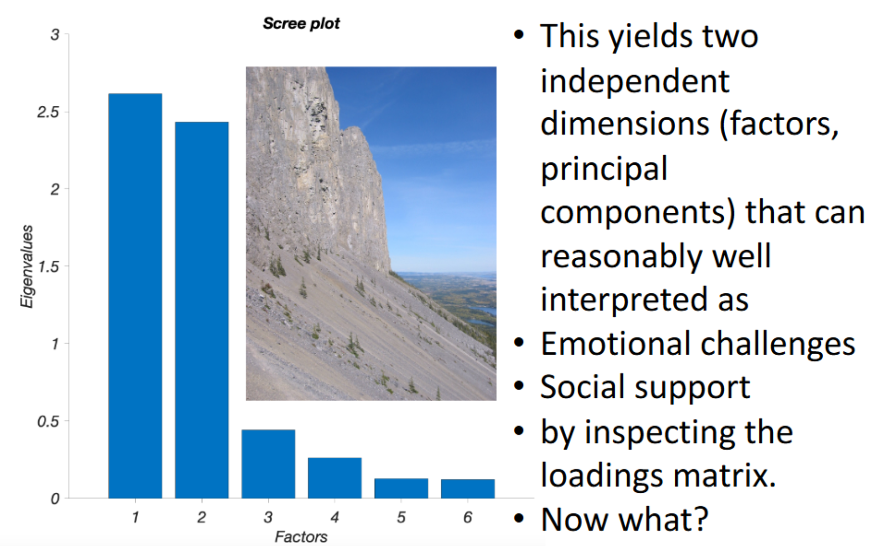

- **remark**
  - focus on direction **maximizing variance**, not direction helping classification
  - works well when class labels are missing (unsupervised learning)
  - If know class labels, PCA might through away factors helpful for classification

#### 2. Linear Discriminant Analysis (LDA, supervised)

- project into a dimension that **maximize the distance between projected class means**, **minimizes the variance within the projected classes**

  - require class labels, assumes gaussian distribution of data within classes

- **steps**

  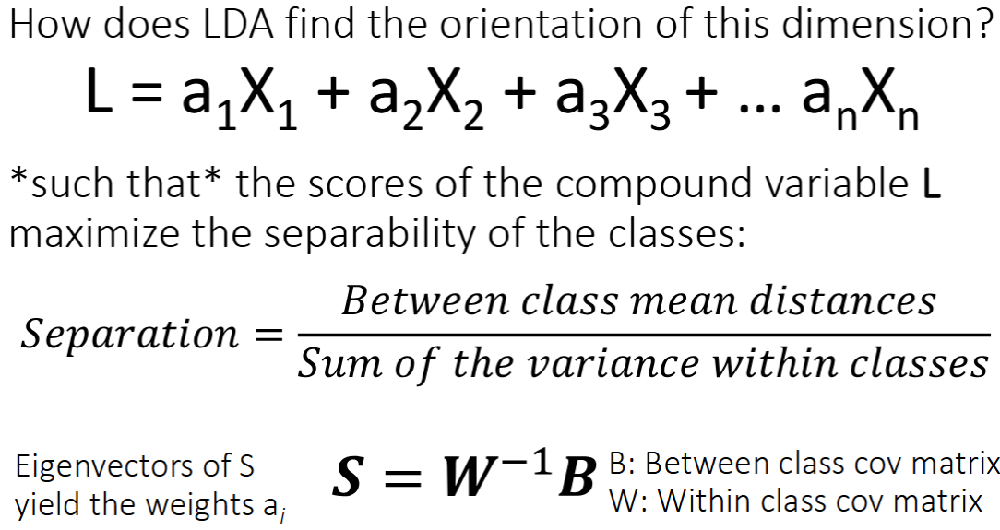

  1. calculate the covariance matrix for each class, take the weighed average of each matrix to get W
  2. compute the total covariance of the data regardless of class T, subtract it by the pooled within class covariance W to get B: B = T - B
  3. $S = W^{-1}B$
  4. compute the eigenvector of S: [a_1, a_2, a_3 ....]
  5. each column $L_1 = a_1 X = a_{11}X_1 + a_{12}X_2 ....$, $LDA = [L_1, L_2, ...]$
  6. now data has been extracted to LDA dimension, you can train model with it

### Nonlinear

#### 3. Multidimensional Scaling (MDS)

- can have no variables, data are the distance matrix between samples
- **purpose**: dimension itself contains dimension information. Reconstruct map with MDS low dimension matrix to approximate input dimension matrix

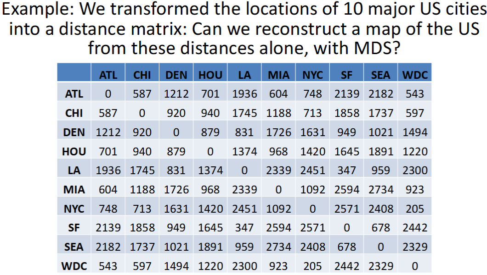

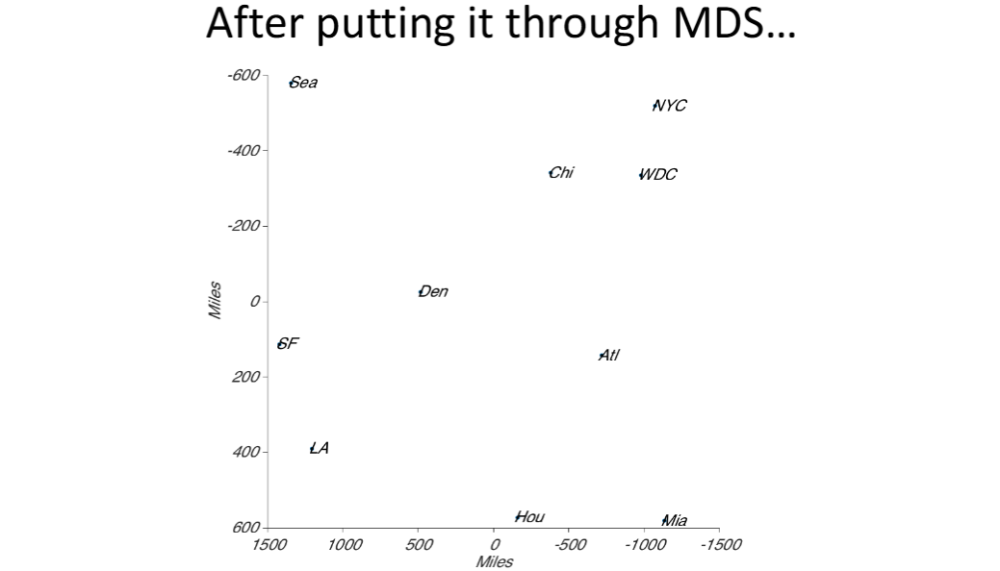

- **steps**

  1. transform data into a distance matrix $D \in \R^{n \times n}$

  2. 

     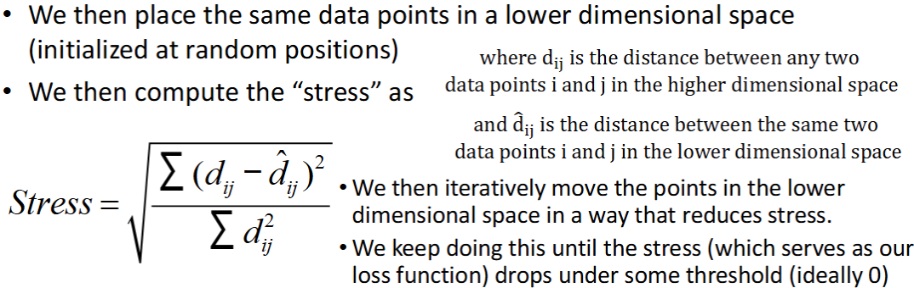

  3. We get $Y \in \R^{n \times k}$ where each row represents the coordinate of a sample

- **downsides**
  - Extreme computational complexity
  - might unable to preserve distances in the lower dimensional space

#### 4. Stochastic Neighbor Embeddings (SNE)

- **address the downsides of MDS**
- **preserve the nearest neighbors** (locality) in lower dimensional space, not distances，
- **steps**

  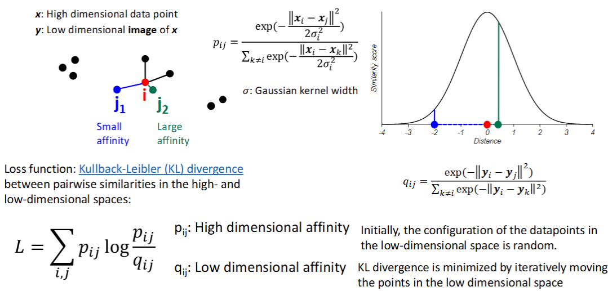

  1. compute high dimensional affinity matrix P
  2. Initialize low dimension coordinates for each sample (randomly or use PCA)
  3. compute low dimensional affinity matrix Q
  4. minimize loss L (KL-Divergence) to make Q approximate P

- **parameter**
  - **perplexity**: effective width of neighborhood

- **tSNE**: use t distribution in low dimension instead of Gaussian distribution for better clustering

- **downsides**
  
  - still a bit slow, though faster than MDS
  - preserves the local, but not the global data structure well

#### 5. Uniform Manifold Approximation and Projection (UMAP)

- Similar to SNE: but not using probability distribution, instead use graph

- **steps**:

  1. compute fuzzy simplicial set for each sample with k neighbors for high dimension

     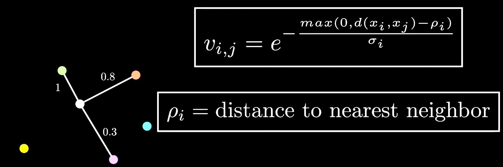

  2. Initialize low dimension coordinates for each sample (randomly or use PCA)
  3. compute fuzzy simplicial set for each sample with k neighbors for low dimension
  4. minimize loss to make low dimension representation approximate high dimension representation

- **pros**
  - preserves good overall structure
  - faster then t-SNE
- **cons**
  - sensitive to noise and extreme values (though SNE is more sensitive)
  - large number of hyperparameters

## Clustering

- **Intuition**: members of a cluster are similar, but dissimilar from members of other clusters

### 1. k-means clustering

- difference with KNN: KNN has labeled data

- **process**

  1. Placing K cluster centers (centroids) at some initial location in the data space

  2. Identifying which centroid a given datapoint is closest to, for all datapoints

  3. Calculating the distance of all data points from their nearest cluster center (centroid)

  4. Summing all of these distances

  5. Adjusting the location of the centroids such that the total distance of all points from their centroids decreases.

  6. Iteratively doing that until the total distance / centroid location doesn’t change anymore

- **parameters**
  - **K**: the number of clusters
  - Initial centroid locations (default: random)
  - Distance metric (Euclidian distance $||x||_2 = \sqrt{\sum_i x_i^2}$)

- **pros**:

  - yield optimal location of cluster centers that minimize the total distance of all data to centers
  - labeling the data in terms of their nearest center

- **cons**:

  - usually converge, but may not converge if the cluster centers start unevenly (eg. all in the same position)

  - it does not yield the optimal number of clusters, only optimal location of cluster centers

  - **solution**: 

    1. the elbow method: find variance within cluster for each K, if it starts becoming flat at k, then k is elbow point

    2. **the sihouette method**

       - **process**

         1. Apply the K-means clustering method for a range of plausible values K (e.g. 2-10)
         2. For each of these –and each data point i-calculate the **Silhouette Coefficient** s(i):
            1. calculate the average distance of a point i to all other points in the same cluster as a(i)
            2. Then calculate the average distance of a data point i to all points in the nearest cluster as b(i)
            3. Then calculate s(i) as (b(i)–a(i) / max([b(i),a(i)])) 
         3. s(i) will vary from 0 (if classification is arbitrary) to 1 (if classification is ideal). Negative s(i) values indicate misclassification.
         4. Make a histogram of the s(i) values for all values of K that you tried

         5. choose the k (number of clusters) with the highest sihouette score

       - **cons**: yields spherical clusters, sensitive to outliers

### 2. GMM

- difference between k-means: k-means is hard clustering, where each point is assigned to only one cluster center, and assumes each cluster comes from an isotropic gaussian distribution;  GMM assumes data is the mixture of different gaussian distribution, so each point has its probability distribution on each cluster, and covariance matrix makes ellipse clusters.

  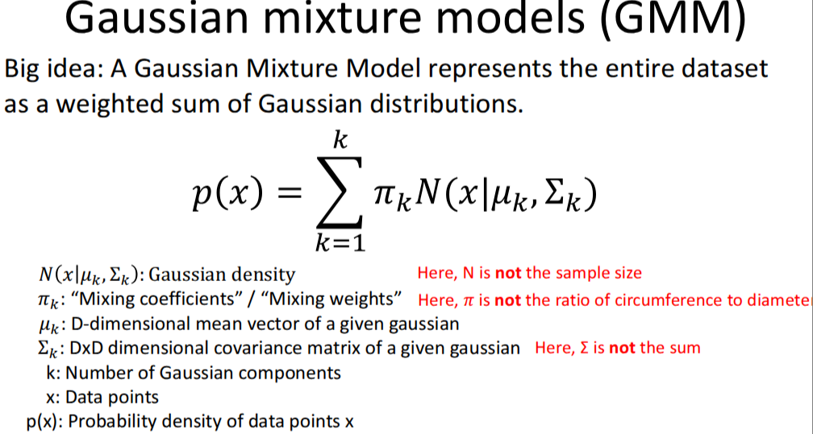

  - covariance matrix makes ellipse

    

### 3. DBSCAN

- density-based spatial clustering of application with noise
- can find clusters with non-regular (non-spherical, non-convex) shapes

- **idea**: Use **Density** (number of data points per area) instead of distance
- **parameter**
  - **Epsilon**: The radius around a data point that forms a region/neighborhood within the perimeter
  - **MinPoints**: The minimum number of data points (including starting point) that must be in the region (within the perimeter) for a cluster to be formed 

- **steps**

  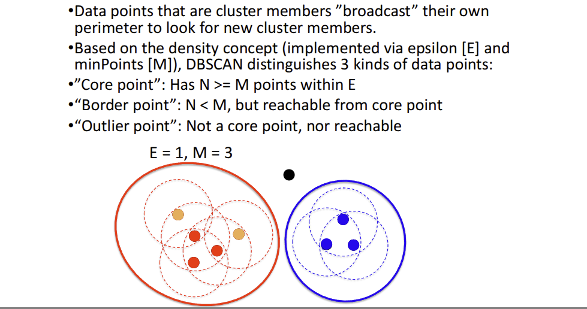

**pros and cons**

- pros
  - finds the number of clusters
  - yiled clusters of arbitrary shape
  - not sensitive to outliers
  - does not include noise in the clusters
- cons
  - slow
  - relies on sharp density drops to identify cluster boundaries
  - determining epsilon and minPoints can be arbitrary